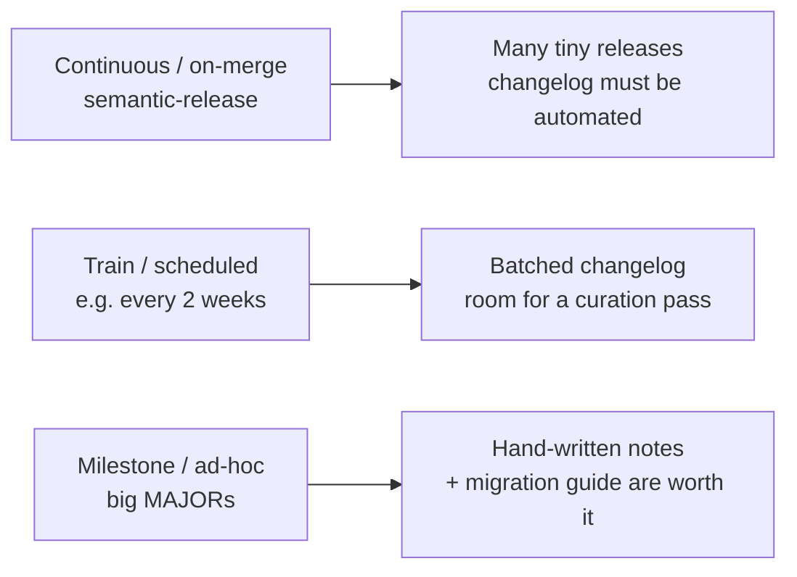
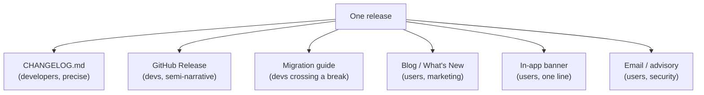
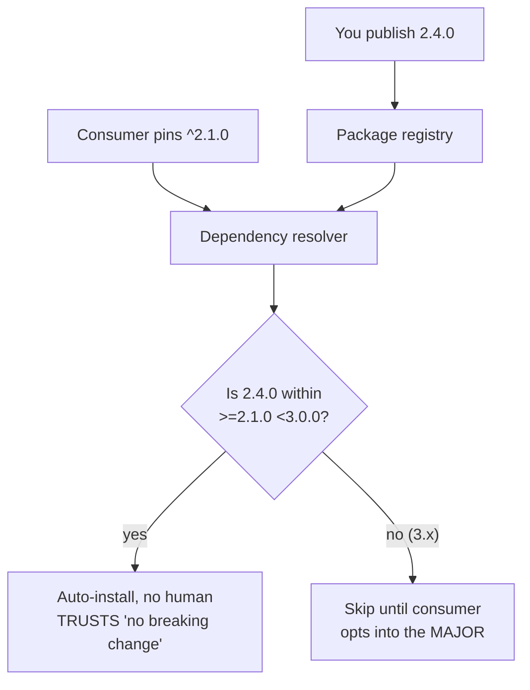
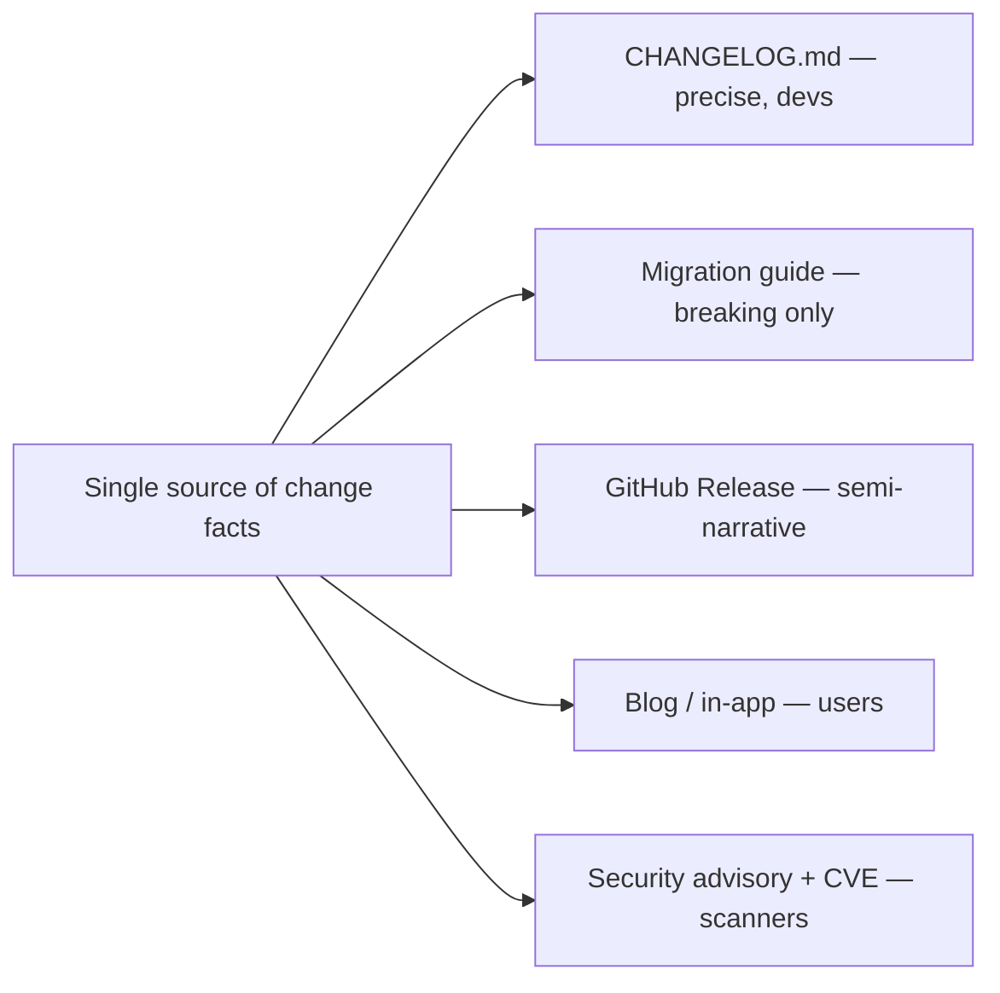

# Changelogs & Release Notes — Senior

> **Category:** [Documentation](../README.md) — communicating *what changed* between versions to the humans who must decide whether and how to upgrade.

> **Prerequisites:** [Junior](junior.md) · [Middle](middle.md)
> **Focus:** **Design trade-offs** and **system-level reasoning**

---

## Introduction

> Focus: **design trade-offs** and **system-level reasoning**

At the senior level, changelogs and versioning stop being a documentation chore and become an **interface design problem**. A published version number is a *contract* with everyone who depends on you; a changelog is the *evidence* that you honored it; a release note is the *relationship management* with users. Get these wrong at scale and you don't just have stale docs — you have broken builds across an ecosystem, eroded trust, and a support queue full of "the upgrade broke us."

This file covers the hard questions a senior owns:

1. **What does the version number actually promise, and what counts as breaking it?** (Far subtler than "MAJOR = breaking.")
2. **How do versioning strategy and release cadence interact** with the changelog discipline?
3. **How does this scale** to monorepos, security advisories, and many audiences at once — and where does automation help versus hurt?

---

## The Version Number Is an API Contract

Semver's deepest idea: **the version number is a machine-readable promise**, and an entire dependency-resolution ecosystem is built on trusting it.

When a consumer writes `"widget": "^2.1.0"` (npm caret) or `widget = ">=2.1,<3"` (Python), they are saying: *"Auto-install any MINOR or PATCH up to, but not including, the next MAJOR — because semver promises those won't break me."* Their CI installs `2.4.7` at 3 a.m. without a human looking, **trusting your version number**. Range operators (`^`, `~`, `>=`) only make sense because semver is a contract.

```
Consumer declares:  ^2.1.0   means  >=2.1.0  <3.0.0
                    └─ "give me features & fixes, but never a breaking change
                        without me explicitly opting in by bumping the range"
```

The consequences are stark:

- **Ship a breaking change as a MINOR**, and you break every consumer auto-upgrading within the range — silently, at scale, without anyone choosing it. This is the cardinal sin of versioning.
- **Bump MAJOR for a non-breaking change**, and you strand consumers on the old version (their range won't auto-adopt `3.x`), splitting your user base and fragmenting your support.

> The version number is not a label you choose by feel. It is a *commitment* that downstream automation acts on without asking. Treating it casually breaks the trust the whole ecosystem runs on.

The senior corollary: **the changelog and the version must be consistent or the contract is a lie.** If the version says PATCH but the changelog (honestly) lists a breaking change, your tooling and your humans disagree — and consumers get hurt by whichever they trusted.

---

## What "Breaking" Actually Means — and Why It's Slippery

"MAJOR = breaking change" is the easy part. The hard part is that *breaking* is defined relative to the **observable contract**, which is broader than most engineers assume. A change can be breaking even when no signature changed:

| Subtle breaking change | Why it breaks consumers |
|---|---|
| **Tightening input validation** | Inputs that used to be accepted now error — code that relied on leniency breaks. |
| **Changing a default value** | Behavior shifts for everyone who relied on the default. |
| **Changing error type/message** | Code that catches/parses errors breaks (this is the "Hyrum's Law" trap). |
| **Adding a required field** to a response/event | Consumers parsing strictly may break; producers adding required *request* fields definitely break. |
| **Changing timing/ordering** | Async consumers relying on order break. |
| **Bug fixes consumers depended on** | If observable behavior changes, someone was relying on the bug. |
| **Stricter types** | Narrowing a type breaks callers passing the wider type. |

> **Hyrum's Law:** *with enough consumers, every observable behavior of your system — not just the documented contract — will be depended upon by somebody.* So "breaking" is empirically about what consumers observe, not only about what you documented.

The senior judgment is twofold. First, **define your public contract explicitly** — what is API and what is internal — so you have a defensible line for "this change isn't breaking, you were depending on internals." (Mark internals clearly: `_private`, `internal` packages, `@internal` annotations.) Second, **when in doubt, treat it as breaking.** Under-calling a break (shipping it as MINOR) costs you far more in ecosystem trust than over-calling one (an extra MAJOR). The asymmetry favors caution.

---

## Release Cadence and Versioning Strategy

Senior teams choose a *strategy*, not just a format. The main axes:

**Versioning schemes** (semver is dominant but not universal):

| Scheme | Form | When it fits |
|---|---|---|
| **SemVer** | `MAJOR.MINOR.PATCH` | Libraries/APIs with consumers who need compatibility promises. The default. |
| **CalVer** | `YYYY.MM` / `2026.06` | Products where "when" matters more than "compatibility" (Ubuntu, pip). Communicates recency, not compatibility. |
| **ZeroVer** | stuck on `0.x` forever | A (mostly tongue-in-cheek) anti-pattern; signals "no stability promise" indefinitely. |

The deep point: **semver and CalVer answer different questions.** Semver answers *"is this safe to upgrade?"*; CalVer answers *"how old is this?"*. A library chooses semver because consumers need the compatibility promise; an end-user application may choose CalVer because users care about freshness, not API stability.

**Release cadence** interacts with the changelog effort:



- **Continuous release** (ship every merge) *requires* automation — no human can write notes per release. The changelog is necessarily mechanical.
- **Release trains** (fixed schedule) batch changes, which creates a natural window for a human curation pass and a coherent release narrative.
- **Milestone releases** (occasional, large) justify hand-crafted notes, a blog post, and a full migration guide — the effort amortizes over a big audience.

The strategy choice cascades: it determines whether your changelog *can* be hand-curated at all, and what your version numbers even mean.

---

## Monorepo and Multi-Package Changelog Complexity

The hardest changelog problem at scale is the **monorepo**: many independently-versioned packages in one repository. Now "what version is this?" and "what changed?" have *N* answers, not one.

The core difficulties:

- **A commit may touch multiple packages** — which one(s) does the change belong to? Per-commit parsing can't always tell.
- **Packages have independent versions.** `@acme/core` is at `4.2.0` while `@acme/cli` is at `1.7.3`; a single PR might bump one, both, or neither.
- **Internal dependency cascades.** If `@acme/core` makes a breaking change, every package depending on it must bump *and* get a changelog entry explaining the propagated change.

This is exactly what **changesets** is built for. Instead of inferring intent from commit messages, the *author* declares intent in a small file per PR:

```markdown
---
"@acme/core": minor
"@acme/cli": patch
---

Add streaming support to the core client; CLI now exposes `--stream`.
```

At release time, the tool aggregates all changesets, computes each package's correct bump, **propagates dependency bumps** (a `core` minor that `cli` depends on may force a `cli` patch), writes a *per-package* `CHANGELOG.md`, and versions each independently.

| Approach | Strength | Weakness |
|---|---|---|
| **Commit-message inference** (semantic-release per package) | No extra author work | Struggles to attribute a commit to the right package |
| **Intent files** (changesets) | Author states package + bump explicitly; handles cascades | Requires authors to remember the changeset file |

The senior takeaway: in a monorepo, **make the change-intent explicit per PR** (the changeset model) rather than reverse-engineering it from commits — the attribution and dependency-cascade problems make pure commit inference unreliable. The trade-off is one more file per PR, enforced in CI ("PR must include a changeset or explicitly mark itself as no-release").

---

## Security Advisories and CVE Linkage

Security changes are a distinct discipline layered on top of the changelog, because the audience and timing differ:

- **Coordinated disclosure:** you often fix *before* you disclose, to avoid handing attackers a roadmap. The changelog entry and the public advisory may be *delayed* relative to the patch, or released together at an embargo lift.
- **CVE linkage:** a security fix should reference its identifier — `CVE-2026-0011`, or a GitHub Security Advisory `GHSA-xxxx` — so vulnerability scanners (Dependabot, Snyk, OSV) can match it to consumers' lockfiles and alert them automatically.
- **Out-of-band releases:** security patches don't wait for the next scheduled release. They ship immediately, often as a PATCH to *every* currently-supported version line (`1.9.x`, `2.4.x`, `3.1.x`) — backported.

```markdown
### Security
- Fixed header-injection allowing request smuggling (CVE-2026-0011, GHSA-q8xk-...).
  Patched in 3.1.4, 2.4.9, and 1.9.12. **Upgrade immediately.**
```

The senior responsibility is to wire the changelog into the **machine-readable security ecosystem** (the GitHub Advisory Database / OSV feed), not just write prose — because that's what lets a consumer's `dependabot` open an upgrade PR the morning after you disclose. A security fix that isn't discoverable by scanners protects only the people who happen to read your changelog.

---

## The Automation-vs-Curation Decision, at System Scale

The middle level framed this as a per-project choice; at the senior level it's a *portfolio* decision shaped by audience and contract surface:

| Factor | Pushes toward **automation** | Pushes toward **curation** |
|---|---|---|
| Audience | Other developers / machines | End users / executives |
| Release frequency | High (continuous) | Low (milestones) |
| Contract surface | Internal / library API | Product features |
| Cost of a bad note | Low (devs can read code) | High (user confusion, support load) |
| Number of packages | Many (monorepo) | Few |

The mature stance: **automate the contract-keeping, curate the relationship.** The version bump and the precise change list are bookkeeping — let machines own them, because consistency with the contract is what matters and humans are unreliable at it. The *narrative* a user reads — what's exciting, what to watch out for, how to migrate — is relationship work; a human should own it. A team that automates everything ships technically-correct, unreadable notes; a team that hand-writes everything is inconsistent and slow. Split the responsibility along the contract/relationship line.

---

## Designing for the Audiences You Actually Have

One release event fans out to several artifacts, each tuned to an audience and channel. Designing this fan-out is a senior responsibility:



The design rules:

- **Single source of facts, multiple renderings.** All channels derive from one accurate change list; you reframe, you don't re-decide. Divergent facts across channels destroy trust.
- **Match register to channel.** The in-app banner is one sentence; the changelog is a precise list; the blog is a story. Same facts, different *level of detail and tone*.
- **Security gets its own urgent channel.** "Upgrade now" doesn't belong buried in a blog post; it needs the advisory + email + a pinned changelog entry.
- **Breaking changes get a dedicated guide**, linked from every other channel, never crammed into a one-liner.

The anti-pattern is publishing the raw, mechanical changelog to *every* channel — dumping `fix: handle nil pointer in pool (#1290)` into a user-facing "What's New" that no user can parse. Audience-fit is the whole job.

---

## "Nobody Reads Release Notes Until They Break"

A hard truth seniors must design around: **most consumers ignore your notes — right up until an upgrade breaks them, at which point the notes are the only thing standing between them and a support ticket.** This reality drives several design decisions:

- **Optimize the changelog for the *failure* moment, not the browsing moment.** The reader who matters most arrives *after* something broke, searching for "what changed in 3.0 and how do I fix it." Make breaking changes and migration steps the most prominent, most findable thing — not buried among features.
- **Make breakage loud and self-explaining.** Deprecation warnings *at runtime* (not just in the changelog) reach people who never read docs. A removed feature should fail with an error that *names the changelog/migration guide*.
- **Don't rely on humans reading to stay safe.** This is why security fixes must be machine-discoverable (CVE/OSV) — you cannot assume anyone read the Security section.

> Design the release notes as if the reader is angry, in a hurry, and arrived because something just broke — because that's your most important reader. Everything else is a bonus.

---

## Changelogs as Part of the Doc System

A senior treats the changelog not as a standalone file but as a node in the documentation system ([docs-as-code](../10-docs-as-code-and-tooling/senior.md)):

- **It lives in the repo and is reviewed in PRs** — the changelog entry (or changeset) is part of the *definition of done* for a change, gated in CI.
- **It cross-references the rest of the docs:** breaking entries link migration guides; the [README](../03-readmes-and-onboarding-docs/senior.md) links the changelog; [versioned reference docs](../04-api-and-reference-documentation/senior.md) align with the version line the changelog describes.
- **It is a primary weapon against [doc rot](../11-keeping-docs-alive-and-doc-rot/senior.md):** because it's written *with* the change (or generated *from* the change), it can't drift the way after-the-fact docs do. A changelog generated from commits is, by construction, never stale.

The system view: the changelog is where *what changed* is recorded once and propagated everywhere — reference docs, release notes, advisories, the README's "latest version" badge. Treating it as the single source of change-truth is what keeps the whole doc set consistent across versions.

---

## Liabilities

### Liability 1: A version number that lies

Shipping a breaking change as a MINOR/PATCH (or to satisfy a green CI) breaks the contract every consumer's dependency resolver trusts — silently, at ecosystem scale. The most expensive mistake in the topic. Audit "is this breaking?" against the *observable* contract (Hyrum's Law), not just signatures.

### Liability 2: Automation that ships nonsense

Fully automated notes are only as good as commit messages. `fix: stuff` becomes a worthless changelog line that a customer reads. Without a human gate on user-facing notes, you publish mechanically-correct, humanly-useless releases.

### Liability 3: Removal without a deprecation window

Deleting a feature that was never deprecated — no warning, no timeline, no migration guide — is the trust-killer. Even a correct MAJOR bump doesn't excuse skipping the deprecation runway for anything widely used.

### Liability 4: Security fixes invisible to scanners

A patched CVE with no CVE/GHSA linkage protects only the handful of people who read your changelog. The fix exists; the *discoverability* doesn't; consumers stay vulnerable. Wire releases into the advisory ecosystem.

### Liability 5: Monorepo changelog drift

In a monorepo, inferring per-package bumps from commits mis-attributes changes and misses dependency cascades, producing per-package changelogs that are subtly wrong. Use explicit intent (changesets) and enforce it in CI.

---

## Pros & Cons at the System Level

| Dimension | Automated (commits → tool) | Hand-curated |
|---|---|---|
| Consistency with the version contract | **High** — version always matches commits | Depends on discipline |
| Effort at scale | Near zero | Grows with release count |
| Readability for users | Low — mechanical | **High** if written well |
| Correctness in monorepos | Needs changeset-style intent files | Hard to keep consistent by hand |
| Security/advisory integration | Strong (tooling links CVEs) | Manual, easy to forget |
| Narrative / relationship value | Weak | **Strong** |
| Best for | Libraries, monorepos, high cadence, dev audience | Products, milestones, user audience |

The system stance: **automate the parts that must be consistent with the contract (version, change list, advisory linkage) and curate the parts that build a relationship (the narrative, the migration guide).** This split — not "automate everything" or "write everything by hand" — is what scales across many packages, audiences, and release cadences without either lying to consumers or boring them.

---

## Diagrams

### The version number as the contract that ecosystem automation trusts



### Audience fan-out from one release



---

## Related Topics

- **Lives in the repo as docs-as-code:** [Docs as Code & Tooling](../10-docs-as-code-and-tooling/senior.md)
- **The README points to the changelog:** [READMEs & Onboarding](../03-readmes-and-onboarding-docs/senior.md)
- **Versioned reference must align with the version line:** [API & Reference Documentation](../04-api-and-reference-documentation/senior.md)
- **The changelog fights doc rot:** [Keeping Docs Alive](../11-keeping-docs-alive-and-doc-rot/senior.md)

---


---

## Check your understanding

1. Explain Changelogs & Release Notes — Senior Level in your own words and name the problem it solves.
2. How would you apply the ideas around Table of Contents, Introduction, The Version Number Is an API Contract in a realistic engineering change?
3. What failure mode or misuse should you look for, and what evidence would reveal it?
4. How would you validate a system-level decision about Changelogs & Release Notes — Senior Level under uncertainty?
5. What observable result would convince you that the approach improved the system?
