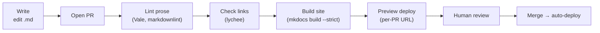
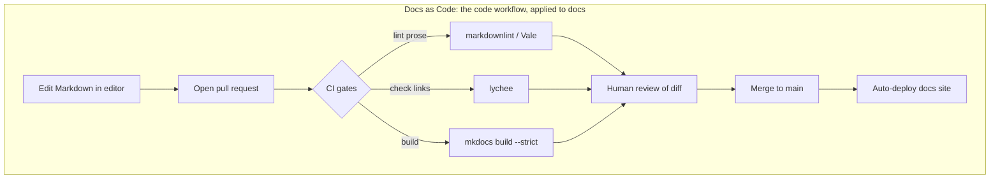

# Docs as Code & Tooling — Junior

> **Category:** [Documentation](../README.md) — treat documentation like source code: plain-text, in version control, reviewed in pull requests, built and tested in CI, deployed automatically.

---

## Introduction

> Focus: **What is it?** and **How to use it?**

**Docs as Code** is a way of working, popularized by the *Write the Docs* community, in which you produce documentation using the **same tools and workflow you already use for source code**:

> Plain-text docs live in **version control** (Git), are changed through **pull requests**, are **reviewed** like code, are **built and tested in CI**, and are **deployed automatically** to a docs site.

That is the whole idea. There is no separate documentation tool that engineers must context-switch into, no Word file emailed around, no wiki that drifts out of date. A doc is a `.md` file in the repo. You edit it in your editor, open a PR, a teammate reviews the diff, CI checks that links aren't broken and the prose is clean, and on merge the site rebuilds and redeploys.

### Why this matters

The reason teams adopt Docs as Code is brutally practical: **documentation that lives anywhere other than next to the code rots.** A wiki page describing how a service starts up is correct the day it's written and wrong three deploys later, because nothing ties it to the code. When the docs are in the same repo as the code, a change to behavior and a change to its docs can land in the **same pull request**, get reviewed together, and ship together. The drift problem shrinks dramatically.

Docs as Code also lets engineers contribute **without leaving their workflow.** Fixing a typo or clarifying a setup step is a normal edit-and-PR, not "log into Confluence, find the page, hope you have edit rights." Lowering that friction is how docs actually get maintained.

---

## Prerequisites

- **Required:** Basic **Git** — clone, branch, commit, open a pull request. Docs as Code *is* a Git workflow.
- **Required:** Comfort writing **[Markdown](#markup-why-plain-text)** (headings, lists, links, fenced code blocks).
- **Helpful:** Familiarity with **code review** — docs are reviewed the same way.
- **Helpful:** A first look at **[CI/CD](#the-docs-ci-pipeline)** — the pipeline that lints, builds, and deploys.
- **Connects to:** [Code Comments & Docstrings](../02-code-comments-and-docstrings/junior.md) (the in-code layer), [API & Reference Docs](../04-api-and-reference-documentation/junior.md), [Diagrams as Code](../08-diagrams-as-code/junior.md).

---

## Glossary

| Term | Definition |
|------|-----------|
| **Docs as Code** | Treating docs with the same tooling and workflow as source code: plain-text, versioned, PR-reviewed, CI-built, auto-deployed. |
| **Markup language** | A plain-text format that encodes structure (headings, links, code) with simple syntax — e.g., Markdown, reStructuredText, AsciiDoc. |
| **Static Site Generator (SSG)** | A tool that turns markup files into a finished HTML website — e.g., MkDocs, Docusaurus, Sphinx, Hugo. |
| **Front matter** | A small metadata block at the top of a file (title, tags, weight) that the SSG reads — usually YAML between `---` fences. |
| **Linter** | A tool that automatically checks text for problems — broken links, style violations, spelling. |
| **Link checker** | A tool that visits every link in the docs and fails the build if any is dead (e.g., `lychee`). |
| **CI (Continuous Integration)** | Automation that runs checks (lint, build) on every push/PR — here, the *docs pipeline*. |
| **Preview deploy** | A temporary, per-PR version of the docs site so reviewers see the rendered change before merge. |
| **Single source of truth** | One authoritative place a piece of information lives, so it can't disagree with itself. |
| **Doc rot** | Documentation that has silently become wrong because the thing it describes changed. |

---

## The Core Idea

Map every step of the code workflow onto documentation:

| Code workflow | Docs-as-Code equivalent |
|---|---|
| Source files in a repo | Markdown files in a repo |
| Branch + commit | Branch + commit (same) |
| Pull request | Pull request (same) |
| Code review | Docs review — reviewer reads the diff |
| Linter / formatter | Prose linter (`Vale`, `markdownlint`) |
| Unit tests | Link-checking, spell-check, build-fails-on-warning |
| CI build | SSG build (`mkdocs build`) |
| Deploy on merge | Site auto-rebuilds and redeploys |
| `git log` / blame | Same — full history of who changed what doc, and why |

The payoff of this mapping: **everything you already know about working with code now applies to docs.** Diffs, blame, reverts, review, branching, automation — all of it transfers for free.

---

## Why It Works: Docs Live Next to the Code

The single most important benefit is **co-location**. When the documentation for a module sits in the same repository (often the same directory) as the module:

- A behavior change and its doc update are **one atomic PR**. A reviewer who approves the code change *sees the doc change too* and can block "you changed the flag default but didn't update the docs."
- The doc is **diffed and reviewed** — a reviewer catches a wrong example before users hit it.
- **History is preserved.** `git blame README.md` tells you who wrote a claim and links to the commit (and PR, and ticket) that explains *why*.
- There is **one place to look.** No "is the truth in the code, the wiki, or that Google Doc someone shared in 2022?"

```text
my-service/
├── src/
│   └── auth/
│       └── tokens.py
└── docs/
    └── auth/
        └── tokens.md      ← lives beside the code it documents; updated in the same PR
```

> The closer a document lives to the thing it describes, the smaller the chance it drifts — because the same person, in the same change, is reminded to update both.

---

## The "Where Is the Truth?" Problem

Before Docs as Code, most teams scatter documentation across tools that don't talk to each other:

```text
        ┌──────────────┐   ┌──────────────┐   ┌──────────────┐
        │  Word doc on │   │  Confluence  │   │ Google Doc   │
        │  someone's   │   │  wiki page   │   │ shared in    │
        │  laptop      │   │  (last edited│   │ a Slack DM   │
        │              │   │   8mo ago)   │   │              │
        └──────────────┘   └──────────────┘   └──────────────┘
                  ▲                ▲                  ▲
                  └──── all claim to describe the same service ─────┘
                          which one is correct today?
```

Each of these can be edited independently, none is tied to the code, and none fails when the code changes. The result is **three documents that disagree** and an engineer who trusts none of them — so they read the code instead, and the docs become pure overhead.

Docs as Code solves this by **collapsing the truth into the repo.** The docs that ship are the docs in `main`. They were reviewed alongside the code. If they're wrong, that's a bug you can file, fix, and trace — not a mystery. (Fighting drift is the whole subject of [Keeping Docs Alive & Doc Rot](../11-keeping-docs-alive-and-doc-rot/junior.md).)

---

## Markup: Why Plain Text

Docs as Code starts with **plain-text markup** rather than a binary WYSIWYG format (`.docx`), because plain text is what Git diffs cleanly. The default is **Markdown**.

### Markdown (the default)

Markdown is a lightweight syntax that reads almost like the text it produces:

```markdown
# Authentication

Call `POST /login` with a JSON body:

```json
{ "email": "a@b.com", "password": "..." }
```

See the token guide for refresh handling.
```

There are two flavors you'll meet constantly:

- **CommonMark** — the strict, unambiguous specification of "core" Markdown.
- **GitHub-Flavored Markdown (GFM)** — CommonMark plus tables, task lists, fenced code with language hints, and strikethrough. This is what most repos and SSGs assume.

### Front matter (metadata)

Many SSGs let a file carry metadata in a **YAML front-matter block** at the very top:

```markdown
---
title: Authentication
weight: 20
tags: [security, api]
---

# Authentication
...
```

The SSG reads this to set the page title, ordering, tags, etc. — without putting that metadata into the visible body.

### When Markdown isn't enough

Markdown is deliberately simple, which means it has limits (no footnotes, admonitions, or includes in vanilla form). When you outgrow it, teams reach for richer markup — **MyST** (Markdown with extensions), **reStructuredText** (Sphinx's powerful markup with *directives* and *roles*), or **AsciiDoc** (built for books and large manuals). The trade-off is always **simplicity vs. power** — covered in depth at [Middle](middle.md). For most engineering docs, GFM is plenty.

---

## Static Site Generators

A **Static Site Generator (SSG)** is the tool that turns your folder of Markdown into a real website: navigation, search, theming, and a set of HTML files you can host anywhere.

```text
   docs/*.md  ──▶  [ Static Site Generator ]  ──▶  site/*.html
   (you write)        (mkdocs / sphinx / ...)        (deployed)
```

The common choices a junior should recognize:

| Generator | Markup | Sweet spot |
|---|---|---|
| **MkDocs** (+ *Material* theme) | Markdown | Project/product docs; simple, fast; **what this repo uses** |
| **Docusaurus** | Markdown/MDX | React-based product docs; versioning, i18n built in |
| **Sphinx** (+ *Read the Docs*) | reStructuredText/MyST | Python ecosystem; powerful API autodoc |
| **Hugo** | Markdown | Very fast; large sites, blogs |
| **mdBook** | Markdown | Single-book docs (Rust ecosystem) |

You don't need to know all of them. You need to know that **the same Markdown can feed any of them**, and that the team picks one and standardizes.

---

## This Repo as a Concrete Example: MkDocs + .pages

The repository you're reading right now *is* a docs-as-code project. It uses **MkDocs** with the **awesome-pages** plugin, which controls navigation through small `.pages` files placed in each folder. That is exactly the file sitting next to this one:

```yaml
# .pages  — controls the order pages appear in the nav for THIS folder
nav:
  - junior.md
  - middle.md
  - senior.md
  - professional.md
```

A top-level `mkdocs.yml` configures the whole site:

```yaml
site_name: Engineering Roadmap
theme:
  name: material
plugins:
  - search
  - awesome-pages          # lets each folder define nav via a .pages file
markdown_extensions:
  - admonition             # > !!! note blocks
  - pymdownx.superfences   # nested/fenced code + mermaid
  - toc:
      permalink: true
```

So when you write a topic, you are practicing Docs as Code: Markdown files + a `.pages` nav, committed to Git, reviewed in a PR, built by MkDocs. Everything in this section describes the very workflow that produced it.

---

## The Docs CI Pipeline

The "tested in CI" part is what separates Docs as Code from "just put Markdown in Git." A docs pipeline runs **quality gates** on every PR, the same way a code pipeline runs unit tests.



The gates a junior will see most:

- **Link checking** — a tool like `lychee` visits every link and **fails the build on a dead link**. This is how a docs site avoids the "404 in the docs" embarrassment. (This repo checks links exactly this way.)
- **Prose / Markdown linting** — `markdownlint` enforces consistent Markdown (heading levels, list style); `Vale` enforces a *style guide* (banned phrases, terminology).
- **Build-fails-on-warning** — `mkdocs build --strict` turns warnings (like a broken internal link or a page missing from the nav) into a *failed build*, so problems can't sneak in.

Here is a minimal real GitHub Actions workflow doing the first three:

```yaml
# .github/workflows/docs.yml
name: docs
on: [pull_request]
jobs:
  check:
    runs-on: ubuntu-latest
    steps:
      - uses: actions/checkout@v4
      - uses: actions/setup-python@v5
        with: { python-version: "3.12" }

      - name: Install
        run: pip install mkdocs-material mkdocs-awesome-pages-plugin

      - name: Lint Markdown
        uses: DavidAnson/markdownlint-cli2-action@v16
        with: { globs: "docs/**/*.md" }

      - name: Check links
        uses: lycheeverse/lychee-action@v2
        with: { args: "--no-progress docs/" }

      - name: Build (fail on warning)
        run: mkdocs build --strict
```

If any step fails, the PR is blocked — the docs equivalent of a red test. (Spell-check, preview deploys, and prose style are added at [Middle](middle.md).)

---

## A Minimal Docs-as-Code Setup, End to End

Putting it together, here's the smallest complete setup and the loop you live in:

```text
repo/
├── mkdocs.yml                     # site config
├── docs/
│   ├── index.md                   # home page
│   └── guide/
│       ├── .pages                 # nav order for this folder
│       └── getting-started.md
└── .github/workflows/docs.yml     # lint + linkcheck + build in CI
```

The daily loop:

1. `git switch -c docs/clarify-setup` — branch.
2. Edit `docs/guide/getting-started.md` in your editor; run `mkdocs serve` to preview locally at `localhost:8000`.
3. Commit and `git push`; open a PR.
4. CI lints prose, checks links, builds with `--strict`. A teammate reviews the rendered diff.
5. On merge, the site rebuilds and deploys automatically.

That loop is **identical to shipping code** — which is the entire point.

---

## Best Practices

1. **Keep docs in the repo, next to the code they describe.** Co-location is the main weapon against drift.
2. **Write Markdown (GFM).** Start simple; reach for richer markup only when you hit a real limit.
3. **Update docs in the same PR as the behavior change** — never as a "later" ticket that never happens.
4. **Run the SSG locally** (`mkdocs serve`) before pushing, so you see the rendered result.
5. **Treat a red docs pipeline like a red test** — fix broken links and lint errors, don't merge around them.
6. **Use `--strict` builds** so warnings (broken internal links, missing nav entries) fail loudly.
7. **Review docs like code** — read the rendered diff, check that examples are correct and links resolve.

---

## Common Mistakes

1. **Putting docs in a separate wiki/Confluence "for now."** It immediately starts drifting from the code and re-creates the "where's the truth?" problem.
2. **Skipping link checking.** Without it, the docs site quietly fills with 404s as files move and rename.
3. **Editing the generated HTML** instead of the Markdown source — your change is overwritten on the next build.
4. **Committing the built `site/` directory** to Git. The build output is generated; only the source belongs in version control.
5. **Treating docs PRs as un-reviewable.** A wrong example or a misleading sentence is a defect; review it.
6. **Reaching for AsciiDoc/reStructuredText "to be safe"** before you've outgrown Markdown — extra power you don't need is extra friction for contributors.

---

## Tricky Points

- **Static site ≠ "no server features."** Static means the *output* is plain HTML/JS/CSS with no backend to run — but you still get client-side **search**, navigation, and theming. "Static" refers to hosting, not capability.
- **`mkdocs build` vs `mkdocs serve`.** `serve` runs a live-reloading local preview; `build` produces the `site/` folder CI deploys. Use `serve` while writing, `build --strict` in CI.
- **`.pages` is MkDocs-specific.** The awesome-pages plugin reads it to order/title navigation per folder; it isn't a Markdown or Git feature. (It's why this repo orders topics junior→interview without one giant nav block in `mkdocs.yml`.)
- **A link checker that's too aggressive becomes noise.** External links break for reasons outside your control (a third-party site goes down). Teams often check internal links strictly and external links on a looser schedule — more at [Middle](middle.md).

---

## Test Yourself

1. In one sentence, what is "Docs as Code"?
2. Name three things you get "for free" by putting docs in Git under the same workflow as code.
3. What problem does co-locating docs with code solve, and how?
4. What is a Static Site Generator, and what does this repo use?
5. What does the `.pages` file in this folder do?
6. Name three checks a docs CI pipeline commonly runs.

---

## Cheat Sheet

```text
DOCS AS CODE = same tools/workflow as source code
  plain-text  →  version control  →  pull request  →  review
             →  CI (lint + linkcheck + build)  →  auto-deploy

MARKUP        Markdown (CommonMark / GitHub-Flavored) is the default
              front matter = YAML metadata block at top (--- ... ---)

SSG           Markdown → website.  This repo: MkDocs + Material + awesome-pages
              .pages file = per-folder nav order (MkDocs-specific)

CI GATES      link-check (lychee)  |  markdownlint  |  Vale (prose style)
              mkdocs build --strict  (warnings → failed build)

DAILY LOOP    branch → edit → `mkdocs serve` preview → PR → CI → review → merge

GOLDEN RULE   docs change ships in the SAME PR as the behavior change
```

---

## Summary

- **Docs as Code** treats documentation exactly like source code: plain-text, in Git, changed via PRs, reviewed, built/tested in CI, deployed automatically.
- It works because docs **live next to the code** — a behavior change and its doc update land in one reviewed PR, which is the strongest defense against drift and the "where's the truth?" problem.
- The default markup is **Markdown** (CommonMark / GitHub-Flavored), with **front matter** for metadata; richer markup exists for when you outgrow it.
- A **Static Site Generator** turns Markdown into a website. **This repo uses MkDocs** with the Material theme and the awesome-pages `.pages` convention.
- A **docs CI pipeline** runs quality gates — link-checking, Markdown/prose linting, and `--strict` builds — so docs problems block a PR like a failing test.

---

## Further Reading

- *Write the Docs* — [Docs as Code](https://www.writethedocs.org/guide/docs-as-code/) — the community origin of the term.
- [MkDocs](https://www.mkdocs.org/) and [Material for MkDocs](https://squidfunk.github.io/mkdocs-material/) — the SSG this repo uses.
- [awesome-pages plugin](https://github.com/lukasgeiter/mkdocs-awesome-pages-plugin) — the `.pages` convention.
- [CommonMark](https://commonmark.org/) and [GitHub-Flavored Markdown](https://github.github.com/gfm/) specs.
- [lychee](https://github.com/lycheeverse/lychee) — fast link checker.

---

## Related Topics

- **The in-code layer:** [Code Comments & Docstrings](../02-code-comments-and-docstrings/junior.md)
- **Feeds the docs site:** [API & Reference Docs](../04-api-and-reference-documentation/junior.md), [Diagrams as Code](../08-diagrams-as-code/junior.md), [Changelogs & Release Notes](../09-changelogs-and-release-notes/junior.md)
- **The goal behind it all:** [Keeping Docs Alive & Doc Rot](../11-keeping-docs-alive-and-doc-rot/junior.md)

---

## Diagrams




---

## Check your understanding

1. Explain Docs as Code & Tooling — Junior Level in your own words and name the problem it solves.
2. How would you apply the ideas around Table of Contents, Introduction, Prerequisites in a realistic engineering change?
3. What failure mode or misuse should you look for, and what evidence would reveal it?
4. What small example would prove that you can apply Docs as Code & Tooling — Junior Level correctly?
5. What observable result would convince you that the approach improved the system?
