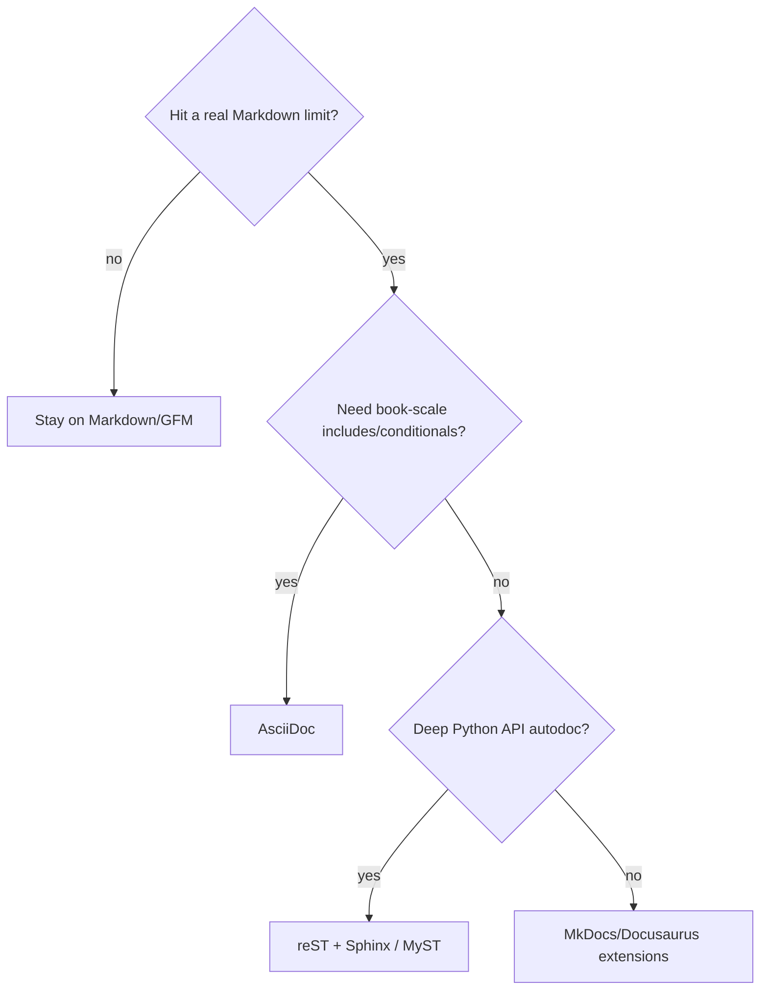
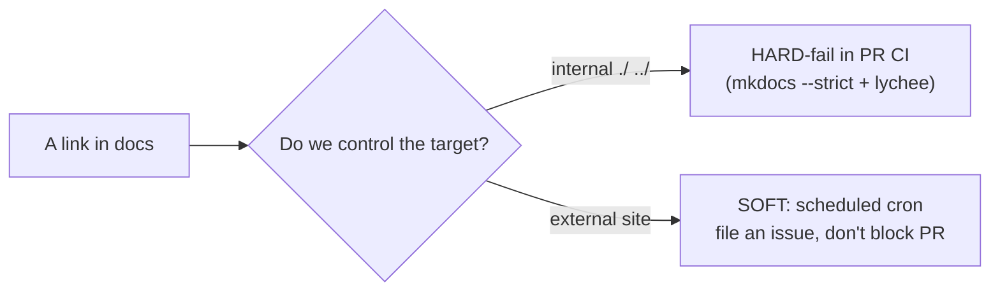

# Docs as Code & Tooling — Middle

> **Category:** [Documentation](../README.md) — treat documentation like source code: plain-text, in version control, reviewed in pull requests, built and tested in CI, deployed automatically.

> **Prerequisite:** [Junior](junior.md)
> **Focus:** **Why** and **When**

---

## Introduction

> Focus: **Why** and **When**

At the junior level Docs as Code is a workflow you follow. At the middle level it becomes a set of **decisions you make for a team**: which markup, which generator, which CI gates, how strict, how to preview, how to version. Each choice has a *when* — a condition under which it's right — and the middle-level skill is matching the tool to the situation instead of cargo-culting whatever a tutorial used.

The throughline is the same as for any engineering tooling: **the workflow exists to reduce friction and catch defects automatically.** Every gate you add to the pipeline must earn its keep by catching a real class of problem (broken links, wrong terminology, a build that won't render) without becoming noise that the team learns to ignore. A docs pipeline that cries wolf is worse than no pipeline.

---

## Choosing a Markup Language

The markup decision is mostly **simplicity vs. power**, weighted heavily toward *who writes the docs.*

| Markup | Strengths | Weaknesses | Choose when |
|---|---|---|---|
| **Markdown (CommonMark/GFM)** | Trivial to learn; everyone knows it; diffs cleanly; supported everywhere | Limited: no native includes, footnotes, complex tables, admonitions | Default for almost all engineering docs |
| **MyST** (Markdown extensions) | Markdown that gains Sphinx's power (directives, roles, cross-refs) | Tied to the Sphinx/Jupyter ecosystem | You want Markdown ergonomics *and* Sphinx features |
| **reStructuredText (reST)** | Powerful, extensible; **directives** and **roles**; strong cross-referencing; Python's standard | Fussy syntax; steeper learning curve; weaker outside Python | Python projects, deep API autodoc via Sphinx |
| **AsciiDoc** | Built for **large docs/books**: includes, conditionals, rich tables, admonitions, indexes | Smaller ecosystem; another syntax to learn | Manuals, books, large multi-file technical references |

### The decision rule

> **Start with Markdown. Switch only when a concrete limitation blocks you** — and bias toward keeping the simplest markup your *contributors* can use, because the people who fix docs are often not the people who set up the toolchain.

The classic trap is reaching for reST or AsciiDoc "because it's more powerful," then discovering that every casual contributor (a backend engineer fixing one wrong step) now has to learn unfamiliar syntax — so they don't, and docs stop getting fixed. The power you bought costs you the contributions that keep docs alive. For 90% of engineering docs, GFM plus a few SSG extensions (admonitions, includes) is the right answer.

A pragmatic middle path many teams use: **Markdown for hand-written guides, generated reference docs from the source of truth** (OpenAPI, docstrings) merged into the same site — see [Information Architecture](#information-architecture-single-sourcing) and [API & Reference Docs](../04-api-and-reference-documentation/middle.md).

---

## Choosing a Static Site Generator

The SSG is a longer-lived commitment than the markup; migrating sites is real work. Pick for your ecosystem and your *abandonment risk.*

| Generator | Stack | Versioning | Multi-repo | Best for |
|---|---|---|---|---|
| **MkDocs** + Material | Python | via `mike` plugin | no (single repo) | Project/product docs; fast to stand up — **this repo** |
| **Docusaurus** | React/Node | built-in | no | Product docs with i18n + versioning out of the box |
| **Sphinx** + Read the Docs | Python | RTD handles it | no | API-heavy Python docs; autodoc from docstrings |
| **Hugo** | Go | manual | no | Very large sites, blogs, speed-critical builds |
| **Antora** | Node/Asciidoctor | built-in | **yes** | Docs aggregated from **many repos** |
| **mdBook** | Rust | manual | no | A single book/manual |
| **Docsify** | runtime JS | manual | no | Zero-build docs (renders MD in the browser) |

### What to weigh

- **Ecosystem fit.** Python team → MkDocs or Sphinx (you can `pip install` everything and reuse docstrings). JS/React product → Docusaurus.
- **Versioned docs needed?** If you ship versioned releases, prefer a generator with first-class versioning (Docusaurus, RTD, MkDocs+`mike`) over bolting it on later.
- **Multi-repo?** If docs come from many repositories, **Antora** is purpose-built; most others assume one repo.
- **Abandonment risk.** Prefer a generator with an active maintainer community and a large user base. A clever-but-niche generator that goes unmaintained becomes a migration project. (More at [Senior](senior.md).)

> **This repo uses MkDocs + Material + awesome-pages** — a deliberately boring, widely-supported choice. "Boring" is a feature: low abandonment risk, huge community, trivial onboarding.

---

## The Full CI Pipeline: Every Gate

The junior file showed lint + linkcheck + build. The full pipeline adds spell-check, prose style, preview deploys, and (for code-heavy docs) executable examples.


A representative full workflow:

```yaml
# .github/workflows/docs.yml
name: docs
on: [pull_request]
jobs:
  quality:
    runs-on: ubuntu-latest
    steps:
      - uses: actions/checkout@v4
      - uses: actions/setup-python@v5
        with: { python-version: "3.12" }
      - run: pip install mkdocs-material mkdocs-awesome-pages-plugin mike

      - name: Markdown structure
        uses: DavidAnson/markdownlint-cli2-action@v16
        with: { globs: "docs/**/*.md" }

      - name: Prose style (Vale)
        uses: errata-ai/vale-action@reviewdog
        with: { files: docs }

      - name: Spelling
        uses: streetsidesoftware/cspell-action@v6
        with: { files: "docs/**/*.md" }

      - name: Links (internal strict, external best-effort)
        uses: lycheeverse/lychee-action@v2
        with: { args: "--no-progress --exclude-mail docs/" }

      - name: Build (warnings are errors)
        run: mkdocs build --strict
```

The principle: **each gate maps to a distinct failure class.** markdownlint = malformed structure; Vale = wrong terminology/tone; cspell = typos; lychee = dead links; `--strict` = won't render/missing nav. Don't pile on overlapping linters — redundant findings train people to ignore the pipeline.

---

## Prose Linting with Vale

**Vale** is a configurable prose linter: it enforces a *style guide* in CI the way ESLint enforces code style. You write rules (or import a ready-made style like Google's or Microsoft's) and Vale flags violations in the diff.

A `.vale.ini` wiring up a style:

```ini
StylesPath = .vale/styles
MinAlertLevel = warning

[*.md]
BasedOnStyles = Vale, Google      # import Google's developer style
```

A custom rule — ban marketing fluff and enforce terminology:

```yaml
# .vale/styles/House/Filler.yml
extends: existence
message: "Avoid filler — '%s' adds no information."
level: warning
ignorecase: true
tokens:
  - simply
  - just
  - obviously
  - easily
```

```yaml
# .vale/styles/House/Terms.yml  — enforce one spelling of a product term
extends: substitution
message: "Use '%s' (the canonical spelling)."
level: error
ignorecase: false
swap:
  '(?i)git ?hub': GitHub
  '(?i)java ?script': JavaScript
```

This is how a team enforces *"always say GitHub, never github"* or *"don't write 'simply just'"* automatically, instead of relitigating it in every review. Related linters in the same family: **write-good** (weak/passive prose), **alex** (insensitive/exclusionary wording), **markdownlint** (Markdown structure). Pick one prose-style tool (usually Vale) and one structure tool (markdownlint) — running all four overlaps and creates noise.

---

## Link Checking That Doesn't Cry Wolf

A naive link checker that hard-fails on *every* dead link, internal and external, becomes a flaky gate: a third-party site has a hiccup and your unrelated docs PR goes red. The middle-level pattern splits link checking by **who controls the link**:

| Link type | You control it? | Policy |
|---|---|---|
| **Internal** (`./tokens.md`, `../api/`) | Yes | **Hard-fail in PR CI.** A broken internal link is always your bug. |
| **External** (other sites) | No | **Don't gate PRs.** Check on a schedule (nightly/weekly cron) and file an issue; tolerate transient flakiness. |

```yaml
# Scheduled external check — reports, doesn't block PRs
on:
  schedule: [{ cron: "0 6 * * 1" }]   # weekly
jobs:
  external-links:
    runs-on: ubuntu-latest
    steps:
      - uses: actions/checkout@v4
      - uses: lycheeverse/lychee-action@v2
        with: { args: "--max-retries 3 docs/" }
        # on failure → open/update a tracking issue, not block a PR
```

`mkdocs build --strict` already hard-fails on broken **internal** links and missing-from-nav pages, so internal integrity is covered at build time. Reserve the external link checker for a cron job. This keeps the PR gate trustworthy: when it's red, it's *your* fault and *worth* fixing.

---

## Preview Deploys per PR

A **per-PR preview deploy** builds the docs from the PR branch and posts a temporary URL, so reviewers read the *rendered* page — not raw Markdown. This catches what a text diff can't: a broken table, a mermaid diagram that won't render, an admonition with wrong syntax.

- **Read the Docs** builds a preview for every PR automatically.
- **Netlify / Cloudflare Pages / Vercel** create a "deploy preview" per PR and comment the URL.
- **GitHub Pages** can do it with a per-PR path and an Actions workflow.

```text
PR #482  ───▶  build branch  ───▶  https://docs--pr-482.netlify.app
                                   reviewer clicks, sees the page as users will
```

> Reviewing rendered docs is to a Markdown diff what running the app is to reading the code. Both matter, but the rendered view is where you catch the things that only break on render.

---

## Versioned Docs

Software ships in versions; its docs must too. A user on `v2.3` needs the `v2.3` docs, not `main`. **Versioned docs** keep a tree (or branch/tag-built site) per release.

```text
docs.example.com/
├── latest/        → newest release (default)
├── v3/            → v3.x docs
├── v2/            → v2.x docs (still supported)
└── dev/           → main / unreleased
```

Mechanisms by generator: **Docusaurus** and **Read the Docs** have it built in; **MkDocs** uses the **`mike`** plugin to publish versioned builds to the `gh-pages` branch and maintain a version switcher. The decision of *when* to version is a release/policy question that connects directly to [Changelogs & Release Notes](../09-changelogs-and-release-notes/middle.md) — you version docs on the same cadence you cut releases.

---

## Search

A docs site is only as good as its findability. Options:

- **Built-in client-side search** (MkDocs Material, Docusaurus ship this) — indexes at build time, runs in the browser; great up to a few hundred pages.
- **Algolia DocSearch** — a hosted crawler + search service, free for open-source docs; scales to large sites and gives instant, ranked results.

For most internal/project docs, the built-in search is enough. Reach for Algolia when the site is large, public, and search quality is a product concern.

---

## Executable Docs: Testing the Examples

The most powerful — and most overlooked — CI gate: **run the code examples in your docs and fail the build if they're wrong.** A documentation example that doesn't actually work is worse than none, because the reader *trusts* it. This is the docs-as-code answer to example rot, and it ties directly to [Code Comments & Docstrings](../02-code-comments-and-docstrings/middle.md), where the same idea (`doctest`) keeps docstring examples honest.

```python
def add(a, b):
    """Add two numbers.

    >>> add(2, 3)
    5
    >>> add(-1, 1)
    0
    """
    return a + b
```

```yaml
# in CI — these examples are now tested like unit tests
- name: Doctest the examples in docs
  run: python -m doctest docs/**/*.md -v
```

Other languages have equivalents (Go's testable examples, Rust's `cargo test --doc`, `mdbook test`). The principle: **a snippet shown to a reader should be a snippet CI executes.** When the API changes and breaks the example, the build goes red — the example can't silently lie. This is the strongest single weapon against the example-drift form of [doc rot](../11-keeping-docs-alive-and-doc-rot/middle.md).

---

## Information Architecture & Single-Sourcing

Where docs live, and how they're organized, is its own decision:

- **Directory structure mirrors the mental model**, not the code's package layout. Group by what the *reader* is trying to do.
- **Single-sourcing:** state each fact once and *include* it where needed, rather than copy-pasting (which drifts). Most SSGs support includes/snippets:

```markdown
<!-- reuse one canonical block instead of duplicating it -->
--8<-- "includes/auth-warning.md"
```

- **Generated + hand-written, merged.** Auto-generate the *reference* (every endpoint, every flag) from the source of truth (OpenAPI, docstrings) and hand-write the *guides* (tutorials, concepts); the SSG stitches both into one site. This keeps reference docs from drifting while letting humans write the narrative. (See [API & Reference Docs](../04-api-and-reference-documentation/middle.md).)

---

## Workflow & Culture

Tooling is necessary but not sufficient. The cultural rules that make Docs as Code actually work:

- **Docs in the Definition of Done.** A feature isn't "done" until its docs are updated — enforced in the same PR.
- **"Docs PR required for behavior change."** If you change a flag default, an endpoint, or a setup step, the same PR updates the docs. Reviewers block PRs that change behavior without touching docs.
- **Docs review is part of code review.** The reviewer reads the doc diff alongside the code diff — not a separate, later, optional pass.
- **Doc ownership via `CODEOWNERS`.** Assign owners so doc changes get the right reviewers automatically:

```text
# .github/CODEOWNERS
/docs/auth/      @security-team
/docs/billing/   @payments-team
*.md             @docs-guild
```

- **Treat doc rot as a bug.** A wrong doc gets a bug ticket, a fix, and ideally a regression guard (an executable example). This is the bridge to [Keeping Docs Alive & Doc Rot](../11-keeping-docs-alive-and-doc-rot/middle.md).

---

## Trade-offs

| Decision | Lean lightweight (Markdown, few gates) | Lean heavy (rich markup, full pipeline) |
|---|---|---|
| Setup cost | Low | High (Vale styles, preview infra, versioning) |
| Contributor friction | Low — anyone can edit Markdown | Higher — syntax + passing more gates |
| Defects caught automatically | Few | Many (links, terms, broken examples) |
| Maintenance burden | Low | CI + plugins to keep working |
| Best when | Small/internal docs, casual contributors | Large public docs, many contributors, high stakes |

The honest tension: **every gate you add improves quality and adds friction.** A startup's internal docs need Markdown + link-check + build. A public product's docs warrant Vale, versioning, preview deploys, and executable examples. Match the pipeline weight to the docs' audience and stakes — over-tooling small docs scares off the contributors who'd keep them alive.

---

## Tricky Points

- **Non-engineers struggle with Git/PRs.** A product manager or support lead who'd happily fix a typo in a wiki balks at branch/commit/PR. This is the real cost of Docs as Code, and it's a *people* problem — covered as a first-class concern at [Senior](senior.md). Mitigations: web-based editing (GitHub's "edit this page" pencil), or a CMS front-end that commits behind the scenes.
- **`--strict` is your friend until it isn't.** It fails on warnings — including ones from a plugin you don't control. Pin plugin versions so a plugin update doesn't surprise your build.
- **Don't over-lint prose.** Vale + write-good + alex + markdownlint all firing creates dozens of low-value warnings; people stop reading them. One prose-style tool + one structure tool.
- **External link rot is inevitable; internal isn't.** Gate internal links hard, external links soft (scheduled). Conflating them makes the gate flaky.
- **Generated reference can swamp hand-written guides.** A site that's 95% auto-generated API reference and 5% guides is technically complete and practically unusable. Curate the narrative.

---

## Best Practices

1. **Default to Markdown; upgrade markup only on a concrete limitation**, weighing contributor friction.
2. **Pick a boring, well-supported SSG** that fits your stack and won't be abandoned; standardize on it.
3. **Gate internal links hard, external links soft** (scheduled cron).
4. **Run `mkdocs build --strict`** so warnings (broken internal links, missing nav) fail the build.
5. **Add preview deploys** so reviewers read rendered docs, not raw Markdown.
6. **Test your examples in CI** (doctest / testable examples) — a shown snippet must be a run snippet.
7. **Version docs on the same cadence as releases**, using the generator's native mechanism.
8. **Encode culture in tooling:** docs in DoD, `CODEOWNERS`, "docs PR required for behavior change."

---

## Test Yourself

1. Give the decision rule for choosing a markup language, and the trap of choosing too powerful a one.
2. Why split link checking into internal (hard-fail) and external (scheduled)?
3. What does a per-PR preview deploy catch that a Markdown diff cannot?
4. What is Vale, and what kind of rule does it enforce that markdownlint does not?
5. Why is "test the examples in CI" such a high-value gate?
6. Name two cultural rules that make Docs as Code actually prevent drift.

---

## Summary

- Markup choice is **simplicity vs. power**, weighted toward contributor friction: **default to Markdown**, upgrade only on a real limitation.
- SSG choice is a longer commitment: pick for ecosystem fit and **low abandonment risk**; this repo's MkDocs+Material is deliberately "boring."
- The full CI pipeline adds **prose style (Vale), spell-check, preview deploys, versioning, search, and executable examples** to the junior-level lint+linkcheck+build — each gate mapping to a distinct failure class.
- **Gate internal links hard, external links soft;** test code examples in CI so they can't lie; **single-source** facts and merge generated reference with hand-written guides.
- Tooling is necessary but **culture** (docs in DoD, docs-PR-per-behavior-change, `CODEOWNERS`, doc-rot-as-a-bug) is what actually keeps docs alive.

---

## Diagrams

### Choosing the markup and the generator



### Internal vs. external link checking




---

## Check your understanding

1. Explain Docs as Code & Tooling — Middle Level in your own words and name the problem it solves.
2. How would you apply the ideas around Table of Contents, Introduction, Choosing a Markup Language in a realistic engineering change?
3. What failure mode or misuse should you look for, and what evidence would reveal it?
4. Which local design trade-off would make you choose or reject Docs as Code & Tooling — Middle Level in an existing codebase?
5. What observable result would convince you that the approach improved the system?
