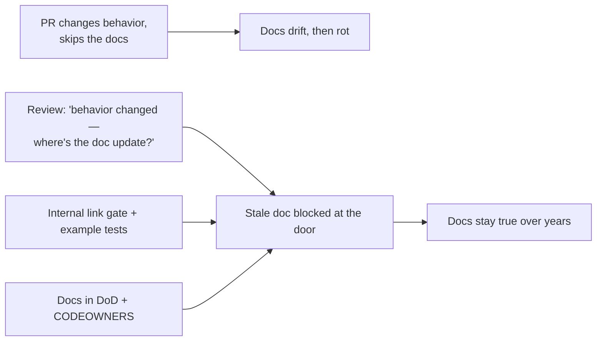
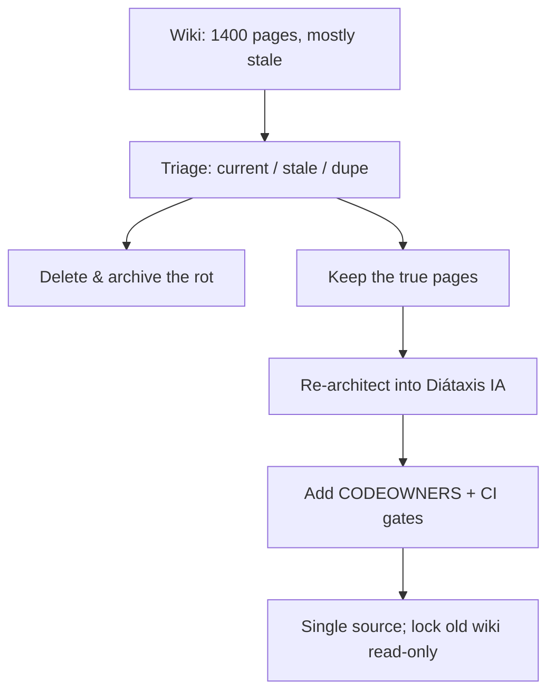

# Docs as Code & Tooling — Professional

> **Category:** [Documentation](../README.md) — treat documentation like source code: plain-text, in version control, reviewed in pull requests, built and tested in CI, deployed automatically.

> **Prerequisites:** [Junior](junior.md) · [Middle](middle.md) · [Senior](senior.md)
> **Focus:** **Production** — rollout, governance, metrics, migrations, incidents

---

## Table of Contents

1. [Introduction](#introduction)
2. [Rolling Out Docs as Code to an Org](#rolling-out-docs-as-code-to-an-org)
3. [Migrating off a Wiki](#migrating-off-a-wiki)
4. [Governance: CODEOWNERS, Gates, and Policy](#governance-codeowners-gates-and-policy)
5. [Enforcing Docs in Code Review](#enforcing-docs-in-code-review)
6. [Measuring Docs Health](#measuring-docs-health)
7. [Operating the Pipeline](#operating-the-pipeline)
8. [Real Incidents](#real-incidents)
9. [The Politics of Docs as Code](#the-politics-of-docs-as-code)
10. [Review Checklist](#review-checklist)
11. [Cheat Sheet](#cheat-sheet)
12. [Diagrams](#diagrams)
13. [Related Topics](#related-topics)

---

## Introduction

> Focus: **production** — making Docs as Code work across many teams, for years.

Standing up MkDocs and a link checker is a day's work. Making Docs as Code the **default way an entire organization documents**, and keeping that true through reorgs, deadlines, and a hundred PRs a week, is the professional problem. It is mostly *not* a tooling problem — it's rollout, governance, incentives, and migration, with tooling in service of those.

The recurring failure: a team adopts Docs as Code, the docs are great for three months, then a deadline hits, "we'll document it next sprint" becomes permanent, the link checker goes red and gets disabled, and within a year the repo's docs are as stale as the wiki they replaced. Sustaining Docs as Code is a system: gates that make the right thing automatic, metrics that surface rot before users hit it, and a culture that treats a wrong doc as a bug.

---

## Rolling Out Docs as Code to an Org

A migration that lands has a shape. One that fails is usually a big-bang tool swap with no workflow change.

1. **Pilot on one motivated team.** Pick a team that already cares about docs and a repo with real docs pain. Prove the loop (edit → PR → CI → deploy) end to end. Produce a reference setup others copy.
2. **Standardize the toolchain, not just the tool.** Publish a template repo: `mkdocs.yml`, the CI workflow, the Vale config, `CODEOWNERS`, a starter IA. Teams should adopt by *copying a working setup*, not assembling one.
3. **Make the simple path the default.** A `cookiecutter`/template that scaffolds docs in every new repo means the docs structure exists before anyone has to think about it.
4. **Integrate into existing CI, don't add a parallel system.** Docs checks run in the same pipeline as code checks. A separate docs CI nobody watches is dead on arrival.
5. **Train on the *workflow*, not Markdown.** Engineers know Markdown; what trips them is "docs change goes in the same PR as the behavior change." That's the habit to instill.
6. **Address non-engineer contributors up front** (the [Senior](senior.md) problem): ship the "edit this page" pencil and/or a CMS-over-Git layer in the pilot, or those docs won't migrate.

> Rollout truth: **Docs as Code spreads by being the lower-friction option, not by mandate.** If the template makes documenting easier than not documenting, teams adopt it. If it's a compliance checkbox, they game it.

---

## Migrating off a Wiki

Moving years of Confluence/wiki content into the repo is the most common large migration. Done naively (export everything, dump it in), you import the wiki's rot into Git and gain nothing.

| Step | What | Why |
|---|---|---|
| **1. Inventory & triage** | List every page; tag *current / stale / duplicate / dead* | Most wiki content is rotten; migrating it all imports the rot |
| **2. Delete aggressively** | Don't migrate stale/dead pages — archive them read-only | A smaller, true docs set beats a large, distrusted one |
| **3. Convert format** | Confluence/HTML → Markdown (`pandoc`, dedicated exporters) | Plain text is the substrate; clean up the machine conversion |
| **4. Re-architect, don't re-paste** | Reorganize into a real IA (Diátaxis), not the wiki's tree | The wiki's structure is usually accidental; fix it now |
| **5. Establish single source** | Redirect/lock the old wiki; one canonical home going forward | Two live sources = the "where's the truth?" problem returns |
| **6. Backfill ownership & gates** | `CODEOWNERS`, link-check, build in CI | Without gates, the new docs rot exactly like the wiki did |

```text
   OLD WIKI (mixed truth/rot)         NEW DOCS-AS-CODE
   ┌────────────────────┐            ┌────────────────────┐
   │ 1200 pages         │  triage    │ ~300 pages          │
   │  ~30% current      │ ─────────▶ │  curated, true      │
   │  ~70% stale/dupe   │  delete    │  IA-structured      │
   └────────────────────┘            │  gated in CI        │
        lock read-only ◀── redirect ─┘  (single source)    │
                                      └────────────────────┘
```

The non-obvious lesson from real migrations: **the value is in the deletion, not the import.** A migration that moves 1,200 pages is a failure; one that distills them to the 300 that are true and gives those a maintained home is a success.

---

## Governance: CODEOWNERS, Gates, and Policy

Governance encodes the senior reasoning so teams get it right by default and reviewers cite policy, not preference.

**Ownership** — every doc area has owners, enforced by the platform:

```text
# .github/CODEOWNERS  — doc changes auto-request the right reviewers
/docs/                 @docs-guild
/docs/auth/            @security-team
/docs/billing/         @payments-team
/docs/reference/       @api-platform   # generated; changes signal a generator issue
*.md                   @docs-guild
mkdocs.yml             @docs-guild     # site config is high-blast-radius
.vale/                 @docs-guild     # style rules are org-wide
```

**Branch protection** makes the gates non-optional:

```yaml
# required status checks on the docs path
required_status_checks:
  - markdownlint
  - vale
  - linkcheck-internal     # mkdocs --strict + internal lychee
  - build
# external link crawl is NOT required (scheduled) — keep the gate trustworthy
```

**Written policy** in the engineering handbook, so it's standard not personal:

- *Docs change ships in the same PR as the behavior change.* (Docs in Definition of Done.)
- *Reference is generated, never hand-maintained.*
- *Internal links hard-fail; external links are checked on a schedule.*
- *One-way-door decisions get an [ADR](../05-architecture-decision-records-adrs/professional.md).*

> Governance's job is to make "documented, reviewed, link-checked" the path of least resistance and "undocumented behavior change" the path that gets blocked at the gate.

---

## Enforcing Docs in Code Review

Docs rot enters one un-updated PR at a time, so review is where it's stopped. The reviewer's docs checklist:

1. **Behavior changed → docs changed?** A flag default, an endpoint, a config key, a setup step changed *and the PR touches no docs* is a red flag. Ask: "what doc describes this, and did it move?"
2. **Examples still correct?** If the change breaks a documented example, the example must update — ideally the executable-examples gate already caught it.
3. **Reference vs. hand-written.** A hand-written list of endpoints/flags is a smell — it should be generated. Push back on hand-maintained volatile facts.
4. **Single-sourcing.** Is this fact copy-pasted from somewhere it already lives? Prefer an include.
5. **Right IA mode.** Is this reference content leaking into a tutorial, or vice versa? (Diátaxis.)

### Review comment templates

> "This PR changes the default for `--timeout` from 30s to 60s but doesn't touch `docs/config/`. Same PR should update the documented default — otherwise the docs are wrong on merge."

> "This is a hand-maintained table of every endpoint. It'll drift the first time someone adds a route. Can we generate it from the OpenAPI spec instead?"

> "Great content, but it's pasted from the auth guide. Let's `--8<--` include the canonical block so they can't disagree later."

> "The external link to that blog 404s, but that's outside our control — the scheduled crawl will track it. Don't block this PR on it."

---

## Measuring Docs Health

You can't manage rot you can't see. Useful, non-vanity metrics:

| Metric | What it tells you | Source |
|---|---|---|
| **Broken internal links** | Build integrity | `mkdocs --strict` / lychee — should be **zero** |
| **External link rot rate** | Decay of outbound references | scheduled lychee crawl |
| **Doc freshness / staleness** | Pages not touched since the code they describe changed | git timestamps vs. code change-coupling |
| **Build success rate** | Pipeline health | CI history |
| **Example test pass rate** | Whether shown code actually works | doctest/testable-examples CI |
| **Coverage of public surface** | % of endpoints/flags with docs | diff generated reference vs. hand-written |
| **Time-to-publish** | Friction of the docs loop | PR-open → deploy duration |
| **"Docs were wrong" incidents** | Ground-truth quality | support tickets / incident tags |

### The honest-measurement rules

- **Zero broken internal links is achievable and non-negotiable** — it's fully under your control. Track it; never let it drift above zero.
- **Don't confuse volume with health.** "5,000 pages" is not a quality metric; a smaller, *true* set is better. Page count is vanity.
- **Staleness via change-coupling is the rot detector:** if `auth/tokens.py` changes frequently but `docs/auth/tokens.md` hasn't been touched in a year, that doc is probably wrong. (This is the core technique of [Keeping Docs Alive](../11-keeping-docs-alive-and-doc-rot/professional.md).)
- **The ground-truth metric is "docs-were-wrong" incidents** — support tickets and outages caused by stale docs. If those are dropping, the system works regardless of what the page counts say.

> Never report "docs improved" with page count. Report broken-links (zero), staleness on hot files, example pass rate, and docs-were-wrong incidents.

---

## Operating the Pipeline

A docs pipeline is production infrastructure once teams depend on it:

- **Pin everything.** Pin SSG, plugin, and GitHub Action versions. An unpinned plugin minor bump that changes `--strict` behavior can red every docs PR org-wide overnight.
- **Keep the required path fast and deterministic.** Cache dependencies; run the full external-link crawl and exhaustive example tests on a schedule, not on every PR. A 12-minute required docs check trains people to bypass it.
- **Monitor the deploy, not just the build.** A green build that fails to publish (expired token, broken Pages config) means users see stale docs with no signal. Alert on deploy failure.
- **Own the aggregation's failure modes.** If you build one site from many repos, a single source repo being unavailable can break the whole docs deploy — degrade gracefully (skip+warn), don't hard-fail the world.
- **Have a rollback.** Docs deploys can ship a broken render; keep the ability to redeploy the last-good build fast.

---

## Real Incidents

### Incident 1: The wiki migration that imported the rot

A team exported 1,400 Confluence pages and bulk-converted them into the repo, declaring victory. Six months later engineers trusted the new docs no more than the old wiki — because ~70% of the imported pages were the same stale content, now just in Markdown. **Fix:** a triage pass deleted/archived ~1,000 pages, re-architected the survivors into a Diátaxis structure, and added a staleness metric. **Lesson:** migrating a wiki is mostly *deleting* it. Format conversion without curation imports the rot.

### Incident 2: The flaky external link gate everyone disabled

A team gated every PR on a full link crawl including external sites. A popular external blog had intermittent downtime, reddening unrelated docs PRs. Frustrated engineers added `# skip linkcheck` everywhere, then disabled the gate. Months later the docs were full of dead *internal* links too — the baby went out with the bathwater. **Fix:** split the gate — internal links hard-fail in PR CI, external links run on a weekly cron that files an issue. **Lesson:** gate what you control; a gate that fails for reasons outside the author's control gets routed around, taking the valuable checks with it.

### Incident 3: The doc that lied — and caused an outage

A runbook documented a database failover command. A release changed the command's flags but didn't update the runbook (no docs gate on that repo). At 3 a.m. an on-call engineer ran the documented command verbatim; it did the wrong thing and extended the outage. **Fix:** the failover steps became an *executable* check run in CI against a staging cluster, so a flag change that breaks the runbook reds the build. **Lesson:** for operational docs, "test the example" isn't a nicety — a wrong runbook is an availability risk. (See [Runbooks & Ops Docs](../07-runbooks-and-operational-docs/professional.md).)

### Incident 4: The unpinned plugin that broke every docs PR

A `mkdocs-material` minor release tightened a `--strict` warning. Because the CI installed it unpinned (`pip install mkdocs-material`), every docs PR across the org went red the next morning with a build no author had changed. **Fix:** pin versions in a lockfile; upgrade deliberately in a dedicated PR that fixes the new warnings. **Lesson:** the docs pipeline is production infrastructure — treat its dependencies with the same discipline as the app's.

---

## The Politics of Docs as Code

Sustaining it is partly a social problem:

- **Docs are the first thing cut under deadline.** "We'll document it next sprint" is where docs go to die. Counter: docs in Definition of Done, enforced at review — the behavior change *doesn't merge* without its docs.
- **Writing docs is undervalued vs. shipping features.** If documentation never appears in promotion criteria, rational engineers deprioritize it. Make doc quality visible and credited.
- **Deleting docs feels risky and goes unrewarded.** Yet deleting a stale, wrong page is often more valuable than adding one. Celebrate curation, as you celebrate code deletions.
- **The non-engineer exclusion is political too.** If support/product can't easily fix docs, they resent the system. Investing in the WYSIWYG-over-Git layer is partly buying their buy-in.
- **Leaders set the norm.** If senior engineers ship behavior changes without doc updates, everyone does. Model "the docs PR is part of the change."

---

## Review Checklist

```text
DOCS-AS-CODE REVIEW CHECKLIST
[ ] BEHAVIOR  did this PR change behavior (flag/endpoint/config/step)?
              if yes → does the SAME PR update the docs?
[ ] EXAMPLES  do documented examples still run? (executable-examples gate green)
[ ] GENERATED reference facts are generated, not hand-maintained
[ ] DRY       no copy-pasted fact that should be a single-sourced include
[ ] IA        content is in the right Diátaxis mode (no ref/tutorial mixing)
[ ] LINKS     internal links resolve (build --strict green); external = scheduled
[ ] OWNERS    CODEOWNERS routed the right reviewers
[ ] RENDER    preview deploy looks right (tables, diagrams, admonitions render)
[ ] GATES     red pipeline is the author's bug, not third-party flakiness
```

---

## Cheat Sheet

```text
ROLLOUT       pilot one team → template repo (mkdocs.yml + CI + Vale + CODEOWNERS)
              → integrate into existing CI → train the WORKFLOW, not Markdown

WIKI MIGRATE  inventory → DELETE aggressively → convert → re-architect (Diátaxis)
              → single source (lock old) → backfill gates. Value is in deletion.

GOVERNANCE    CODEOWNERS per area · branch protection (internal links REQUIRED,
              external NOT) · written policy: docs-PR-per-behavior-change

MEASURE       broken internal links = ZERO · staleness on hot files · example
              pass rate · "docs-were-wrong" incidents.  NOT page count.

OPERATE       PIN versions · keep required checks fast · run heavy checks on cron
              · monitor the DEPLOY · own aggregation failure · keep a rollback

POLITICS      docs in DoD · credit doc work · celebrate deletions · fund the
              non-engineer (WYSIWYG-over-Git) path · leaders model it
```

---

## Diagrams

### Where rot enters, and where it's stopped



### Wiki migration: distill, don't dump



---

## Related Topics

- **The rot it fights:** [Keeping Docs Alive & Doc Rot](../11-keeping-docs-alive-and-doc-rot/professional.md)
- **Operational docs as tested artifacts:** [Runbooks & Ops Docs](../07-runbooks-and-operational-docs/professional.md)
- **Generated reference source of truth:** [API & Reference Docs](../04-api-and-reference-documentation/professional.md)
- **Document the toolchain "why":** [Architecture Decision Records](../05-architecture-decision-records-adrs/professional.md)
- **Tooling:** MkDocs Material, Vale, lychee, cspell, `mike`, Antora, Read the Docs, Netlify previews, Algolia DocSearch.

---


---

## Check your understanding

1. Explain Docs as Code & Tooling — Professional Level in your own words and name the problem it solves.
2. How would you apply the ideas around Table of Contents, Introduction, Rolling Out Docs as Code to an Org in a realistic engineering change?
3. What failure mode or misuse should you look for, and what evidence would reveal it?
4. How would you introduce and govern Docs as Code & Tooling — Professional Level across teams through reversible, measurable increments?
5. What observable result would convince you that the approach improved the system?
