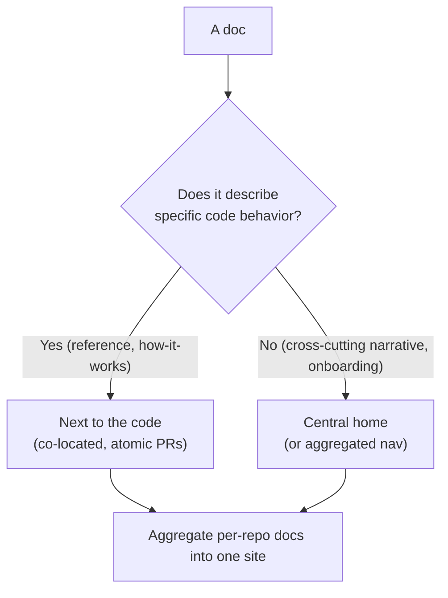
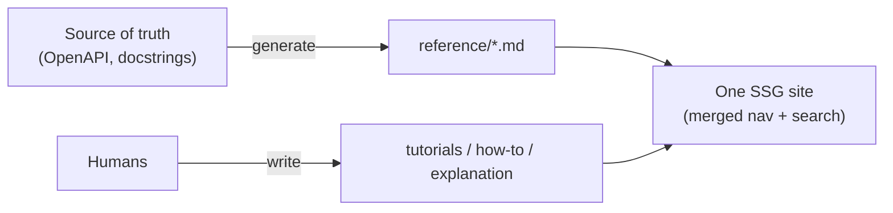

# Docs as Code & Tooling — Senior

> **Category:** [Documentation](../README.md) — treat documentation like source code: plain-text, in version control, reviewed in pull requests, built and tested in CI, deployed automatically.

> **Prerequisites:** [Junior](junior.md) · [Middle](middle.md)
> **Focus:** **Design trade-offs** and **system-level reasoning**

---

## Introduction

> Focus: **design trade-offs** and **system-level reasoning**

At the senior level, Docs as Code stops being "set up MkDocs and a link checker" and becomes an **architecture decision with the same character as choosing a service topology**: where does documentation *live*, how does it *aggregate* across repos, who can *contribute*, and which choices are reversible versus one-way doors. The tooling is easy; the consequential decisions are structural.

Three questions define the senior view:

1. **Where do docs live** — beside the code (per-repo) or in a central docs repo — and what does that decision cost you for years?
2. **How do docs from many repos become one site** without re-introducing drift?
3. **Who actually maintains the docs**, and does your chosen workflow include or exclude them?

Every one of these is a trade-off, not a best practice, and the senior job is to make the trade deliberately and document *why* (an [ADR](../05-architecture-decision-records-adrs/senior.md) is the right home for "why we chose Antora over per-repo MkDocs").

---

## Docs-Next-to-Code vs. Central Docs Repo

The foundational structural decision. Both are valid; they optimize for different things.

```text
   DOCS NEXT TO CODE                    CENTRAL DOCS REPO
   ┌───────────────┐                    ┌───────────────┐
   │ service-auth  │                    │  service-auth │
   │  src/  docs/  │                    │  src/         │
   ├───────────────┤                    ├───────────────┤
   │ service-bill  │                    │ service-bill  │
   │  src/  docs/  │                    │  src/         │
   └───────────────┘                    └───────────────┘
     each repo owns its docs                    │ docs PRs go here
                                         ┌───────▼───────┐
                                         │   docs-repo   │
                                         │  everything   │
                                         └───────────────┘
```

| Dimension | Docs next to code (per-repo) | Central docs repo |
|---|---|---|
| **Drift resistance** | **Strong** — change code & docs in one PR/review | **Weak** — docs PR is separate, easy to skip |
| **Atomic with behavior** | Yes — same commit | No — two repos, two PRs, two merges |
| **Ownership** | Clear — the team that owns the code | Diffuse — "the docs repo" owned by no one |
| **Cross-cutting/narrative docs** | Awkward — where does a tutorial spanning 3 services go? | **Natural** — one home for the whole story |
| **Unified site / search / nav** | Needs aggregation tooling | **Trivial** — it's one repo |
| **Non-engineer access** | Hard — they must touch code repos | Easier — one repo, simpler permissions |
| **Versioning per release** | Aligns with the code's tags naturally | Must track many components' versions |

### The senior synthesis

> **Reference and how-it-works docs belong next to the code** (they drift the instant they're separated). **Cross-cutting, narrative, and conceptual docs** — tutorials spanning services, architecture overviews, onboarding — **belong in a central home.** Most mature setups are *hybrid*: per-repo docs aggregated into one site.

The dominant failure mode is picking *central-only* for the convenience of a single site, then watching every per-service doc drift because updating it now means a PR in a *different* repo than the code change. The co-location benefit — the entire reason Docs as Code beats a wiki — evaporates the moment the docs leave the code's repo. So the default for *behavior-describing* docs is **next to the code**, and you solve the "one site" problem with aggregation rather than centralization.

---

## Multi-Repo Docs and Aggregation

If docs live next to code across dozens of repos, you still want **one site**. There are three patterns, in increasing sophistication:

| Pattern | How | Trade-off |
|---|---|---|
| **Git submodules / subtrees** | Central docs repo pulls component repos in | Simple but fragile; submodules are notoriously painful |
| **Build-time aggregation** | CI clones N repos, copies their `docs/`, builds one site | Flexible; you own the glue script and its failure modes |
| **Antora** | Purpose-built multi-repo SSG: a playbook lists repos/branches, it assembles a versioned site | Best fit for true multi-repo; AsciiDoc-centric, more to learn |

A build-time aggregation sketch (the most common pragmatic choice):

```yaml
# docs-site repo: assemble per-repo docs into one MkDocs site
- name: Pull component docs
  run: |
    for repo in auth billing search; do
      git clone --depth 1 https://github.com/acme/$repo
      cp -r $repo/docs "site-src/$repo"
    done
- run: mkdocs build --strict   # one site, sourced from many repos
```

The deeper point: **aggregation lets you keep docs co-located (drift-resistant) while presenting one site (usable).** You pay for it in CI glue and a build that depends on multiple repos being green. Antora formalizes this if you're doing it across many repos with versioning — it's the one mainstream SSG designed for the multi-repo case rather than retrofitted to it.

---

## Information Architecture as a System

At small scale, "put files in folders" suffices. At system scale, **information architecture (IA)** is a design discipline, and the dominant framework is **Diátaxis** (Daniele Procida): four documentation modes serving four distinct needs.

| Mode | Serves | Example | Reader's question |
|---|---|---|---|
| **Tutorials** | Learning | "Build your first integration" | "Teach me, hold my hand" |
| **How-to guides** | A task | "Rotate an API key" | "I have a goal; steps please" |
| **Reference** | Lookup | API/flag/config reference | "What exactly does X do?" |
| **Explanation** | Understanding | "Why we use event sourcing" | "Help me understand the why" |

The senior insight: **most bad docs are bad because they mix modes** — a reference page that lapses into tutorial, a tutorial cluttered with edge-case reference. IA is the discipline of keeping these separate and routing each reader to the right mode. This maps onto the *generated vs. hand-written* split: **reference** is generated; **tutorials/how-to/explanation** are hand-written. Your directory structure and nav should make the four modes visible.

```text
docs/
├── tutorials/        # learning-oriented, hand-written
├── how-to/           # task-oriented, hand-written
├── reference/        # generated from OpenAPI / docstrings
└── explanation/      # concept/architecture, hand-written (ADRs link in)
```

This isn't bureaucracy — it's the structural answer to "why are our docs hard to use?" Misclassified content is the root cause far more often than missing content.

---

## Single-Sourcing and Generated/Hand-Written Merge

Duplication in docs is exactly as dangerous as duplication in code — and harder to detect, because no compiler catches two prose paragraphs that disagree. **Single-sourcing** is the docs analogue of DRY:

- **State each fact once; include it elsewhere.** SSG includes (`--8<--` in MkDocs, `include::` in AsciiDoc, `` in others) let one canonical block appear in many pages without copy-paste.
- **Generate the volatile facts from the source of truth.** Anything that changes when code changes — endpoints, flags, config, error codes — should be *generated* from the code/OpenAPI/docstrings, never hand-maintained. Hand-maintained reference is drift waiting to happen (the whole subject of [Keeping Docs Alive](../11-keeping-docs-alive-and-doc-rot/senior.md)).
- **Merge the two cleanly.** The generated reference and the hand-written narrative live in the same site, cross-linked. The art is curation: a site that's 95% machine-generated reference and 5% guides is complete and unusable.

```text
  OpenAPI spec / docstrings ──(generate)──▶ reference/*.md  ┐
                                                            ├─▶ one site
  humans ───────────────────(write)──────▶ guides/*.md     ┘
            (the SSG merges generated + hand-written into one nav)
```

> The senior rule: **if a fact changes when the code changes, generate it. If it requires human judgement to explain, write it.** Never hand-maintain a list the machine could produce — that list is guaranteed to drift.

(This is the same boundary drawn in [API & Reference Docs](../04-api-and-reference-documentation/senior.md): generated reference + hand-written guides.)

---

## The Non-Engineer Contributor Problem

The honest, load-bearing weakness of Docs as Code: **the Git/PR workflow excludes the people who often most need to fix docs** — product managers, support engineers, designers, sales engineers. A wiki's WYSIWYG editor lets anyone fix a wrong sentence; "branch, commit, resolve a conflict, open a PR, address review" does not.

This is a *real* trade-off, not a skill gap to dismiss. If your docs need non-engineer contributions and your workflow blocks them, **the docs will rot for exactly the audiences those contributors serve.** Senior mitigations, in order of preference:

| Mitigation | How | Cost |
|---|---|---|
| **Web "edit this page" pencil** | MkDocs/Docusaurus add a GitHub edit link; the platform handles the branch+PR | Low — but still exposes a PR |
| **GitHub.dev / web editor** | Edit in-browser, commit on a branch | Low; still Git concepts |
| **CMS that commits to Git** (Netlify CMS/Decap, TinaCMS) | WYSIWYG front-end; writes Markdown commits behind the scenes | Medium — another tool to run |
| **Issue-driven** | Non-engineers file an issue; an engineer makes the PR | Low tooling, high human cost; doesn't scale |
| **Keep some docs in a wiki** | Accept a non-code surface for non-code contributors | Re-introduces drift — last resort, narrow scope |

> Choosing Docs as Code is implicitly choosing *who can contribute*. If your contributor base is engineers, the friction is near zero. If it includes non-engineers, you must either invest in a WYSIWYG-over-Git layer or accept that those docs need a different surface. Pretending the friction doesn't exist is how docs-as-code initiatives quietly fail.

---

## Choosing a Generator You Won't Outgrow

The SSG is one of the more expensive decisions to reverse — migrating a large docs site between generators means rewriting front matter, includes, macros, theme, and CI. Seniors evaluate on **reversibility-aware** criteria:

| Criterion | Why it matters long-term |
|---|---|
| **Maintenance health** | Active maintainers + large community = low abandonment risk. A clever, niche, single-maintainer generator is a future migration. |
| **Markup portability** | If content is plain Markdown, migrating later is feasible. Heavy reliance on a generator's *proprietary* macros/MDX locks you in. |
| **Versioning & i18n** | Retrofitting these is painful; if you'll need them, pick a generator with them built in (Docusaurus, RTD, MkDocs+`mike`). |
| **Build performance** | Hugo builds huge sites in seconds; some generators crawl at thousands of pages. Matters only at scale. |
| **Ecosystem fit** | Reuse the team's existing stack (Python → MkDocs/Sphinx; React → Docusaurus) so the toolchain isn't a new operational burden. |

> The reversibility hedge: **keep content as portable plain Markdown and isolate generator-specific features.** The more your docs are "just Markdown + standard extensions," the cheaper a future migration. The more they lean on MDX components or reST directives, the more locked-in you are. This is the same one-way-door reasoning you apply to a database or framework choice.

This repo's MkDocs+Material+awesome-pages choice scores well here on purpose: huge community, portable Markdown, low lock-in (the `.pages` files and a few Material extensions are the only non-portable surface).

---

## Designing the Pipeline as a Quality System

A senior treats the docs CI pipeline the way they treat a test suite: as a **quality system with a signal-to-noise budget.** Principles:

- **Each gate guards a distinct, real failure class.** Don't add overlapping linters (Vale + write-good + alex all firing) — redundant warnings erode trust and people start merging past red.
- **Gate strength tracks controllability.** Hard-fail what you control (internal links, build, your terminology); soft-report what you don't (external links, third-party uptime).
- **Make the fast path fast.** A docs PR shouldn't take 15 minutes to validate. Cache dependencies; run heavy checks (full external link crawl, exhaustive doctest) on a schedule, not every PR.
- **Preview is a first-class gate, not a nicety.** For docs, the rendered output *is* the artifact; reviewing raw Markdown is reviewing source, not product.
- **Treat the pipeline as code too** — it's versioned, reviewed, and itself a one-way-door-ish dependency (pin plugin/action versions so a transitive update doesn't break every docs PR).

The system-level goal: **a green pipeline means "publishable," a red pipeline means "your bug, worth fixing."** The moment red sometimes means "a third-party site is flaky," the gate is dead — people route around it, and the quality system is theater.

---

## Trade-offs at the System Level

| Dimension | Per-repo docs + aggregation | Central docs repo | Wiki/Confluence |
|---|---|---|---|
| Drift resistance | **High** | Medium | **Low** |
| Atomic with code change | **Yes** | No | No |
| One unified site | Needs aggregation | **Trivial** | Trivial |
| Non-engineer contribution | Hard | Medium | **Easy** |
| Review & history | **Full (Git)** | Full (Git) | Weak |
| Ownership clarity | **High** | Low | Low |
| Tooling/maintenance cost | High (aggregation) | Medium | Low |

The senior reading: **Docs as Code dominates on the dimensions that determine whether docs are *trustworthy* (drift, atomicity, review, history)** and loses on *contributor accessibility* and *initial simplicity*. A wiki wins exactly where Docs as Code is weakest — which is why the pragmatic answer for many orgs is *Docs as Code for everything engineers own, with a WYSIWYG-over-Git layer for non-engineers,* never a wiki that re-creates the drift problem.

---

## Liabilities

### Liability 1: Central-repo drift

Choosing a central docs repo for the convenience of one site reintroduces the exact problem Docs as Code solves: docs in a different repo than the code drift because updating them isn't part of the code change. Default behavior-describing docs to co-location; aggregate, don't centralize.

### Liability 2: Pretending the non-engineer problem away

Adopting Git/PR docs without addressing who maintains them guarantees rot for support/product/sales-facing docs. The friction is real; budget for a WYSIWYG-over-Git layer or accept the contributor exclusion explicitly.

### Liability 3: A flaky pipeline that everyone ignores

Gating PRs on external links, over-linting prose, or a 15-minute build trains the team to merge past red. A quality gate people route around is worse than none — it gives false confidence. Keep red meaningful.

### Liability 4: Generator lock-in via proprietary features

Building deeply on MDX components, reST directives, or generator-specific macros makes migration a rewrite. Keep content portable; isolate the non-portable surface. Treat the generator like any framework one-way door.

### Liability 5: Hand-maintaining what should be generated

Any reference list a human keeps in sync by hand (endpoints, flags, error codes) *will* drift. If the machine can produce it, generate it; reserve hand-writing for judgement-requiring narrative.

---

## Diagrams

### Where docs live decides drift resistance



### The generated/hand-written single-sourced site



---

## Related Topics

- **The source-of-truth boundary:** [API & Reference Docs](../04-api-and-reference-documentation/senior.md)
- **The in-code layer & executable examples:** [Code Comments & Docstrings](../02-code-comments-and-docstrings/senior.md)
- **Document the "why" of the toolchain:** [Architecture Decision Records](../05-architecture-decision-records-adrs/senior.md)
- **The goal behind it all:** [Keeping Docs Alive & Doc Rot](../11-keeping-docs-alive-and-doc-rot/senior.md)

---


---

## Check your understanding

1. Explain Docs as Code & Tooling — Senior Level in your own words and name the problem it solves.
2. How would you apply the ideas around Table of Contents, Introduction, Docs-Next-to-Code vs. Central Docs Repo in a realistic engineering change?
3. What failure mode or misuse should you look for, and what evidence would reveal it?
4. How would you validate a system-level decision about Docs as Code & Tooling — Senior Level under uncertainty?
5. What observable result would convince you that the approach improved the system?
