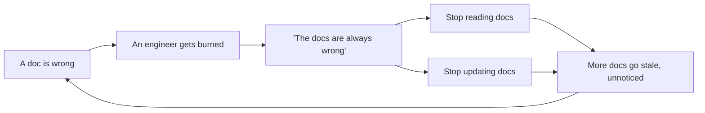
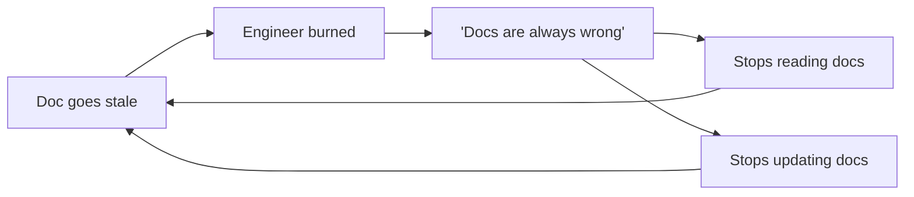
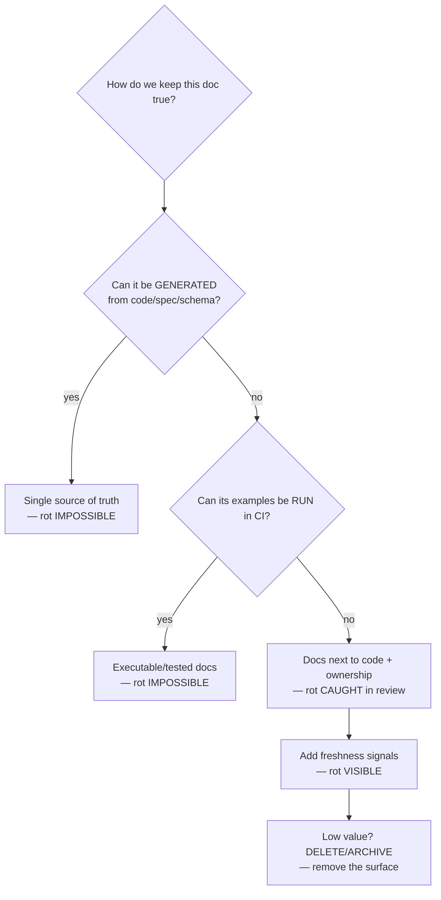

# Keeping Docs Alive & Fighting Doc Rot — Junior

> **Category:** [Documentation](../README.md) — the capstone discipline: keeping documentation *true* as the code and systems it describes change underneath it.

---

## Introduction

> Focus: **What is it?** and **How to fight it?**

Every other topic in this section taught you how to *write* a kind of document — a [README](../03-readmes-and-onboarding-docs/), an [API reference](../04-api-and-reference-documentation/), an [ADR](../05-architecture-decision-records-adrs/), a [changelog](../09-changelogs-and-release-notes/). This final topic is about the one thing that decides whether any of that effort was worth it: **keeping the document true after you write it.**

> **Doc rot** is documentation that has drifted out of sync with reality. The code changed; the doc didn't. The setup steps no longer work, the endpoint it describes was deleted six months ago, the screenshot shows a UI that no longer exists, and the "current" decision was superseded last quarter.

The central, counter-intuitive claim of this topic — the one everything else hangs on — is this:

> **A wrong document is worse than no document at all.**

A missing doc costs you a little time (you go ask someone, or read the code). A *wrong* doc actively sends you down the wrong path, wastes hours, causes incidents, and — worst of all — destroys trust. Once an engineer gets burned by a stale doc, they stop trusting *all* the docs, and a team's documentation collapses into something nobody reads and nobody updates.

So "keeping docs alive" is not a nice-to-have at the end of the writing process. It is the *point*. The real skill in documentation is not producing prose — it's building docs that **resist rot** by construction, so they stay true with little or no manual effort.

---

## Prerequisites

- **Required:** You have written at least one real doc — a README, a docstring, or an API note — and seen it go stale.
- **Required:** Comfort with version control (git), pull requests, and the idea of a CI pipeline that runs checks on every change.
- **Helpful:** Exposure to **[docs as code](../10-docs-as-code-and-tooling/)** — keeping documentation in the same repository as the code, reviewed in the same pull request.
- **Helpful:** A feel for what "the single source of truth" means — that a fact should live in exactly one authoritative place.

---

## Glossary

| Term | Definition |
|------|-----------|
| **Doc rot (documentation drift)** | Documentation that has fallen out of sync with the code/system it describes. |
| **Stale doc** | A specific document that is now wrong because reality changed without it. |
| **Single source of truth (SSOT)** | The one authoritative place a fact lives; other views are *generated* from it, never copied. |
| **Generated docs** | Documentation produced automatically from the source of truth (code, schema, spec) rather than hand-written. |
| **Executable / tested docs** | Documentation whose examples actually run in CI, so they fail the build if they break. |
| **Docs as code** | Treating docs like code: same repo, version control, code review, CI checks. |
| **Trust collapse** | The point where engineers stop believing *any* docs because they've been burned by stale ones. |
| **Freshness signal** | Metadata (e.g. a `last_reviewed` date) that tells a reader how trustworthy a doc still is. |
| **Doc gardening** | The ongoing, never-finished work of pruning, updating, and deleting docs to keep them healthy. |
| **Optimize for deletion** | Prefer fewer docs and an easy path to delete them; less surface area means less to rot. |

---

## What Doc Rot Looks Like

Doc rot is not abstract. You have hit every one of these:

- **Stale setup steps.** The README says `npm install && npm start`, but the project moved to a different package manager and a Docker container a year ago. A new hire spends a morning fighting errors the doc caused.
- **Endpoints documented after deletion.** The API reference still lists `POST /v1/legacy-export`. The route was removed. A consumer integrates against it and gets a 404 in production.
- **Screenshots of an old UI.** The onboarding guide shows buttons and menus that no longer exist; the user can't find "the green Publish button" because it's now blue and in a different place.
- **Dead links.** "See the deployment guide [here]" — the link 404s because the page was renamed.
- **Superseded decisions presented as current.** A design doc says "we use polling"; the team switched to webhooks eight months ago, but the doc reads as if polling is the live design. A new engineer builds on a decision that was already reversed.
- **Drifted config docs.** The doc lists 12 config keys; the code now reads 20, three of the documented keys were renamed, and two were deleted.

Every one of these has the same shape: **a fact lived in two places — the system and the doc — and only one of them was updated.**

---

## Why Stale Docs Are Worse Than No Docs

This is the load-bearing argument of the whole topic, so let's make it precise.

When a doc is **missing**, you *know* it's missing. You don't trust it (it isn't there), so you fall back to the next-best source: read the code, ask a colleague, experiment. You lose a little time, but you're never *misled*.

When a doc is **wrong**, it looks authoritative. It's confident. It's formatted nicely. You follow it — and it lies to you. You don't find out until you've burned an hour, shipped a bug, or paged the on-call.

```
        MISSING DOC                          STALE DOC
  ┌─────────────────────┐            ┌──────────────────────────┐
  │ "There's nothing     │           │ "Here are the steps"      │
  │  here."              │           │  (but they're WRONG)      │
  └─────────┬───────────┘            └──────────┬───────────────┘
            │                                   │
   you KNOW to look elsewhere          you TRUST it and follow it
            │                                   │
     small, bounded cost                hidden cost: wasted hours,
     (ask / read code)                  bugs, incidents, broken trust
```

But the worst damage isn't the wasted hour — it's the **trust collapse**, which runs as a vicious loop:



Once "the docs are always wrong, don't bother" becomes the team's belief:

1. Engineers stop **reading** docs (so the docs provide zero value).
2. Engineers stop **updating** docs (because nobody reads them, why bother).
3. With nobody updating, *more* docs rot — which confirms the belief and tightens the loop.

A wrong doc therefore doesn't just fail to help; it **poisons the value of every other doc around it.** That's why "worse than nothing" is literal, not rhetorical. The entire fight against doc rot is a fight to keep this trust loop from ever starting.

---

## Why Docs Rot

Docs rot for structural reasons, not because engineers are lazy. Understand the causes and the cures become obvious.

| Cause | Why it leads to rot |
|---|---|
| **Docs live apart from the code** | A separate repo/wiki/tool means a code change and its doc change are two different chores, in two places, often by two people. The code one gets done; the doc one gets forgotten. |
| **No owner** | If nobody is responsible for a doc, nobody notices when it goes wrong. |
| **No trigger to update** | Nothing *forces* the doc to change when the code does. Updating it depends on someone *remembering*. |
| **Not in the Definition of Done** | If "the feature works" counts as done while the doc is untouched, the doc is structurally last and structurally skipped. |
| **No feedback when wrong** | A reader who hits a stale doc usually just sighs and moves on. The author never learns it broke. |
| **Write-once, never revisit** | Docs are treated as a one-time deliverable, not a living artifact. |
| **The asymmetry** | This is the deep one. **Code is tested and run constantly; prose just sits there, untested.** If you break the code, a test fails and CI goes red. If you break the truth of a doc, *nothing happens* — there's no failing test for "this sentence is now a lie." |

That last row is the key insight to carry into the rest of this topic. **Code can't silently rot, because it's exercised.** Docs silently rot precisely because they *aren't*. Every powerful anti-rot strategy works by closing that gap — making the doc exercised, generated, or co-located with the thing it describes, so it can no longer drift in silence.

---

## The Strategies, From Most to Least Powerful

There is a clear hierarchy. The higher strategies make rot *structurally impossible*; the lower ones merely make it *more visible*. Always reach for the highest one that fits.

```
   POWER  ┌──────────────────────────────────────────────────────────┐
   HIGH   │ 1. SINGLE SOURCE OF TRUTH — generate the doc from the     │
          │    authoritative source. It CAN'T drift.                  │
          │ 2. EXECUTABLE / TESTED docs — examples run in CI; a       │
          │    broken example fails the build.                        │
          │ 3. DOCS NEXT TO CODE — same repo, same PR, reviewed &     │
          │    link-checked together.                                 │
          │ 4. OWNERSHIP & PROCESS — owners, Definition of Done, PR   │
          │    checklists make updating the doc someone's job.        │
          │ 5. FRESHNESS SIGNALS — last-reviewed dates, staleness     │
          │    bots, "report an error" — make rot VISIBLE.            │
   LOW    │ 6. DELETE / ARCHIVE — less doc surface = less to rot.     │
          └──────────────────────────────────────────────────────────┘
```

### 1. Single source of truth — generate, don't hand-write

The most powerful move: don't write the doc by hand at all. **Generate it from the thing that's already true.** If the doc is produced *from* the code/spec/schema, it literally cannot disagree with it.

- API reference → generated from the [OpenAPI spec or code](../04-api-and-reference-documentation/).
- CLI usage docs → generated from the argument parser itself.
- Config docs → generated from the config schema.
- [Changelog](../09-changelogs-and-release-notes/) → generated from commit history.
- Function/parameter docs → from [docstrings](../02-code-comments-and-docstrings/) next to the code.

**Generated beats hand-written wherever it's possible**, because a hand-written copy is a second place for the fact to live — i.e., a future stale doc.

### 2. Executable / tested docs

If a doc can't be generated, make its **examples run**. A "getting started" snippet, a usage example, a tutorial — turn them into tests (doctests, runnable code blocks executed in CI, tested onboarding scripts or containers). When the code changes and the example breaks, **the build goes red.** A doc that runs can't silently rot.

### 3. Docs next to code (docs as code)

Put the doc in the **same repository** as the code it describes, so a behavior change and its doc change land in the **same pull request**, reviewed together. Add automated link-checking and linting in CI. (This is the whole subject of [docs as code & tooling](../10-docs-as-code-and-tooling/).)

### 4. Ownership & process

Make updating the doc *someone's job and part of "done"*: `CODEOWNERS` for docs, "update the docs" as a checklist item on every PR, doc review as part of code review, and "docs updated" in the Definition of Done.

### 5. Freshness signals & feedback

When you can't prevent rot, make it *visible*: a `last_reviewed` date in each doc, a bot that flags docs not reviewed in N months, and a "Was this helpful? / Report an error" widget so readers can tell you when a doc is wrong.

### 6. Delete / archive ruthlessly

The cheapest doc to keep correct is the one that doesn't exist. **Out-of-date docs should be deleted or clearly marked archived/superseded** (an [ADR](../05-architecture-decision-records-adrs/) that's been replaced links to its successor and says so). Less doc surface area means less to rot. *Optimize for deletion.*

---

## Real-World Analogies

| Concept | Analogy |
|---|---|
| **Doc rot** | A wall calendar nobody flips — it confidently tells you it's still last March. |
| **Stale doc worse than none** | A road sign pointing to a bridge that washed out. No sign and you'd slow down and look; the *wrong* sign drives you off the edge at speed. |
| **Trust collapse** | A smoke alarm that cried wolf once too often — now everyone ignores it, including during the real fire. |
| **Single source of truth (generated)** | A digital clock wired to the atomic time signal — it can't show the wrong time because it doesn't *store* a separate guess. |
| **Executable docs** | A recipe you actually cook every night — if an ingredient is wrong, dinner fails immediately and you fix the recipe. |
| **Freshness date** | A "best before" stamp on food — it doesn't keep the milk fresh, but it tells you when to be suspicious. |
| **Delete ruthlessly** | Throwing out expired medicine instead of leaving it in the cabinet where someone might take it. |

---

## Mental Models

**The core intuition:** *Code can't lie for long because we run it. Docs lie quietly forever because we don't. Every fix to doc rot makes the doc more like code — generated from it, tested with it, or living right next to it.*

```
        ┌───────────────────────────────────────────────┐
  CODE  │ run + tested constantly → breaks LOUDLY → fixed │
  DOCS  │ never run, untested     → breaks SILENTLY → rots│
        └───────────────────────────────────────────────┘
   Anti-rot = drag docs UP into the "run / tested / co-located" world.
```

A second model — the **two-copies-of-a-fact** rule:

> Every time a fact lives in *two* places (the system and a hand-written doc), one of them will eventually be updated and the other won't. Rot is born the moment you make the copy. The fix is to keep **one** copy and *derive* the other.

---

## A Worked Example: Killing a Rotting Setup Doc

A README has a hand-written "Getting Started" that rots every few weeks as the project changes. Watch it climb the strategy hierarchy.

### Stage 0 — the rotting hand-written doc

```markdown
## Getting Started
1. Install Python 3.9
2. pip install -r requirements.txt
3. Set DB_URL in config.py
4. python run.py
```

The project upgraded to Python 3.12, moved to Poetry, renamed `DB_URL` to `DATABASE_URL`, and replaced `run.py` with a CLI. **Every step is now wrong.** A new hire follows it and loses a morning. This is rot: the steps are a hand-written *copy* of facts that live in the code, and the copy drifted.

### Stage 1 — make the steps executable (strategy 2)

Replace prose steps with a real, runnable setup script, and *run that exact script in CI*:

```bash
# scripts/setup.sh — the ONE place setup is defined
set -euo pipefail
poetry install
cp .env.example .env
poetry run app db migrate
poetry run app serve --check   # smoke test: process starts and health-checks
```

```yaml
# .github/workflows/onboarding.yml — runs the real onboarding path nightly + on PRs
jobs:
  fresh-setup:
    runs-on: ubuntu-latest
    steps:
      - uses: actions/checkout@v4
      - run: ./scripts/setup.sh   # if onboarding breaks, THIS goes red
```

Now the README just says **"Run `./scripts/setup.sh`."** If anyone changes setup and forgets the script, CI fails — the doc *cannot* silently lie, because its single instruction is tested every day.

### Stage 2 — co-locate and link-check (strategy 3)

The README lives in the repo, in the same PR as code changes, and CI checks its links so a renamed page is caught immediately (covered in [docs as code](../10-docs-as-code-and-tooling/)).

### Stage 3 — a freshness signal as backstop (strategy 5)

For the parts that *must* stay prose (the "why", the architecture overview), add a review date so staleness becomes visible even when nothing tests it:

```markdown
---
last_reviewed: 2026-06-11
owner: platform-team
---
```

A bot can now flag this section if it hasn't been reviewed in six months. The freshness date doesn't *make* it fresh — it tells the team when to be suspicious (strategy 5 is the weakest tier for a reason).

**Result:** the rot-prone hand-written steps became a tested script (can't rot), and only the genuinely human "why" prose remains — guarded by a freshness signal. We climbed from the weakest defense to the strongest.

---

## Code Examples

### A doctest that fails CI when the code changes (Python)

The most direct anti-rot tool: an example *inside the docstring* that is executed as a test.

```python
def slugify(title: str) -> str:
    """Convert a title to a URL slug.

    >>> slugify("Hello, World!")
    'hello-world'
    >>> slugify("Keeping Docs ALIVE")
    'keeping-docs-alive'
    """
    return re.sub(r"[^a-z0-9]+", "-", title.lower()).strip("-")
```

```bash
# In CI:
python -m doctest -v mymodule.py     # FAILS if the example output no longer matches
```

If someone changes `slugify` to keep commas, the documented example `'hello-world'` no longer matches, the doctest **fails the build**, and the author is *forced* to either fix the code or update the doc. The example can't quietly become a lie.

### A README example tested in CI (any language)

```python
# tests/test_readme_examples.py — extract fenced ```python blocks from README.md and run them
import doctest, re, pathlib

def test_readme_python_blocks_run():
    readme = pathlib.Path("README.md").read_text()
    blocks = re.findall(r"```python\n(.*?)```", readme, re.S)
    for block in blocks:
        exec(compile(block, "README.md", "exec"), {})   # raises if the example is broken
```

Now a copy-paste example in the README is exercised on every PR. Break the API the example uses, and this test goes red.

### `CODEOWNERS` for docs — making updates someone's job (strategy 4)

```bash
# .github/CODEOWNERS
# Docs require review by the team that owns the relevant area.
/docs/api/            @backend-team
/docs/onboarding/     @platform-team
README.md             @platform-team
*.md                  @docs-maintainers   # catch-all so no doc is ownerless
```

Any PR touching these docs now *requires* an owning team's review — so a doc change isn't an afterthought, it's a gated, owned step.

### A staleness check in CI (strategy 5)

```python
# scripts/check_freshness.py — fail if any doc's last_reviewed is older than 180 days
import datetime, glob, sys, yaml

MAX_AGE_DAYS = 180
stale = []
for path in glob.glob("docs/**/*.md", recursive=True):
    text = open(path).read()
    if text.startswith("---"):
        front = yaml.safe_load(text.split("---")[1])
        reviewed = front.get("last_reviewed")
        if reviewed and (datetime.date.today() - reviewed).days > MAX_AGE_DAYS:
            stale.append(f"{path} (last reviewed {reviewed})")

if stale:
    print("Docs overdue for review:\n  " + "\n  ".join(stale))
    sys.exit(1)   # turns the CI/dashboard red until someone re-verifies
```

### A link-check step in CI (strategy 3)

```yaml
# .github/workflows/docs.yml
jobs:
  link-check:
    runs-on: ubuntu-latest
    steps:
      - uses: actions/checkout@v4
      - uses: lycheeverse/lychee-action@v2
        with:
          args: --no-progress './**/*.md'   # fails the build on any dead link
```

A renamed or deleted page is now caught the moment it breaks a link, instead of by a frustrated reader months later.

---

## Best Practices

1. **Generate before you write.** If a doc *can* be produced from code/spec/schema, generate it. A hand-written copy is a future stale doc.
2. **Make examples executable.** Doctests, tested README snippets, runnable onboarding scripts. A doc that runs in CI can't silently rot.
3. **Keep docs next to code, in the same PR.** A behavior change and its doc change should land together, reviewed together.
4. **Make updating the doc part of "done."** Add it to the Definition of Done and the PR checklist; assign owners with `CODEOWNERS`.
5. **Add freshness signals.** `last_reviewed` dates and a "report an error" link make rot visible when you can't prevent it.
6. **Delete ruthlessly.** Remove or clearly mark-as-superseded any doc you won't keep correct. Less surface, less rot.
7. **Treat a wrong doc as a bug.** When someone reports a stale doc, fix it like you'd fix a broken build — promptly, and at the source.

---

## Common Mistakes

1. **Believing "we just need to be more disciplined."** Relying on humans to *remember* to update docs is exactly what fails. Build structure (generation, tests, ownership), not willpower.
2. **Hand-writing what could be generated.** Copying API signatures or config keys into prose guarantees they'll drift.
3. **Leaving wrong docs up "until someone fixes them."** Every reader they mislead deepens the trust collapse. Delete or fix *now*.
4. **Treating docs as a one-time deliverable.** "Write the README at launch and never touch it" is the recipe for rot.
5. **Mistaking a freshness date for freshness.** A `last_reviewed` stamp that nobody acts on is theater — it makes the doc *look* maintained while it rots.
6. **Hoarding docs.** Keeping every doc forever multiplies the surface that can rot. Fewer, truer docs beat many stale ones.

---

## Tricky Points

- **Not everything can be generated.** Reference material (signatures, config, endpoints) can be generated; *explanation* — the "why", the architecture rationale, the trade-offs — needs a human and will always be rot-prone. Aim generation at the mechanical parts and guard the human parts with freshness signals and ownership.
- **Freshness dates can become theater.** A date that's bumped without a real re-verification is *worse* than none, because it falsely signals "trustworthy." The date must mean "a human actually checked this against reality on that day."
- **Over-aggressive deletion/expiry has its own cost.** A bot that auto-deletes anything over six months old will throw away stable, still-correct, high-value docs (a runbook for a rare incident is *supposed* to sit untouched). Expiry should *flag for review*, not silently delete.
- **The cost of maintenance must be weighed against the value of the doc.** A low-value doc that keeps rotting should be *deleted*, not endlessly repaired. Maintenance effort is finite; spend it on the docs that earn it.

---

## Test Yourself

1. Define doc rot and give three concrete examples.
2. Why is a stale doc *worse* than a missing one? Explain the trust-collapse loop.
3. Name the single deepest reason docs rot but code usually doesn't.
4. List the anti-rot strategies in order of power, and say which one makes rot *impossible* vs merely *visible*.
5. What does "single source of truth" mean for docs, and why is generated better than hand-written?
6. Why can a freshness date become "theater," and how do you prevent that?

---

## Cheat Sheet

```text
THE CORE CLAIM
  A WRONG doc is WORSE than NO doc — it misleads, wastes time, and
  collapses trust ("the docs are always wrong → stop reading AND updating").

WHY DOCS ROT (the deep one)
  Code is RUN + TESTED → breaks loudly.  Prose just SITS there → rots silently.

STRATEGIES (strongest → weakest)
  1. SINGLE SOURCE OF TRUTH   generate from code/spec/schema → can't drift
  2. EXECUTABLE / TESTED       doctests, CI-run examples → break the build
  3. DOCS NEXT TO CODE         same repo, same PR, link-checked & linted
  4. OWNERSHIP & PROCESS       CODEOWNERS, Definition of Done, PR checklist
  5. FRESHNESS SIGNALS         last_reviewed date, staleness bot, "report error"
  6. DELETE / ARCHIVE          less surface = less rot; mark superseded clearly

RULE OF THUMB
  Two copies of a fact (system + hand-written doc) → one WILL drift.
  Keep ONE copy; DERIVE the other.  Treat a wrong doc as a bug.
```

---

## Summary

- **Doc rot** is documentation drifting out of sync with reality; a **stale doc is worse than no doc** because it misleads with false authority and triggers a **trust collapse** where engineers stop both reading *and* updating docs.
- Docs rot for structural reasons — separated from code, no owner, no update trigger, not in the Definition of Done — and one deep one: **code is run and tested, prose isn't**, so docs break silently.
- The anti-rot strategies form a power hierarchy: **generate from a single source of truth** (1) and **make examples executable** (2) make rot impossible; **docs next to code** (3) and **ownership/process** (4) make updating it someone's job; **freshness signals** (5) make rot visible; **deleting ruthlessly** (6) shrinks the surface.
- Not everything can be generated (the "why" needs humans); freshness dates can become theater; over-aggressive deletion is its own failure. Match the effort to the doc's value — **delete the low-value ones rather than maintain them.**

---

## Further Reading

- Write the Docs community — [Keeping documentation up to date](https://www.writethedocs.org/).
- Google's *Documentation* practices (from *Software Engineering at Google*) — docs in the repo, freshness, ownership.
- Diátaxis framework — separating reference (generatable) from explanation (human) docs.
- Keep a Changelog & Conventional Commits — generating change docs from commits (see [Changelogs](../09-changelogs-and-release-notes/)).

---

## Related Topics

- **Builds on:** [Docs as Code & Tooling](../10-docs-as-code-and-tooling/), [API & Reference Docs](../04-api-and-reference-documentation/), [Code Comments & Docstrings](../02-code-comments-and-docstrings/).
- **Single-source examples:** [Changelogs & Release Notes](../09-changelogs-and-release-notes/), [ADRs](../05-architecture-decision-records-adrs/) (superseding).
- **Framing:** [Why & What to Document](../01-why-and-what-to-document/).

---

## Diagrams

### The trust-collapse loop (what we're fighting)



### The rot-prevention hierarchy




---

## Check your understanding

1. Explain Keeping Docs Alive & Fighting Doc Rot — Junior Level in your own words and name the problem it solves.
2. How would you apply the ideas around Table of Contents, Introduction, Prerequisites in a realistic engineering change?
3. What failure mode or misuse should you look for, and what evidence would reveal it?
4. What small example would prove that you can apply Keeping Docs Alive & Fighting Doc Rot — Junior Level correctly?
5. What observable result would convince you that the approach improved the system?
