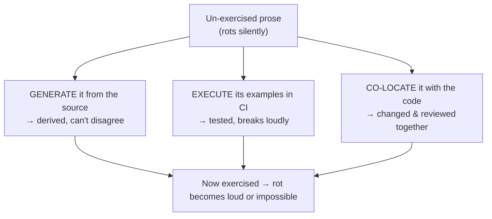
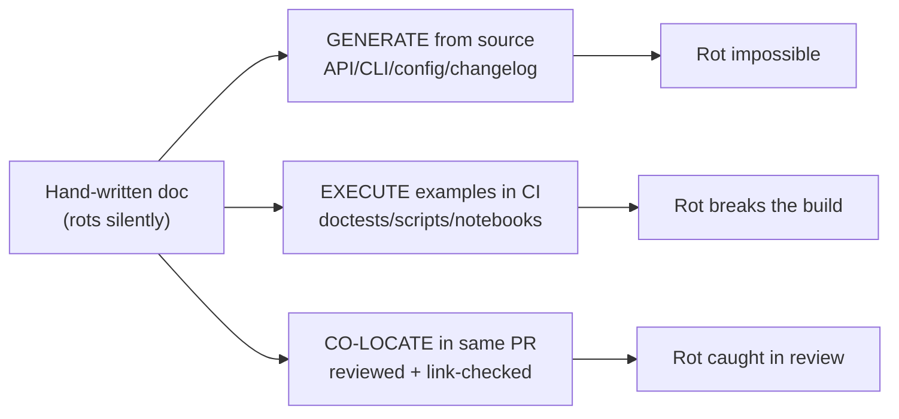
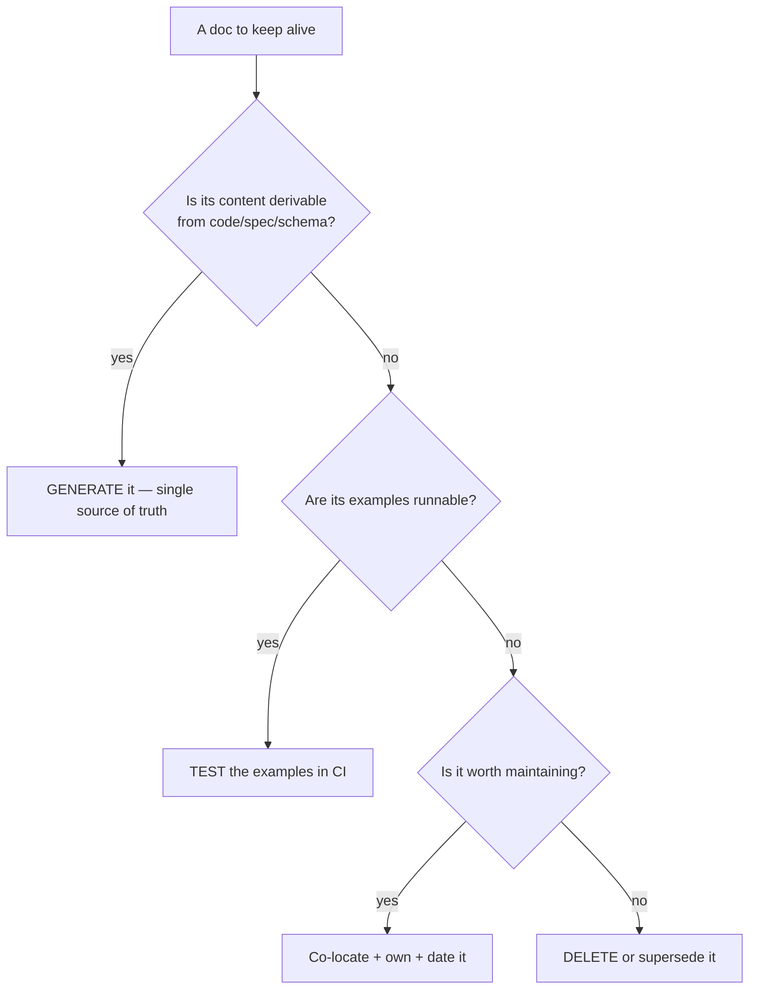

# Keeping Docs Alive & Fighting Doc Rot — Middle

> **Category:** [Documentation](../README.md) — the capstone discipline: keeping documentation *true* as the code and systems it describes change underneath it.

> **Prerequisite:** [Junior](junior.md)
> **Focus:** **Why** and **When**

---

## Table of Contents

1. [Introduction](#introduction)
2. [The Asymmetry That Drives All Rot](#the-asymmetry-that-drives-all-rot)
3. [Single Source of Truth: When and How to Generate](#single-source-of-truth-when-and-how-to-generate)
4. [Generated vs Hand-Written, by Doc Type](#generated-vs-hand-written-by-doc-type)
5. [Executable Docs: Making Prose Fail the Build](#executable-docs-making-prose-fail-the-build)
6. [Docs in the Same PR: Closing the Drift Window](#docs-in-the-same-pr-closing-the-drift-window)
7. [Ownership and Definition of Done](#ownership-and-definition-of-done)
8. [Freshness Signals That Aren't Theater](#freshness-signals-that-arent-theater)
9. [Deleting and Archiving Without Losing Knowledge](#deleting-and-archiving-without-losing-knowledge)
10. [Trade-offs](#trade-offs)
11. [Edge Cases](#edge-cases)
12. [Tricky Points](#tricky-points)
13. [Best Practices](#best-practices)
14. [Test Yourself](#test-yourself)
15. [Summary](#summary)
16. [Diagrams](#diagrams)

---

## Introduction

> Focus: **Why** and **When**

The junior level gave you the strategies. The middle level is about **choosing the right strategy for each doc, and knowing the trade-off you accept when you do.** Not every doc can be generated; not every example can be executed; freshness dates help some docs and lie about others. The recurring judgement call is:

> For *this* doc, what's the strongest anti-rot strategy that actually fits — and what does it cost me to apply it?

The wrong instinct is to pick one mechanism (usually freshness dates, because they're easy) and apply it everywhere. The middle-level skill is matching mechanism to doc *type*: generate the reference, test the examples, co-locate the guides, date the explanations, delete the dead weight. Get the match right and rot becomes the exception instead of the default.

---

## The Asymmetry That Drives All Rot

Everything in this topic descends from one fact, worth stating precisely because the cures all derive from it:

> **Code is continuously exercised; prose is not.** A wrong line of code fails a test, crashes, or returns the wrong answer — a *signal*. A wrong sentence in a doc produces *no signal at all*. The truth degrades, and nothing turns red.

This is why "be more disciplined about updating docs" never works as a strategy. Discipline is a human remembering to do something with no forcing function and no feedback. It loses to entropy every time. **The only durable cures convert the doc from un-exercised prose into something that *is* exercised** — and they do it in one of three ways:



When you evaluate any anti-rot proposal, ask: *does this make the doc exercised, or does it just ask someone to remember harder?* The first kind works; the second doesn't.

---

## Single Source of Truth: When and How to Generate

The single most powerful anti-rot move is to **not write the doc by hand** — derive it from the authoritative source so the two physically cannot disagree. The principle:

> A fact should have exactly **one** home. Every other appearance of it must be *generated* from that home, never *copied*.

The moment a fact lives in two hand-maintained places, you've planted a stale doc; it's only a matter of time. Generation removes the second home.

### What generates from what

| Doc | Source of truth | Generator (examples) |
|---|---|---|
| API reference | OpenAPI spec / typed code | Redoc, Swagger UI, `openapi-generator` |
| CLI usage / help | The argument parser itself | `--help` capture, `cobra`/`click` doc gen |
| Config reference | The config schema (JSON Schema, struct tags) | schema-to-Markdown scripts |
| Function/type reference | [Docstrings](../02-code-comments-and-docstrings/) on the code | Sphinx, `godoc`, `javadoc`, TypeDoc |
| [Changelog](../09-changelogs-and-release-notes/) | Conventional commit history | `git-cliff`, `release-please`, `changesets` |
| DB schema docs | The migrations / live schema | SchemaSpy, `tbls` |
| Architecture diagrams | The code/infra ([diagrams as code](../08-diagrams-as-code/)) | Mermaid, Structurizr (C4) |

### The single-vs-double-source contrast

```python
# DOUBLE SOURCE — a hand-written copy of a fact that lives in code. Rots.
# docs/api.md:
#   "GET /users/{id} returns {id, name, email}"   ← will drift when code adds 'role'

# SINGLE SOURCE — annotate the code; generate the reference FROM it.
@router.get("/users/{id}", response_model=UserOut)   # UserOut IS the contract
def get_user(id: int) -> UserOut: ...

# A build step runs the app's /openapi.json → renders the reference site.
# Add 'role' to UserOut and the doc updates automatically. No drift possible.
```

The trade-off to internalize now (and weigh at [Senior](senior.md)): generated docs are *always correct* but often *bare* — they tell you the shape, not the *why* or the *how-to*. Generation handles the mechanical truth; you still hand-write (and must keep alive) the explanatory layer.

---

## Generated vs Hand-Written, by Doc Type

The central decision of this topic. Each doc type sits somewhere on the "can this be derived from a source of truth?" axis:

| Doc type | Generate or hand-write? | Why | Rot risk if hand-written |
|---|---|---|---|
| API endpoint reference | **Generate** | The code/spec *is* the contract | Very high |
| CLI flags / options | **Generate** | The parser *is* the spec | Very high |
| Config keys & defaults | **Generate** | The schema *is* the spec | Very high |
| Changelog | **Generate** (from commits) | History *is* the source | High |
| Function/type signatures | **Generate** (from docstrings) | Signatures live in code | Very high |
| "Getting started" steps | **Hand-write but TEST** (executable) | Steps span tools; run them in CI | High → low once tested |
| Tutorials / how-to guides | **Hand-write, test examples** | Narrative needs a human; snippets can run | Medium |
| Architecture overview / "why" | **Hand-write** (no other option) | Rationale isn't in any machine source | High — guard with freshness + ownership |
| [ADRs](../05-architecture-decision-records-adrs/) | **Hand-write, immutable** | A decision-at-a-time; never edited, only superseded | Low (immutable by design) |

```
   CAN BE DERIVED ───────────────────────────────► PURELY HUMAN
   API ref   CLI   config   changelog  | getting-started | tutorial | "why"/arch
   └── GENERATE (rot impossible) ──────┘└─ TEST examples ┘└──── DATE + OWN ────┘
```

The rule this table encodes: **push every doc as far left as it will go.** Generate what's derivable; for what isn't, make the examples executable; for what's purely human, fall back to freshness signals and ownership — and accept that *this* tier is the rot-prone one you must actively garden.

---

## Executable Docs: Making Prose Fail the Build

When a doc can't be generated, the next-strongest move is to make its **examples run in CI** so a broken example turns the build red. The forms, weakest to strongest coverage:

1. **Doctests** — examples embedded in docstrings, executed as tests.
2. **Extracted code blocks** — pull fenced snippets out of Markdown and run them.
3. **Tested onboarding scripts/containers** — the README says "run this script"; CI runs that exact script on a clean machine.
4. **Literate / notebook docs** — the doc *is* executed top to bottom (e.g. a notebook run in CI), so every cell is verified.

### A doctest that catches drift

```python
def to_cents(amount: str) -> int:
    """Parse a currency string to integer cents.

    >>> to_cents("$12.50")
    1250
    >>> to_cents("$0.07")
    7
    """
    return round(float(amount.lstrip("$")) * 100)
```

If a refactor makes `to_cents` return a float, the documented `1250` no longer matches and `python -m doctest` fails. The example *is* a test. There's no path where the doc lies and CI stays green.

### A tested onboarding container

```dockerfile
# Dockerfile.onboarding — encodes "a fresh machine following our setup doc"
FROM ubuntu:24.04
COPY . /app
WORKDIR /app
RUN ./scripts/setup.sh        # the EXACT steps the README tells a new hire
RUN ./scripts/smoke-test.sh   # prove the app actually starts and serves
```

```yaml
# CI builds this image on every PR. If onboarding breaks, the build breaks —
# not a new hire's first morning three weeks from now.
```

This is the difference between *documenting* onboarding and *guaranteeing* it: the doc's claim ("follow these steps and it works") is now an assertion the build verifies.

> The principle: **a documented claim you can express as code should be expressed as code.** Prose makes a promise; a test keeps it.

---

## Docs in the Same PR: Closing the Drift Window

Even un-generatable, un-testable docs rot far less when they live **in the same repository and change in the same pull request** as the code they describe. This is the heart of [docs as code](../10-docs-as-code-and-tooling/), seen through the rot lens.

The mechanism is about **the drift window** — the gap between a behavior changing and its doc changing:

```
  DOCS IN A SEPARATE WIKI            DOCS IN THE SAME PR
  ┌──────────────┐                   ┌──────────────────────┐
  code change ───┤ ships             │ code + doc change ────┤ ship together
  doc change ────┤ "later" (= never) │ reviewed together     │ drift window ≈ 0
  └──────────────┘                   └──────────────────────┘
   drift window = days→forever         drift window = 0
```

When docs are in a separate system, updating them is a *context switch* to a different tool, a different review, a different moment — and that moment usually never comes. When the doc is in the diff, the reviewer sees the code change and the (missing or present) doc change side by side, and "you changed the behavior but not the doc" becomes a normal review comment. Co-location plus same-PR review collapses the drift window toward zero.

Add the cheap CI guards that co-location enables: **link-checking** (catches dead links the instant a page moves) and **linting** (catches broken Markdown, missing front-matter). These don't verify *truth*, but they catch the mechanical rot — and they're nearly free.

---

## Ownership and Definition of Done

Generation and tests cover the mechanical docs. The human docs (the "why", the guides) need a *process* that makes keeping them true **someone's job** and **part of finishing the work** — otherwise they fall into the "I'll remember to update it" trap that always loses.

Three concrete process levers:

1. **`CODEOWNERS` for docs** — a doc with no owner is a doc nobody notices going wrong.

   ```bash
   # .github/CODEOWNERS
   /docs/runbooks/      @sre-team       # whoever owns the system owns its runbook
   /docs/architecture/  @platform-leads
   *.md                 @docs-guild     # catch-all: nothing is ownerless
   ```

2. **Docs in the Definition of Done** — "done" includes "docs updated," so the doc isn't structurally last-and-skipped.

   ```text
   DEFINITION OF DONE (excerpt)
   [ ] Code merged and tests green
   [ ] User-facing behavior change → relevant docs updated in THIS PR
   [ ] New/changed config or endpoint → reference regenerates cleanly
   [ ] If a decision changed → ADR added or existing ADR superseded
   ```

3. **Doc review as part of code review** — a PR checklist item and, for high-value areas, a required `CODEOWNERS` approval. The reviewer's job explicitly includes "did the docs keep up?"

The point of all three: **convert "remember to update the doc" (which fails) into "the PR can't merge without addressing the doc" (which works).** Process beats willpower because process is a forcing function.

---

## Freshness Signals That Aren't Theater

When you can't prevent rot (the purely-human docs), make it **visible**. But this is the weakest tier, and the easiest to fake, so it must be done honestly.

A real freshness system has three parts:

1. **A `last_reviewed` date that means something** — set *only* when a human actually re-checked the doc against reality, never auto-bumped.

   ```markdown
   ---
   title: Payments Architecture Overview
   owner: payments-team
   last_reviewed: 2026-06-11   # a human re-verified this against the system today
   review_every_days: 180
   ---
   ```

2. **A staleness bot** that flags (does not delete) overdue docs, routing them to the owner.

   ```text
   docs/payments/overview.md   last reviewed 2025-11-02 (221 days ago, limit 180)
     → assigned to @payments-team for re-verification
   ```

3. **Reader feedback** — a "Was this helpful? / Report an error" widget, so the *people who hit the rot* can report it instead of silently sighing and leaving.

   ```html
   <!-- footer of every generated doc page -->
   Was this page accurate?  👍  👎  <a href="/report?doc={{page}}">Report an error →</a>
   ```

> **The theater trap:** a `last_reviewed` date bumped without a real review is *worse than no date* — it broadcasts "trustworthy" while lying. The fix is cultural and procedural: the date is a *claim a human made*, and bumping it without verifying is the same as committing a passing test that doesn't test anything.

Freshness signals are a backstop, not a foundation. They tell you *when to be suspicious*; they never make a doc fresh. Reach for them only after generation, testing, and co-location are exhausted.

---

## Deleting and Archiving Without Losing Knowledge

The cheapest doc to keep correct is the one that doesn't exist. **Optimize for deletion**: less doc surface means less to rot, fewer dead links, less to mislead.

But deletion has a failure mode — losing genuinely useful knowledge — so distinguish three actions:

| Action | When | How |
|---|---|---|
| **Delete** | The doc is wrong *and* low-value; maintaining it costs more than it's worth | Remove it; git history keeps it recoverable if ever needed |
| **Archive** | Still useful as historical context but no longer current | Move to an `/archive/` area, clearly banner it as not-current, exclude from search/nav defaults |
| **Supersede** | A decision/design was replaced by a newer one | Keep the old doc *immutable*, banner it, link forward to the replacement |

The superseding pattern is exactly the [ADR](../05-architecture-decision-records-adrs/) discipline: you never silently edit a decision to "fix" it; you mark it `Superseded by ADR-0042` and link forward. The old reasoning stays visible (it explains *why* you once chose differently), but no reader mistakes it for current.

```markdown
> ⚠️ **SUPERSEDED.** This describes the polling design used until 2026-Q1.
> Current approach: ADR-0042: Webhook delivery.
> Kept for historical context; do not build against this.
```

The discipline: a doc you're not willing to keep correct should be **deleted or clearly marked**, never left silently rotting where it can mislead. "We might want it someday" is the doc-hoarding instinct — and git history already preserves anything you delete, so the hoarding has no upside and a real rot cost.

---

## Trade-offs

| Strategy | Rot resistance | Cost to set up | Cost to maintain | Best for |
|---|---|---|---|---|
| **Generate (SSOT)** | Highest — can't drift | Medium (build pipeline) | Near-zero | Reference: API, CLI, config, changelog |
| **Executable / tested** | High — breaks the build | Medium (write the tests) | Low (runs in CI) | Examples, getting-started, tutorials |
| **Docs next to code (same PR)** | Medium–high | Low | Low | Guides, READMEs, anything human |
| **Ownership & process** | Medium (depends on people) | Low | Ongoing (review discipline) | The human/explanatory docs |
| **Freshness signals** | Low — only *reveals* rot | Low | Ongoing (real re-reviews) | "Why"/architecture docs as a backstop |
| **Delete / archive** | Removes the risk entirely | Near-zero | Near-zero | Low-value or superseded docs |

The asymmetry that should guide you: **the strongest strategies cost more up front and almost nothing thereafter; the weakest cost little up front and a recurring human tax forever.** Generation and tests are an investment that pays a dividend on every future change; freshness dates are a treadmill. Spend the up-front cost where the doc's value justifies a permanent guarantee, and use the cheaper tiers only for what can't be guaranteed.

---

## Edge Cases

### 1. The generated doc is correct but useless

A generated API reference can list every field and still leave a developer lost — it has the *what* but not the *why* or a worked example. Generation prevents rot but doesn't provide understanding. The resolution: generate the reference, then hand-write a *thin* layer of guides/examples on top — and make *those examples* executable so the rot-prone human layer is still tested.

### 2. The example needs external state

A tutorial example that calls a live third-party API can't run deterministically in CI. Options: record/replay (VCR-style fixtures), a hermetic mock server, or a contract test against a sandbox. If none is feasible, this example drops to the freshness-signal tier — accept it, and flag it as "manually verified," not "tested."

### 3. A doc that's *supposed* to sit untouched

A runbook for a rare disaster, a compliance policy, a stable protocol spec — these are correct precisely because nothing changed. A naïve staleness bot screams "221 days old!" at a perfectly fresh doc. The fix: per-doc `review_every_days` (long for stable docs), and bots that *flag for human judgement*, never auto-expire.

### 4. Docs for multiple versions

A library supporting v1 and v2 needs both versions' docs to stay true. Versioned docs sites (built from the corresponding code tag) are themselves a single-source-of-truth move: each version's docs are generated from *that version's* code, so neither rots into the other.

---

## Tricky Points

- **"More discipline" is not a strategy.** Any plan whose mechanism is "people will remember" has already failed. Convert it into a forcing function: generation, a test, a required review, a blocking CI check.
- **Generated docs can rot at the *generation step*.** If the build that regenerates the API site silently stops running, the published site freezes while the code moves on — invisible rot. Treat "docs regenerate and deploy" as a monitored pipeline, not a one-time setup.
- **A passing link-check is not a passing truth-check.** Link-checking and linting catch *mechanical* rot (dead links, bad Markdown). They say nothing about whether the *content* is still true. Don't let green link-check lull you into thinking the doc is correct.
- **Deleting a doc is usually safe; deleting *knowledge* is not.** Before deleting, ask whether the doc holds reasoning that exists nowhere else. If so, archive/supersede (preserve the *why*) rather than delete.
- **Freshness dates only help if the team *acts* on the staleness signal.** A bot that files "overdue" tickets nobody triages is theater with extra steps.

---

## Best Practices

1. **Match the strategy to the doc type.** Generate reference; test examples; co-locate guides; date the "why"; delete the dead weight.
2. **Push every doc as far left as it goes** on the derive-able axis: generate if you can, test if you can't generate, co-locate if you can't test.
3. **Keep one home per fact.** Any second appearance must be generated, never copied.
4. **Make the documented claim a tested claim** wherever possible — doctests, tested onboarding scripts/containers.
5. **Close the drift window:** docs in the same repo, the same PR, reviewed together; link-check and lint in CI.
6. **Make it someone's job:** `CODEOWNERS`, Definition of Done, doc review in code review.
7. **Use freshness signals honestly** — dates that mean a real human checked, bots that flag (not delete), reader "report an error" feedback.
8. **Delete or supersede ruthlessly;** preserve *knowledge* (archive/supersede) but not *rot*.

---

## Test Yourself

1. State the asymmetry between code and prose, and explain why it makes "be more disciplined" a non-strategy.
2. For each of: API reference, getting-started steps, architecture "why" — say whether to generate, test, or date it, and why.
3. What is "the drift window," and how does same-PR co-location shrink it?
4. Give the three parts of an honest freshness-signal system, and the trap that makes freshness dates "theater."
5. When should you delete a doc vs archive vs supersede it?
6. Name two ways a *generated* doc can still effectively rot.

---

## Summary

- All rot descends from one **asymmetry**: code is exercised (breaks loudly), prose isn't (rots silently). Durable cures convert prose into something *exercised* — generated, tested, or co-located — so "be more disciplined" is never the answer.
- **Single source of truth** is the strongest move: keep one home per fact and *generate* every other view (API ref, CLI, config, changelog, signatures). Generated docs can't disagree with their source.
- **Match strategy to doc type:** generate reference, **test** examples (doctests, tested onboarding containers), **co-locate** guides in the same PR (shrinking the drift window), and fall back to **freshness signals + ownership** only for the purely-human "why" docs.
- Freshness dates must be *honest* (a human actually checked) and bots must *flag, not delete*. **Delete or supersede ruthlessly** — preserve knowledge via archive/supersede, but never leave silent rot.
- The economics: strong strategies cost more up front and ~nothing after; weak ones are a permanent human tax. Invest the up-front cost where the doc's value justifies a guarantee.

---

## Diagrams

### Three ways to make prose "exercised"



### Generated-vs-hand-written decision




---

## Check your understanding

1. Explain Keeping Docs Alive & Fighting Doc Rot — Middle Level in your own words and name the problem it solves.
2. How would you apply the ideas around Table of Contents, Introduction, The Asymmetry That Drives All Rot in a realistic engineering change?
3. What failure mode or misuse should you look for, and what evidence would reveal it?
4. Which local design trade-off would make you choose or reject Keeping Docs Alive & Fighting Doc Rot — Middle Level in an existing codebase?
5. What observable result would convince you that the approach improved the system?
