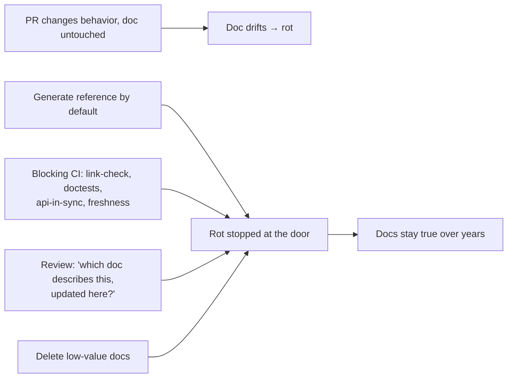
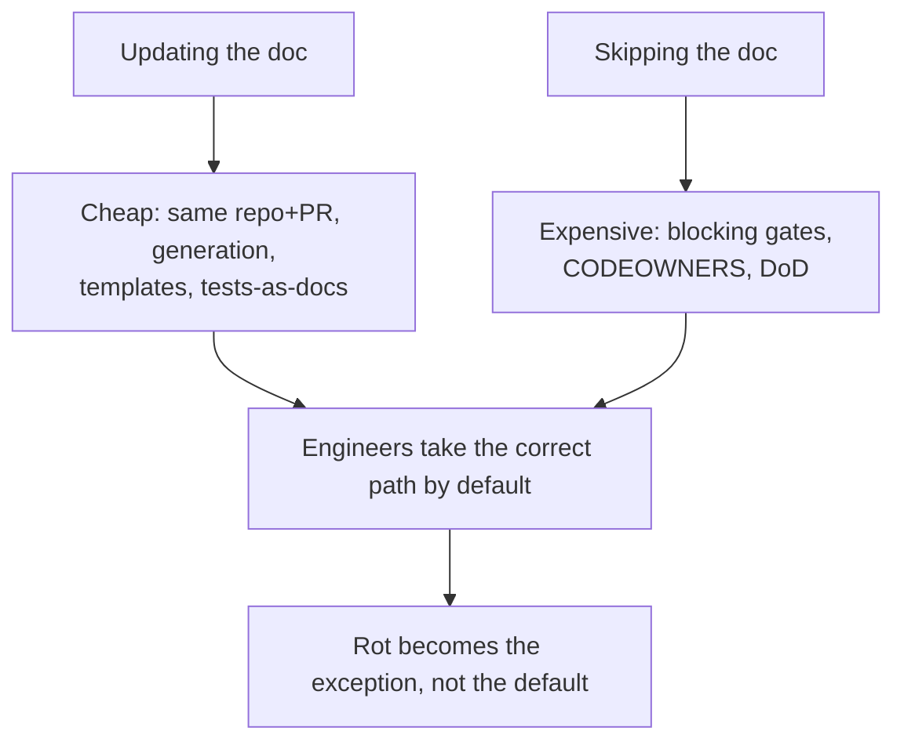

# Keeping Docs Alive & Fighting Doc Rot — Professional

> **Category:** [Documentation](../README.md) — the capstone discipline: keeping documentation *true* as the code and systems it describes change underneath it.

> **Prerequisites:** [Junior](junior.md) · [Middle](middle.md) · [Senior](senior.md)
> **Focus:** **Production** — org-wide programs, metrics, reviews, incidents

---

## Introduction

> Focus: **production** — keeping docs true across many teams, many repos, and years.

At the professional level the question is organizational: **how do you keep documentation true when hundreds of changes land weekly across dozens of teams, none of whom were hired to write docs?** Individual discipline does not scale; a stale-doc incident is forgotten by the next sprint. The answer is a *program*: structural rot-proofing as the default, freshness enforced in the pipeline where humans can't forget it, honest metrics that surface debt, and a culture that rewards *deletion* as much as authorship.

The professional reframing of everything below: **make the correct thing the path of least resistance.** Updating the doc should be cheaper than skipping it; the right doc should be impossible to merge around; deleting a dead doc should be celebrated, not feared. When the incentives and the tooling pull toward truth, rot stops being the default state and becomes the exception you catch at the door.

---

## Running Docs as an Engineering Program

Doc rot at org scale is not solved by exhortation. It's solved the way you solve any reliability problem — with ownership, defaults, gates, and measurement.

| Lever | What it looks like in production |
|---|---|
| **Rot-proof by default** | New API/CLI/config docs are *generated* by template; hand-written reference is rejected in review |
| **Ownership** | `CODEOWNERS` on every doc tree; an ownerless doc is a defect a linter flags |
| **Definition of Done** | "Docs updated in this PR" is a non-optional DoD line for any user-facing change |
| **Gates** | Link-check, doc-lint, freshness, and example-tests are *blocking* CI checks |
| **Measurement** | A doc-health dashboard (freshness, broken-link rate, deflection) reviewed in ops cadence |
| **Gardening** | Doc maintenance is a standing, budgeted activity — not a once-a-year cleanup project |
| **Culture** | Deletions are celebrated; a confirmed wrong doc is triaged like a bug |

The program's north star is the [senior](senior.md) objective function: **maximize correct-answers-delivered per unit of maintenance spent** — which means rot-proofing the high-value derivable docs, deleting the low-value ones, and spending scarce human review only on the irreducible "why."

---

## Enforcing Doc Freshness in Review and CI

Most rot enters one PR at a time — a behavior changes, the doc doesn't, the reviewer doesn't notice. The defense is at the door: review norms plus blocking CI checks that humans can't forget.

### Review by anti-rot strategy

A reviewer checks, in order of power:

1. **Could this doc be generated?** If a PR adds hand-written reference (API/CLI/config) that *could* come from a source of truth, push back — request generation, not prose. A hand-copy is a future stale doc.
2. **Are the examples executable?** New tutorial/getting-started snippets should be tested, not just typed. "Did you run this in CI?" is a standard question.
3. **Did the behavior change without the doc?** The highest-value review question of this whole topic:

   > **"This PR changes behavior X — which doc describes X, and is it updated in this PR?"**

   If the doc lives in another repo/wiki and "will be updated later," that's the drift window opening. Block it: the doc change belongs in *this* PR.
4. **Is a decision changing?** If so, an [ADR](../05-architecture-decision-records-adrs/) is added or an existing one superseded — not silently edited.

### Blocking CI checks

```yaml
# .github/workflows/docs-gate.yml — all BLOCKING; humans can't forget these
jobs:
  docs:
    runs-on: ubuntu-latest
    steps:
      - uses: actions/checkout@v4
      - run: make docs-link-check            # dead link → fail
      - run: make docs-lint                  # bad markdown / missing front-matter → fail
      - run: python -m pytest --doctest-modules src/   # examples must run → fail
      - run: ./scripts/setup.sh && ./scripts/smoke.sh  # onboarding path must work → fail
      - run: ./scripts/api_doc_in_sync.sh    # API changed but spec didn't → fail
      - run: python scripts/freshness_gate.py # overdue docs → red dashboard (warn or block)
```

### Review comment templates

> "This adds a hand-written table of config keys. We generate config docs from the schema — please delete the table and add the field to `config_schema.py`; the reference will regenerate. Otherwise it'll drift the first time someone adds a key."

> "This PR changes the refund flow but I don't see the runbook updated. The on-call doc still describes the old flow — can we update `runbooks/refunds.md` in this PR so they don't drift?"

> "Great tutorial, but the code block isn't tested. Can we move it into `tests/test_docs_examples.py` so it fails the build if the API changes? Right now it'll silently rot."

> "This 'edits' ADR-0017 to flip the decision. ADRs are immutable — please add ADR-0042 that supersedes 0017, and banner 0017 with a forward link, so the *why* of the original choice survives."

---

## Doc Health Metrics That Don't Lie

You cannot run a program you can't measure — but most doc metrics lie by conflating *quantity* with *correctness*. The professional must choose metrics that track truth, and refuse the ones that reward the wrong behavior.

| Metric | Use it? | Why / caveat |
|---|---|---|
| **Coverage** (% documented) | As a floor only | High coverage can be high *rot* — "documented" ≠ "correct." Don't reward it alone. |
| **Freshness** (% within review window) | **Yes** | Best human-doc proxy — *only* if reviews are real, not date-bumps. |
| **Broken-link rate** | **Yes** | Cheap mechanical signal; automatable; trend it to zero. |
| **Time-since-last-verified** distribution | **Yes** | The aging curve; a growing long tail = accumulating doc debt. |
| **Generated / hand-written ratio** | **Yes (leading)** | Rising hand-written share predicts future rot; drive generation up. |
| **Support-ticket / question deflection** | **Yes (outcome)** | Ground truth: do docs answer questions before they become tickets/Slack pings? |
| **"Was this helpful" + error-report rate** | **Yes (outcome)** | Direct reader signal of where rot bites. |
| **Doc word count / page count** | **No** | A vanity metric; more docs ≠ better, often = more rot surface. |

### The honest-measurement rules

- **Never report coverage alone as "doc health."** High coverage with low deflection means *extensive and rotten* — the worst quadrant. Pair coverage with an outcome metric.
- **The ground-truth metric is deflection:** can a person with a question get a *correct* answer from the docs instead of pinging a human? If support tickets and "where do I find…" Slack messages rise while coverage is flat, your docs are rotting regardless of any green check.
- **Trend, don't snapshot.** A rising hand-written ratio, a growing stale long-tail, a climbing broken-link rate — the *direction* is the early warning.
- **Watch the anti-rot machinery's own health** (from [senior](senior.md)): is the generation pipeline green and deploying? Are doctests skipped? A frozen pipeline produces confident, trusted, *wrong* docs — the most expensive kind.

> Never claim "docs improved" because page count or coverage went up. Report freshness, broken-link rate, generated ratio, and **deflection** — the metrics that move with *truth*, not volume.

---

## Doc Gardening: Ongoing Work, Not a Project

The most common organizational failure is treating doc health as a **project** — "Q3 documentation cleanup" — instead of **gardening**: continuous, small, never-finished maintenance woven into normal work.

Why the project framing fails:

- It's all risk and no flow value; it's the first thing cut when a deadline looms.
- It "completes," declares victory, and rot resumes the next day — docs drift continuously, so a one-time fix has a half-life of weeks.
- It batches deletion/verification into a heroic effort instead of making it cheap and routine.

The gardening model instead:

1. **Touch-it-fix-it (the Boy Scout rule for docs).** When you change code, you update (or delete) the doc *as part of the same change*. Simplicity and truth compound through normal PRs.
2. **Standing freshness rotation.** The staleness bot routes overdue docs to owners continuously; each team verifies a few per cycle, not hundreds in a panic.
3. **Periodic doc bug-bashes** as a *complement*, not a substitute: a scheduled hour where the team follows their own onboarding/runbooks and files every lie as a bug. Catches the rot the continuous process missed.
4. **Treat confirmed wrong docs as bugs** in the normal tracker, triaged by consequence severity — a stale runbook that could extend an outage is a real-priority ticket, not backlog dust.

> Rot is continuous, so the cure must be continuous. A garden is never "done" — you weed a little, constantly. The professional builds that little-and-constant maintenance into the team's normal rhythm so it never becomes a heroic, deferred-forever "initiative."

---

## Making It Cheap to Update and Expensive to Skip

The single most leveraged professional intervention: **shift the cost asymmetry so the correct behavior is the easy one.** Rot wins whenever skipping the doc is cheaper than updating it. Flip that on both sides.

**Make updating cheap:**

- Docs in the repo, in the same PR (no context switch to a separate tool).
- Generation, so most "updates" are automatic.
- Templates and scaffolding, so writing the human part is fill-in-the-blank, not blank-page.
- Examples that are tests, so "updating the doc" is "updating the test" — work the engineer already knows how to do.

**Make skipping expensive:**

- Blocking CI checks (the build won't merge with a broken example or dead link).
- `CODEOWNERS` requiring a doc-owner's approval on doc changes.
- DoD that makes "docs untouched" fail the review.
- An `api_doc_in_sync` check that *fails the PR* when the API changed but its source-of-truth doc didn't.

```
   BEFORE (rot wins):   cost(update doc) > cost(skip)   → people skip → rot
   AFTER  (truth wins): cost(update doc) < cost(skip)   → people update → fresh
                        ▲ generation/templates           ▲ blocking gates
                          make UPDATE cheap                make SKIP expensive
```

This is the operational heart of the whole program: you are not asking people to care more about docs; you are **engineering the incentive gradient** so that the lazy path *is* the correct path.

---

## Real Incidents

### Incident 1: The runbook that extended an outage

A payments service degraded at 2 a.m. The on-call followed the runbook's recovery steps — which referenced a `restart-worker.sh` script renamed three months earlier and a dashboard URL that 404'd. The engineer burned 40 minutes discovering the runbook was stale before improvising a fix. **Postmortem:** the runbook lived in a wiki, separate from the code; the rename PR never touched it (no drift signal, no owner). **Fix:** moved runbooks into the service repo with `CODEOWNERS = @sre`, added a CI check that the scripts a runbook references actually exist, and a quarterly game-day that *executes* the runbook. **Lesson:** a stale runbook isn't a doc problem — it's an outage amplifier. Co-locate it, own it, and *test the steps*.

### Incident 2: The frozen generation pipeline

A team's API reference was generated from OpenAPI — the "safe", rot-proof tier. But the docs-deploy job had been silently failing for five weeks (a credential expired), and the failure was non-blocking. Customers integrated against documented fields that had been renamed; integrations broke in production. **Postmortem:** the generation *guarantee* had quietly become decoration — the pipeline rotted while everyone trusted it *more* because it was "generated." **Fix:** doc-deploy made blocking; a daily canary verifies the *published* site matches the live `/openapi.json` and pages on mismatch. **Lesson:** generated docs are only rot-proof if the generator is *monitored*. The guard must itself be guarded.

### Incident 3: Freshness theater during an audit

Before a compliance audit, a team ran a script that bulk-set `last_reviewed` to today across 400 docs to "look maintained." The audit passed. Two months later an engineer trusted a "reviewed last quarter" security doc that was, in fact, two years stale — and configured an integration insecurely. **Postmortem:** the freshness field had become a lie that *manufactured* false trust — worse than no field. **Fix:** review dates can only be bumped via a reviewer's sign-off PR that links the verification; bulk-bumping is blocked. **Lesson:** a freshness signal that can be faked is worse than none, because it converts "I'm not sure" into false confidence.

### Incident 4: The doc nobody should have maintained

A team spent ~2 engineer-days per quarter keeping a "Service Architecture" wiki page accurate — diagrams, component lists, data flows. Analytics showed it was opened 4 times in a year, mostly by its own authors. Meanwhile the *actually-read* getting-started guide was rotting for lack of time. **Fix:** deleted the architecture page (git preserved it), generated a current component diagram from the IaC ([diagrams as code](../08-diagrams-as-code/)) for the rare reader, and redirected the freed budget to rot-proofing the getting-started guide with a tested onboarding container. **Lesson:** maintaining a low-value doc has an opportunity cost. Deleting it wasn't loss — it was reclaiming budget for the docs that matter.

---

## The Politics of Deleting Docs

Sustaining doc health is partly a social problem, and the hardest part is *deletion*.

- **Deleting feels like destroying work; keeping feels safe.** It's backwards: a kept-but-stale doc actively harms readers, while a deleted doc costs nothing (git preserves it). Reframe deletion as a *safety* action — removing a thing that can mislead.
- **Authorship is rewarded; gardening is invisible.** The person who wrote the 3,000-word guide got praise; the person who deleted it when it rotted gets nothing. Flip the incentive: **celebrate net-negative-doc PRs** that remove rot surface, the same way good teams celebrate net-negative-LOC.
- **"We might need it someday" blocks every deletion.** Arm the team with the fact that *git history preserves everything*, so "someday" is recoverable — and with the maintenance-vs-value calculus so deletion is a standard, cited decision, not a personal call.
- **Leaders set the example.** If staff engineers hoard docs and never delete, everyone does. Model deletion, model "this should be generated, not hand-written," and explain *why* — the team copies what senior people actually do.

> A useful proverb for the team wall: *"The best documentation is the documentation you didn't have to write — generate it, test it, or delete it."*

---

## Review Checklist

```text
DOC-ROT REVIEW CHECKLIST (apply in order of power)
[ ] GENERATE?    Could this hand-written reference be generated from a source
                 of truth? If yes → reject the prose, add it to the source.
[ ] EXECUTE?     Are new examples/onboarding steps tested in CI (not just typed)?
[ ] SAME PR?     Behavior changed → is the doc that describes it updated HERE?
[ ] SSOT?        Does this create a SECOND home for a fact? If yes → derive it.
[ ] ADR?         Did a decision change → new/superseding ADR (never silent edit)?
[ ] OWNED?       Does every touched doc have a CODEOWNER?
[ ] FRESHNESS?   Is last_reviewed bumped only with REAL verification (no theater)?
[ ] DELETE?      Low-value + rotting → delete/supersede, don't heroically maintain.
[ ] GUARDS GREEN? Link-check / doctests / generation pipeline actually blocking & passing?
```

---

## Cheat Sheet

```text
THE PROGRAM
  Make the correct thing the path of least resistance:
  cheap to UPDATE (repo + same PR + generation + templates + tests-as-docs)
  expensive to SKIP (blocking CI gates + CODEOWNERS + DoD).

ENFORCE (review)   highest-value question: "behavior changed — which doc
                   describes it, and is it updated in THIS PR?"
                   Reject hand-written reference that could be GENERATED.

METRICS            freshness, broken-link rate, generated/hand-written ratio,
                   and — ground truth — DEFLECTION (docs answer Qs before tickets).
                   NOT coverage-alone, NOT page-count.

GARDENING          continuous, not a project: touch-it-fix-it, standing freshness
                   rotation, periodic bug-bashes. Wrong doc = a triaged bug.

GUARD THE GUARDS   monitor the generation pipeline; doctests can't be silently
                   skipped; link-check & freshness are BLOCKING, not warnings.

CULTURE            celebrate DELETIONS and net-negative-doc PRs. git preserves
                   everything, so "we might need it" is no reason to hoard rot.
```

---

## Diagrams

### Where rot enters, and where the program stops it



### Make update cheap, make skip expensive



---

## Related Topics

- **Enforced via:** [Docs as Code & Tooling](../10-docs-as-code-and-tooling/).
- **Generation sources:** [API & Reference Docs](../04-api-and-reference-documentation/), [Changelogs](../09-changelogs-and-release-notes/), [Diagrams as Code](../08-diagrams-as-code/), [Code Comments & Docstrings](../02-code-comments-and-docstrings/).
- **Superseding decisions:** [ADRs](../05-architecture-decision-records-adrs/).
- **What's worth documenting at all:** [Why & What to Document](../01-why-and-what-to-document/).

---


---

## Check your understanding

1. Explain Keeping Docs Alive & Fighting Doc Rot — Professional Level in your own words and name the problem it solves.
2. How would you apply the ideas around Table of Contents, Introduction, Running Docs as an Engineering Program in a realistic engineering change?
3. What failure mode or misuse should you look for, and what evidence would reveal it?
4. How would you introduce and govern Keeping Docs Alive & Fighting Doc Rot — Professional Level across teams through reversible, measurable increments?
5. What observable result would convince you that the approach improved the system?
