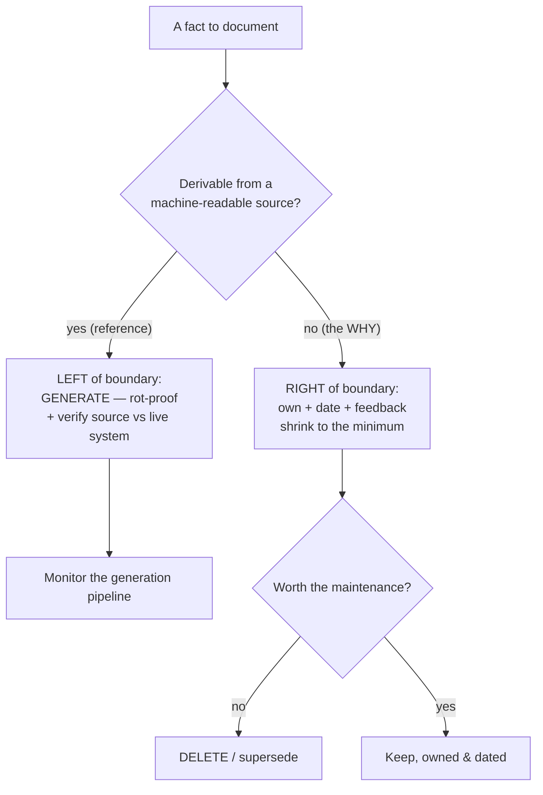
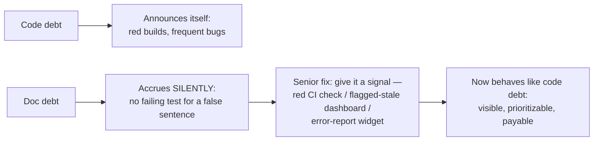

# Keeping Docs Alive & Fighting Doc Rot — Senior

> **Category:** [Documentation](../README.md) — the capstone discipline: keeping documentation *true* as the code and systems it describes change underneath it.

> **Prerequisites:** [Junior](junior.md) · [Middle](middle.md)
> **Focus:** **Design trade-offs** and **system-level reasoning**

---

## Introduction

> Focus: **design trade-offs** and **system-level reasoning**

At junior and middle levels, fighting doc rot is a per-doc choice: generate this, test that, date the other. At the senior level it becomes an **architectural and economic** problem about the whole documentation system:

1. **Where exactly is the generation boundary** — the line between what can be derived from a source of truth (and so made rot-proof) and what is irreducibly human (and so will always rot)?
2. **Which docs are worth keeping alive at all** — because maintenance is a finite budget, and a low-value doc you keep repairing is worse than a deleted one.
3. **How do you design the system so rot surfaces *loudly*** instead of accumulating silently — the same instinct that makes a broken build red rather than a quiet wrong answer?

The senior mistake is treating "keep docs up to date" as an unbounded virtue — try to keep *everything* fresh and you bankrupt the maintenance budget, miss the docs that matter, and still ship rot. The senior stance is the opposite: **rot-proof the derivable, ruthlessly delete the low-value, and make the irreducibly-human remainder small, owned, and loud when it goes wrong.**

---

## Doc Rot as Technical Debt

Doc rot is technical debt in the precise Ward Cunningham sense: a gap between what the artifact *says* and what the system *does*, where the gap compounds interest. Treating it as debt unlocks the right tooling and the right conversations.

| Debt concept | Applied to docs |
|---|---|
| **Principal** | The truth gap — how far the doc has drifted from reality |
| **Interest** | The compounding cost: every reader misled, every incident caused, every hour wasted, trust eroded |
| **Servicing the debt** | Re-verifying and updating the doc |
| **Paying it down** | Rot-proofing (generate/test) or deleting the doc so the gap *can't* reopen |
| **Default / bankruptcy** | Trust collapse — the doc set becomes worthless and is abandoned |

The interest structure is what makes doc debt insidious: unlike code debt, which usually announces itself (slow builds, frequent bugs in a module), **doc debt accrues silently** — there's no failing test for "this sentence became false." It compounds invisibly until an incident or a frustrated new hire cashes it out all at once. This is why the senior framing is to **make doc debt behave like code debt** — give it a failing signal (a red CI check, a flagged-stale dashboard) so it can't accrue in the dark.

> Treat a confirmed wrong doc as a **P-level bug**, not a backlog "nice to fix." A stale runbook can extend an outage; a stale API doc can break a customer integration. The severity of the *consequence* — not the medium (prose vs code) — sets the priority.

### Measuring doc health

You can't manage debt you can't see. The senior metrics that actually track doc health (and the ones that lie):

| Metric | Tracks health? | Notes |
|---|---|---|
| **Coverage** (% of public API / endpoints / configs documented) | Partially | Necessary floor, but "documented" ≠ "correct" — high coverage can be high *rot* |
| **Freshness** (% of docs reviewed within their window) | **Yes** | Best single proxy for human-doc health — *if* reviews are real (not theater) |
| **Broken-link rate** | **Yes (mechanical)** | Cheap, automatable; catches structural rot but not content lies |
| **Time-since-last-verified** distribution | **Yes** | The aging curve of your human docs; long tails are accumulating debt |
| **Generated-vs-hand-written ratio** | **Yes (leading)** | More generated = structurally less rot-able; rising hand-written share is a warning |
| **Support-ticket / question deflection** | **Yes (outcome)** | The ground truth: do the docs actually answer questions before they become tickets? |
| **"Was this helpful" / error-report rate** | **Yes (outcome)** | Direct reader signal of where rot bites |

> The outcome metric dominates: **does a person with a question get a correct answer from the docs instead of pinging a human or filing a ticket?** Coverage and freshness are *leading* indicators; deflection and error-reports are the *lagging* truth. If deflection drops while coverage is high, your docs are extensive *and* rotten — the worst quadrant.

---

## The Generation Boundary: What You Can't Derive

The single most important senior judgement in this topic is locating the **generation boundary**: the line separating docs that can be derived from a machine-readable source of truth (and so made rot-*proof*) from those that cannot (and so are rot-*prone* by nature).

```
   DERIVABLE (rot-proof by generation)   │   IRREDUCIBLY HUMAN (rot-prone)
   ──────────────────────────────────────┼────────────────────────────────────
   API signatures & schemas              │   WHY a design was chosen
   CLI flags / config keys / defaults    │   WHAT we rejected and the trade-offs
   changelog (from commits)              │   HOW these pieces fit conceptually
   type/struct/field reference           │   mental models, intuition, narrative
   "current schema" diagrams             │   roadmap, intent, philosophy
   ──────────────────────────────────────┴────────────────────────────────────
   maps to Diátaxis: REFERENCE           │   maps to Diátaxis: EXPLANATION
```

This maps almost exactly onto the **Diátaxis** quadrants: *reference* (the facts — derivable) and *how-to/tutorial* (executable) lie left of the boundary; *explanation* (the why) lies right of it. The senior insight:

> **Generation can eliminate rot for the left side entirely. It can do nothing for the right side.** So the architecture is: derive everything left of the boundary, shrink the right side to the irreducible minimum, and spend your scarce maintenance budget *only* on that minimum.

A common senior-level error is fighting the boundary — trying to keep a hand-written copy of the API surface "in sync" through discipline (it always loses to generation), *or* trying to auto-generate the architectural "why" from code (it can't be — the rationale exists nowhere in the source). Respecting the boundary means applying the right *kind* of defense to each side: **mechanism (generation/tests) on the left, judgement (ownership/freshness/deletion) on the right.**

There's also a *value* asymmetry across the boundary. The left side is mechanical truth — important but commoditized. The right side — the *why* — is the documentation that justifies the whole section's existence ([why & what to document](../01-why-and-what-to-document/)): code already tells you *what*; only humans can tell you *why*. So the rot-prone side is also the *high-value* side, which is exactly why it deserves the careful, expensive defenses.

---

## Designing for Single Source of Truth at the System Level

At small scale, SSOT is "generate the API docs." At system scale it's an **architecture**: every fact in the org should have a designated authoritative home, and every other representation of that fact is a derived view. Designing this is a senior responsibility because the failure mode — facts with two homes — is created by *organizational* structure, not individual carelessness.

Principles for SSOT-at-scale:

1. **Name the authoritative source for each fact class.** The endpoint contract lives in the OpenAPI spec (or the typed handler). The config schema lives in one schema file. The deploy topology lives in the IaC. Write this mapping down — ambiguity about "where the truth lives" *is* the rot.
2. **Generate every other view; forbid hand-copies.** A wiki page that re-types the config keys is banned by policy, not by hoping. If a second view is needed, it's a generation target, not a manual transcription.
3. **Make the generation pipeline a first-class, monitored system.** If the build that regenerates the API site stops running, the published docs silently freeze — generation that isn't monitored is just slower-motion rot (see [below](#when-the-anti-rot-machinery-itself-rots)).
4. **Push the source of truth as close to the code as possible.** Docstrings, type annotations, schema-in-code, IaC, conventional commits — the closer the truth lives to where the change is made, the smaller the drift window and the harder it is to update one without the other.

> The system-level reframing of SSOT: **doc rot is, at root, a duplicate-fact problem.** Two homes for a fact will diverge. The whole anti-rot architecture is an exercise in collapsing every fact to one home and deriving the rest — the documentation analogue of normalizing a database to eliminate update anomalies.

---

## The Maintenance-Cost vs Doc-Value Calculus

The defining senior trade-off: **keeping a doc alive is not free, and not every doc is worth the cost.** Junior advice ("keep your docs up to date") is unbounded and therefore wrong at scale — maintenance is a finite budget, and spreading it across every doc means none of the important ones get genuinely verified.

The calculus, per doc:

```
   KEEP-ALIVE if:   value(doc) × read_frequency  >  cost(keeping it correct)
   DELETE if:       the inequality flips — the doc costs more to maintain
                    than the value it delivers, OR it's rarely/never read.
```

This produces a 2×2 that should drive every doc's fate:

```
                    HIGH maintenance cost          LOW maintenance cost
                 ┌──────────────────────────┬──────────────────────────┐
   HIGH value    │ ROT-PROOF IT              │ KEEP (cheap to maintain) │
   (read often)  │ generate or make          │ co-locate + own          │
                 │ executable — kill the cost│                          │
                 ├──────────────────────────┼──────────────────────────┤
   LOW value     │ DELETE                    │ DELETE or archive        │
   (rarely read) │ (worst quadrant — paying  │ (no value to justify even│
                 │  a lot for little)        │  small upkeep)           │
                 └──────────────────────────┴──────────────────────────┘
```

The two diagonal moves are the senior decisions:

- **High value + high maintenance cost → rot-proof it** (generate or make executable), converting an expensive treadmill into a one-time investment. This is where SSOT pays for itself.
- **Low value + high maintenance cost → delete it.** This is the quadrant teams get wrong: they keep repairing a doc nobody reads because deleting feels like loss. It isn't — it's reclaiming maintenance budget and removing a rot surface. *Optimize for deletion.*

> "Keep docs up to date" is the wrong objective function. The right one is **maximize correct-answers-delivered per unit of maintenance spent** — which means rot-proofing the high-value docs and *deleting* the low-value ones, not heroically maintaining everything.

---

## Freshness as a Signal, Not a Guarantee

Seniors must hold a precise distinction that junior teams blur:

> Generation and tests are **guarantees** — the doc *cannot* (or cannot silently) be wrong. Freshness dates are **signals** — the doc *might* be wrong, and here's a hint about how much to trust it.

Confusing the two is dangerous in both directions:

- **Treating a signal as a guarantee** — "it has a `last_reviewed: 2026-06` stamp, so it's correct" — is exactly the theater failure: the stamp asserts trustworthiness it can't back up. A reviewed-last-month doc whose system changed last week is still wrong.
- **Demanding guarantees where only signals are possible** — insisting the architecture "why" doc be somehow auto-verified — wastes effort fighting the generation boundary. Some docs *can only* have signals; accept it and make the signal honest.

The senior design for freshness:

- **Per-doc review cadence**, set by volatility, not a global constant. A stable protocol spec reviews yearly; a fast-moving service's runbook reviews monthly. A single global expiry is wrong for both ends.
- **Flag, never auto-delete.** Expiry routes a doc to its owner for *human judgement* — "still true? update the date, fix it, or delete it." Auto-deletion at an age threshold throws away stable, correct, high-value docs (the rare-incident runbook is *supposed* to be old and untouched). Over-aggressive expiry is its own rot — by deletion instead of drift.
- **The date must encode a real act.** Bumping it is a claim a human made ("I checked this against reality"). Treat a falsely-bumped date as you'd treat a falsified test result.

---

## When the Anti-Rot Machinery Itself Rots

A subtle senior-level failure: the systems you built to *prevent* rot can themselves rot, and because they wear the badge of trustworthiness, their rot is the most dangerous of all.

| Machinery | How it rots | Consequence |
|---|---|---|
| **Generation pipeline** | The doc-build job silently stops running / starts failing-but-ignored | Published docs freeze; site looks current but reflects last-good build — *invisible* rot wearing a "generated, so trustworthy" badge |
| **Doctest / example suite** | Examples get `@skip`-ped "temporarily" to unblock a release | The tested-docs guarantee quietly evaporates; everyone still believes the examples run |
| **Link checker** | Set to non-blocking / warnings-only to stop "annoying" failures | Dead links accumulate unnoticed; the green check means nothing |
| **Staleness bot** | Files tickets into a queue nobody triages | Freshness signal exists but is never acted on — theater |
| **Freshness dates** | Bulk-bumped in a "doc cleanup" without real review | Every doc *claims* freshness; none was verified |

> The meta-principle: **a check that can be silently disabled, ignored, or skipped is not a guarantee — it's a guarantee-shaped decoration.** Senior design makes the anti-rot machinery *fail loudly and block*: doc-build failures break the pipeline, skipped doctests are reported and budgeted, link-check is blocking, the staleness queue has an owner with an SLA. The guard must itself be guarded.

The deepest version of the trust-collapse loop operates here: if the *generation pipeline* silently dies, you get rot in docs everyone has been trained to trust *most* — and the eventual discovery ("even the generated docs were wrong") collapses trust faster and harder than a stale wiki ever could.

---

## Code Examples — Advanced

### A generated doc that *proves* it matches the running system (contract drift guard)

Generation alone isn't enough if the generator runs against the *spec* while the *server* drifts. Close the loop by testing the generated source against the live behavior:

```python
# tests/test_openapi_matches_server.py
# The reference docs are generated from openapi.json. This test fails CI if the
# committed spec (the doc's source of truth) no longer matches what the app serves.
def test_committed_spec_matches_live_app(client):
    served = client.get("/openapi.json").json()
    committed = json.load(open("docs/openapi.json"))
    assert served == committed, (
        "API changed but the doc source-of-truth is stale. "
        "Regenerate: `make docs-spec`."
    )
```

Now the *source of truth itself* can't drift from the running system without turning CI red — rot is impossible at the generation step, not just downstream of it.

### Guarding the generation pipeline against silent freeze

```yaml
# .github/workflows/docs-publish.yml — the doc build is a MONITORED, BLOCKING job
jobs:
  build-and-publish-docs:
    runs-on: ubuntu-latest
    steps:
      - uses: actions/checkout@v4
      - run: make docs            # regenerate reference from code/spec
      - run: make docs-link-check  # BLOCKING — dead link fails the deploy
      - run: ./scripts/assert_docs_changed_if_api_changed.sh  # see below
      - run: make docs-deploy
  # A separate scheduled canary verifies the PUBLISHED site freshness daily,
  # so a frozen pipeline pages someone instead of rotting in silence.
```

```bash
# scripts/assert_docs_changed_if_api_changed.sh
# Fail the PR if API source changed but generated reference didn't regenerate —
# catches a broken/forgotten generation step (the machinery rotting).
if git diff --name-only origin/main | grep -qE '^src/api/'; then
  if ! git diff --name-only origin/main | grep -qE '^docs/openapi.json'; then
    echo "API source changed but docs/openapi.json did not. Run 'make docs-spec'."
    exit 1
  fi
fi
```

### A volatility-aware freshness gate (flags, doesn't delete)

```python
# scripts/freshness_gate.py — per-doc cadence; routes overdue docs to owners, never deletes
import datetime, glob, yaml, sys, json

overdue = []
for path in glob.glob("docs/**/*.md", recursive=True):
    fm = yaml.safe_load(open(path).read().split("---")[1])
    cadence = fm.get("review_every_days", 180)        # per-doc, volatility-aware
    reviewed = fm.get("last_reviewed")
    if reviewed and (datetime.date.today() - reviewed).days > cadence:
        overdue.append({"doc": path, "owner": fm.get("owner"), "reviewed": str(reviewed)})

# Emit for the dashboard / ticketing — a SIGNAL for human judgement, not a delete.
print(json.dumps(overdue, indent=2))
sys.exit(1 if overdue else 0)   # red dashboard until a human re-verifies or deletes
```

---

## Liabilities

### Liability 1: Generation theater

Standing up a generation pipeline and assuming the docs are now safe — while the pipeline silently fails, the spec drifts from the server, or the generated reference is technically-correct-but-useless (no examples, no why). Generation removes *fact* rot only if the pipeline is monitored and the source is verified against reality.

### Liability 2: Maintaining what should be deleted

Pouring finite maintenance budget into low-value docs nobody reads, out of a reluctance to delete. Every hour spent repairing a dead doc is an hour not spent rot-proofing a high-value one. Deletion is the senior move; git history is the safety net.

### Liability 3: Freshness theater

A `last_reviewed` field bumped without real verification, or a staleness bot whose tickets nobody triages. This is *worse* than no freshness system, because it manufactures false confidence in docs that are actually rotting.

### Liability 4: Over-aggressive expiry

Auto-deleting docs past an age threshold destroys stable, correct, high-value docs (rare-incident runbooks, protocol specs) that are old *because they're correct*. Expiry must flag for judgement, with volatility-aware cadences — never silently delete.

### Liability 5: Unguarded guards

The link checker set to non-blocking, the doctests `@skip`-ped to ship, the doc-build job failing-but-ignored. A guarantee that can be silently disabled is decoration. Make the anti-rot machinery fail loudly and block.

---

## Pros & Cons at the System Level

| Dimension | Rot-proof (generate / execute) | Process-and-signal (own / date) | Delete / archive |
|---|---|---|---|
| Rot resistance | Highest — structurally impossible/loud | Depends on people & honesty | Total — no doc, no rot |
| Up-front cost | Medium–high (pipeline, tests) | Low | ~Zero |
| Ongoing cost | ~Zero (runs in CI) | Recurring human tax (reviews) | ~Zero |
| Applies to | Reference, examples (left of boundary) | The "why"/explanation (right of boundary) | Low-value / superseded docs |
| Failure mode | Pipeline rots silently if unmonitored | Theater (fake dates, ignored bots) | Losing genuine knowledge if you delete the *why* |
| Senior priority | High-value derivable docs | The irreducible human remainder | Everything low-value |

The system-level stance the table encodes: **rot-proof what you can, signal-and-own what you must, delete what you shouldn't be carrying** — and keep the human remainder as small as possible, because that remainder is the only part that can still silently lie, and it's also your highest-value content.

---

## Diagrams

### The generation boundary and the defense each side needs



### Doc debt vs code debt — give doc debt a failing signal



---

## Related Topics

- **Generation sources:** [API & Reference Docs](../04-api-and-reference-documentation/), [Code Comments & Docstrings](../02-code-comments-and-docstrings/), [Changelogs](../09-changelogs-and-release-notes/), [Diagrams as Code](../08-diagrams-as-code/).
- **Superseding & immutable decisions:** [ADRs](../05-architecture-decision-records-adrs/).
- **Pipeline & CI for docs:** [Docs as Code & Tooling](../10-docs-as-code-and-tooling/).
- **The value of the "why":** [Why & What to Document](../01-why-and-what-to-document/).

---


---

## Check your understanding

1. Explain Keeping Docs Alive & Fighting Doc Rot — Senior Level in your own words and name the problem it solves.
2. How would you apply the ideas around Table of Contents, Introduction, Doc Rot as Technical Debt in a realistic engineering change?
3. What failure mode or misuse should you look for, and what evidence would reveal it?
4. How would you validate a system-level decision about Keeping Docs Alive & Fighting Doc Rot — Senior Level under uncertainty?
5. What observable result would convince you that the approach improved the system?
