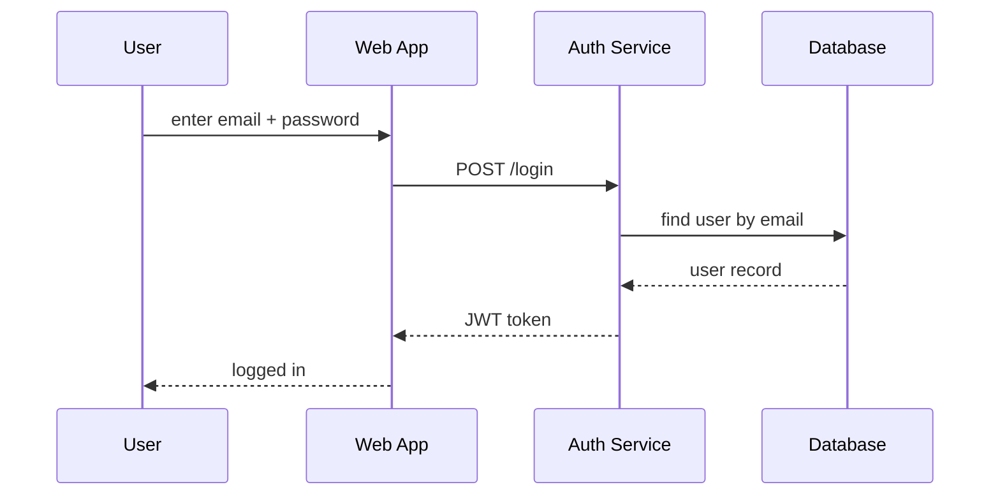
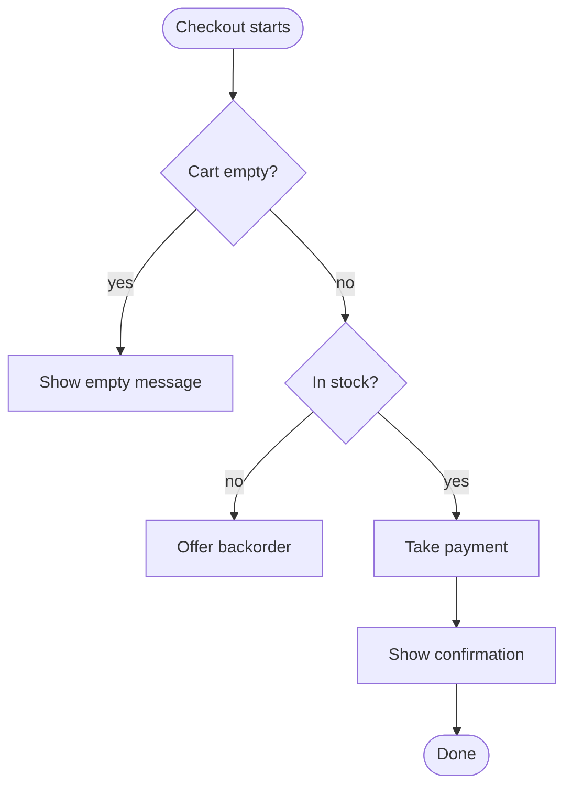

# UML Diagrams — Junior

> **Category:** [Documentation](../README.md) — UML has 14 diagram types, but only five pay rent in real teams; learn to read those five and draw your first ones as plain-text sketches.

---

## Introduction

> Focus: **What is it?** and **How do I read it?**

**UML** (Unified Modeling Language) is a standard set of pictures for describing software. It defines **14** diagram types — but you can ignore most of them. In practice, working engineers use a handful, and even those are usually drawn as quick **sketches** to explain an idea, not as formal blueprints.

> **UML** is a visual notation for software design. Its real value today is as a *shared vocabulary of shapes* so that a diagram you draw means the same thing to the person reading it.

Five diagrams cover almost everything you'll meet on the job:

| Diagram | Answers the question |
|---|---|
| **Class** | What are the types, and how are they related? |
| **Sequence** | Who calls whom, in what order, over time? |
| **State-machine** | What states can one thing be in, and which transitions are legal? |
| **Activity** | What are the steps and branches of a workflow? |
| **Use-case** | Who uses the system, and to do what? (the weakest of the five) |

Your day-one goal is modest and high-value: **be able to read these five** when you find them in a book, a design doc, or a vendor's documentation, and draw a rough one yourself when words aren't enough. This repo writes diagrams as text (see [Diagrams as Code](../08-diagrams-as-code/junior.md)), so every example below is real, renderable **Mermaid** or **PlantUML**.

---

## Prerequisites

- **Required:** comfort with **Markdown** and committing files — these diagrams live as text in the repo.
- **Required:** basic object-oriented vocabulary — *class*, *object*, *method*, *field*, *inheritance*. (See Object-Oriented Programming.)
- **Helpful:** you've read the [Diagrams as Code — Junior](../08-diagrams-as-code/junior.md) file; UML diagrams are a *kind* of diagram-as-code.
- **Helpful:** a rough picture of a web request (client → API → database) so the examples land.

---

## Glossary

| Term | Definition |
|------|-----------|
| **UML** | Unified Modeling Language — a standard visual notation for software design. |
| **Class diagram** | Shows classes/types, their fields and methods, and the relationships between them. |
| **Sequence diagram** | Shows messages exchanged between participants, ordered top-to-bottom in time. |
| **State-machine diagram** | Shows the states one thing can be in and the events that move it between them. |
| **Activity diagram** | A flowchart of a workflow, with decisions, parallel branches, and swimlanes. |
| **Use-case diagram** | Shows actors (users/systems) and the things they can do with the system. |
| **Lifeline** | The vertical dashed line under a participant in a sequence diagram. |
| **Multiplicity** | How many of one thing relate to another (`1`, `0..1`, `*`, `1..*`). |
| **Sketch** | A quick, throwaway diagram drawn to communicate, not to be kept forever. |

---

## The Five Diagrams That Matter

UML's spec is huge, but the 80/20 is brutal: **class, sequence, and state-machine** are the keepers; **activity** is useful for workflows; **use-case** is the one you'll draw least (and often shouldn't). The other nine UML diagram types (component, deployment, object, package, timing, communication, composite-structure, profile, interaction-overview) are rare enough that you can learn them the day you actually need them.

Everything below shows each diagram **twice**: first what it *looks like* conceptually, then the **text** that renders it, because this repo treats diagrams as committed code.

---

## Class Diagram: What Things Are

A **class diagram** is a snapshot of *static structure* — the types in your system, what data and behavior they have, and how they connect. It answers: *"What are the building blocks, and how do they relate?"*

A box has three parts: the **name**, the **fields** (attributes), and the **methods** (operations). `+` means public, `-` private.


Read it as: a `Customer` *places* many `Order`s; an `Order` *contains* many `OrderLine`s. The numbers (`1`, `*`) are **multiplicity** — "one customer, many orders."

The relationship lines have meanings (covered precisely at the [Middle](middle.md) level), but the two you'll see most:

- A plain arrow `-->` is an **association** ("knows about / uses").
- A line with a **filled diamond** `*--` is **composition** ("is made of, and owns the lifetime of").

Class diagrams are the natural way to picture a design pattern. When you study the **creational-patterns**, **structural-patterns**, and **behavioral-patterns** skills, the little box-and-arrow picture at the top of each pattern *is* a UML class diagram.

---

## Sequence Diagram: What Happens, In Order

A **sequence diagram** is the single most useful UML diagram in day-to-day work. It shows *interaction over time*: which participant sends which message to which other participant, read **top to bottom**. It answers: *"In what order do these parts talk to each other?"*

It's the perfect tool for explaining a flow that's hard to follow in code — a login handshake, a checkout, a multi-service request.



The vertical dashed lines under each participant are **lifelines**. A solid arrow `->>` is a message (a call); a dashed arrow `-->>` is a **return**. You read the whole interaction by scanning downward — time flows down the page.

This maps cleanly onto the kind of flow described in the **behavioral-patterns** skill, where objects collaborate by passing messages.

---

## State-Machine Diagram: The Lifecycle of One Thing

A **state-machine diagram** describes the *lifecycle* of a single thing: the states it can be in, and the **events** that move it from one state to another. It answers: *"What states is this allowed to be in, and which transitions are legal?"*

Anything with a status field is a candidate: an order, a network connection, a UI button, a support ticket.


`[*]` is the start (and end) point. Each arrow is a **transition** labelled with the **event** that triggers it. The power of this diagram is that it makes *illegal* transitions obvious by their absence: there's no arrow from `Delivered` back to `Pending`, so that can't happen. A wall of `if (status == ...)` code can never show you that as clearly.

---

## Activity Diagram: A Workflow With Branches

An **activity diagram** is essentially a **flowchart**: the steps of a process, with **decisions** (diamonds) and possibly **parallel** branches. It answers: *"What is the flow of this workflow, including its branches?"* It shines when a process has conditionals that are awkward to describe in prose.



> Note: Mermaid's `flowchart` is the practical stand-in for a UML activity diagram. For the formal UML activity notation (forks, joins, swimlanes), engineers usually reach for **PlantUML** — shown at the [Middle](middle.md) level.

---

## Use-Case Diagram: Actors and Scope

A **use-case diagram** shows **actors** (people or systems outside your software) and the **use cases** (things they can do). It answers: *"Who uses this, and for what?"* Its honest reputation: it's the **weakest** of the five. It's occasionally handy for an early scope conversation ("what's in and out of this system?"), but it's easy to over-produce diagrams that convey very little.

PlantUML draws it cleanly:

If you're unsure whether to draw a use-case diagram, the answer is usually "a bulleted list of features would say the same thing faster." That's a real and common verdict.

---

## Reading the Notation

You will encounter these diagrams *long before* you author them — in textbooks, RFCs, library docs, and architecture pages. The most valuable junior skill is **reading** them confidently. The small symbol set you need:

| Symbol | Where | Means |
|---|---|---|
| `+ field` / `- field` | class | public / private member |
| `1`, `*`, `0..1`, `1..*` | class | multiplicity (how many) |
| `-->` | class | association ("uses / knows") |
| filled diamond | class | composition ("owns, made of") |
| hollow diamond | class | aggregation ("has, shared") |
| hollow triangle | class | inheritance ("is a") |
| dashed lifeline | sequence | a participant's existence over time |
| solid arrow `->>` | sequence | a message / call |
| dashed arrow `-->>` | sequence | a return |
| `[*]` | state | start / end |
| labelled arrow | state | transition triggered by an event |
| diamond | activity | a decision / branch |

You don't need to memorize all of UML. You need to recognize these and look up the rest the two or three times a year you need them.

---

## UML Is for Sketching, Not Ceremony

Here is the most important idea on the page, and it's a relief: **you are not expected to produce big, formal UML up front.** The way UML survives in modern teams is as a **sketch** — a quick drawing to think through a problem or explain it to a teammate, after which you often *throw it away*.

The famous framing (from Martin Fowler) names three modes of using UML:

1. **UML as sketch** — informal, partial, drawn to communicate. *This is the mode that matters.*
2. **UML as blueprint** — detailed, complete, meant to be a rigorous spec handed to implementers.
3. **UML as programming language** — generate runnable code from the model.

Modes 2 and 3 mostly failed in practice; they're heavy, go stale instantly, and few teams keep them up. Mode 1 — sketch to communicate, then discard — is alive and useful. So when this file teaches you a diagram, the goal isn't a perfect spec. It's: *draw the smallest picture that makes the idea click, then move on.*

---

## Which Diagram Answers Which Question

| You want to show… | Use | One-line cue |
|---|---|---|
| The types and how they relate | **Class** | nouns + their connections |
| A flow / protocol over time | **Sequence** | "who calls whom, in order" |
| The lifecycle of one thing | **State-machine** | "what states can it be in?" |
| A workflow with branches | **Activity** | "a flowchart of a process" |
| Who uses the system, for what | **Use-case** | actors + features (use sparingly) |

> The keepers are **class, sequence, and state-machine.** Reach for activity for workflows. Reach for use-case rarely.

---

## Best Practices

1. **Read first, draw second.** Build fluency by reading the diagrams in books and docs; recognizing them is more valuable than authoring them early.
2. **Pick the diagram by the question.** Use the table above — don't draw a class diagram when the question is "what order do these calls happen in."
3. **Keep it small.** A sketch of the *one tricky part* beats a complete diagram nobody finishes reading.
4. **Write it as text.** Use Mermaid/PlantUML so the diagram is committed, diffable, and renders in the PR ([Diagrams as Code](../08-diagrams-as-code/junior.md)).
5. **Treat most diagrams as disposable.** A whiteboard photo or a diagram in a PR comment can be thrown away after the conversation. Keep only the few that earn it.

---

## Common Mistakes

1. **Trying to learn all 14 UML diagrams.** You need five, and three of those are the ones that count.
2. **Drawing a use-case diagram out of habit.** It's often the lowest-value of the five — a feature list usually does the job.
3. **The everything class diagram.** A class diagram of the *whole* codebase is unreadable and rots in days; diagram the slice you're discussing.
4. **Confusing the diagrams.** A class diagram can't show order-of-calls (use sequence); a sequence diagram can't show "what states are legal" (use state-machine).
5. **Treating a sketch as a binding contract.** A sketch is to communicate; don't gold-plate it or defend it as a spec.

---

## Tricky Points

- **Class vs object.** A class diagram shows *types* (`Order`), not specific instances. UML has a separate (rare) "object diagram" for instances — you'll almost never need it.
- **Mermaid ≈ UML, not exactly UML.** Mermaid's `classDiagram`, `sequenceDiagram`, and `stateDiagram-v2` are *close* to UML and perfect for sketching, but Mermaid simplifies some notation. For strict UML (especially activity and use-case), **PlantUML** is the more faithful tool.
- **A sequence diagram reads top-to-bottom, not left-to-right.** Time flows *down*. Participants are arranged left-to-right only for layout.
- **Aggregation vs composition is a famously fuzzy distinction.** Even experienced engineers disagree; the [Middle](middle.md) level pins down the rule (composition = owns the lifetime).

---

## Test Yourself

1. UML has how many diagram types, and how many do you actually need?
2. Which diagram answers "in what order do these services call each other?"
3. Which diagram is right for an order that moves through pending → paid → shipped?
4. What's the difference between a class diagram and a sequence diagram?
5. What are Fowler's three modes of using UML, and which one survives in agile teams?
6. Why is the use-case diagram the weakest of the five?

---

## Cheat Sheet

```text
THE FIVE THAT MATTER (and the question each answers)
  class          → what are the types & how do they relate?      [KEEPER]
  sequence       → who calls whom, in what order?                [KEEPER, most useful]
  state-machine  → what states & legal transitions?              [KEEPER]
  activity       → steps & branches of a workflow (a flowchart)
  use-case       → who uses the system, for what?   (use sparingly)

NOTATION YOU MUST READ
  class:    + public  - private   1 / * multiplicity
            --> association   filled◆ composition   hollow◆ aggregation   △ inherits
  sequence: dashed lifeline   ->> message   -->> return
  state:    [*] start/end     label = the event that triggers a transition

MODE THAT SURVIVES  =  sketch to communicate, then throw it away  (Fowler)
WRITE IT AS         =  Mermaid / PlantUML (committed, diffable)
DEFAULT             =  read first; draw the smallest picture that explains the idea
```

---

## Summary

- **UML defines 14 diagrams; you need 5.** The keepers are **class** (structure), **sequence** (order of calls), and **state-machine** (lifecycle); **activity** for workflows; **use-case** rarely.
- Each diagram answers **one question** — match the diagram to the question.
- The **sequence diagram** is the most useful in everyday work for explaining a flow.
- UML's living value is as a **sketch** (Fowler): draw to communicate, then discard. Heavy blueprint / code-gen modes mostly failed.
- The highest-leverage junior skill is **reading** the notation in books, RFCs, and docs.
- Write diagrams as **text** (Mermaid/PlantUML) so they're committed and reviewable, like the rest of [Diagrams as Code](../08-diagrams-as-code/junior.md).

---

## Further Reading

- Martin Fowler, *UML Distilled* (3rd ed.) — the concise, practitioner's UML book; the "sketch vs blueprint vs programming language" framing comes from here.
- Martin Fowler, ["UML Mode"](https://martinfowler.com/bliki/UmlMode.html) — the original short article on the three modes.
- [Mermaid documentation](https://mermaid.js.org/) — `classDiagram`, `sequenceDiagram`, `stateDiagram-v2` syntax with a live editor.
- [PlantUML](https://plantuml.com/) — the most faithful text-based UML, including activity and use-case.

---

## Related Topics

- **These diagrams are written as:** [Diagrams as Code](../08-diagrams-as-code/junior.md).
- **They illustrate patterns in:** the **creational-patterns**, **structural-patterns**, and **behavioral-patterns** skills.
- **They live inside:** [Design Docs & RFCs](../06-design-docs-and-rfcs/junior.md), [ADRs](../05-architecture-decision-records-adrs/junior.md).

---

## Diagrams

The five diagrams and the one question each answers:


---

## Check your understanding

1. Explain UML Diagrams — Junior Level in your own words and name the problem it solves.
2. How would you apply the ideas around Table of Contents, Introduction, Prerequisites in a realistic engineering change?
3. What failure mode or misuse should you look for, and what evidence would reveal it?
4. What small example would prove that you can apply UML Diagrams — Junior Level correctly?
5. What observable result would convince you that the approach improved the system?
