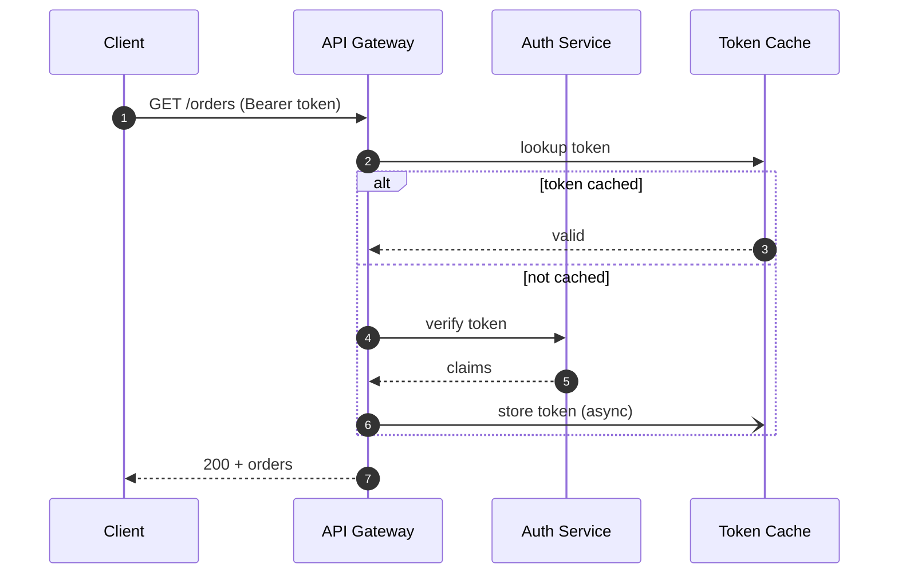
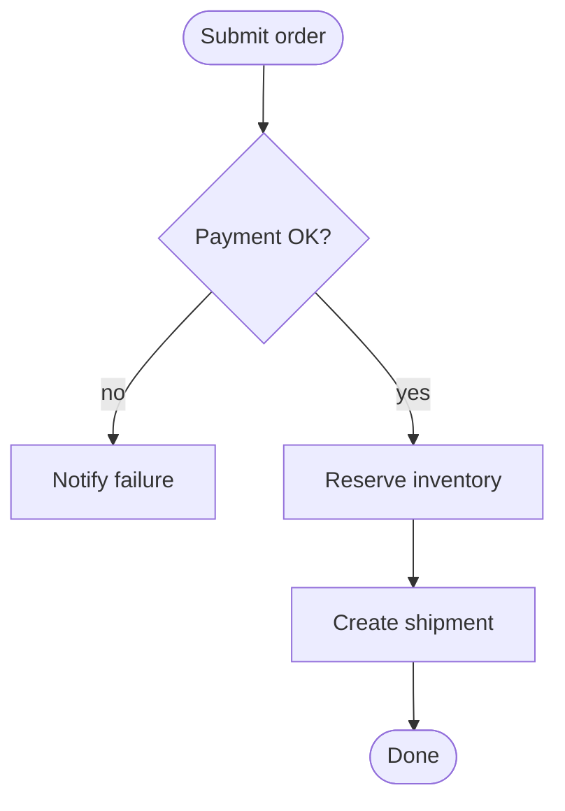

# UML Diagrams — Middle

> **Category:** [Documentation](../README.md) — the precise notation for the five diagrams that matter, when each earns its keep versus when it's ceremony, and Fowler's sketch-vs-blueprint distinction that decides how much rigor to spend.

---

## Introduction

> Focus: **The exact notation** and **when to spend it.**

At the junior level you learned to *read* the five diagrams. Now you learn the **notation precisely** — especially the class-diagram relationship symbols that people routinely get wrong — and, more importantly, the *judgement* of **when a diagram earns its keep**.

> The heuristic that governs everything below: **reach for a diagram when the relationships or the flow are hard to hold in your head or hard to convey in words.** A sequence diagram for a tricky four-service flow earns its keep. A class diagram of the entire codebase rots before the PR merges.

Both halves matter. Knowing the notation lets you draw a correct diagram; knowing *when* keeps you from drawing diagrams that waste everyone's time.

---

## Prerequisites

- **Required:** the [Junior](junior.md) level — the five diagrams and the symbol set.
- **Required:** solid OO fundamentals — inheritance, composition, interfaces (Object-Oriented Programming).
- **Helpful:** familiarity with [Diagrams as Code — Middle](../08-diagrams-as-code/middle.md), which covers PlantUML and the C4 model.
- **Helpful:** you've designed a feature end-to-end, so "when is a diagram worth it" is a real question for you.

---

## Glossary

| Term | Definition |
|------|-----------|
| **Association** | A structural link: one class uses or refers to another. |
| **Aggregation** | A "has-a" with **shared** ownership; parts can outlive the whole. Hollow diamond. |
| **Composition** | A "has-a" with **exclusive** ownership; parts die with the whole. Filled diamond. |
| **Generalization** | Inheritance / "is-a." Hollow triangle pointing at the parent. |
| **Dependency** | A transient "uses" link (e.g., a parameter type). Dashed arrow. |
| **Multiplicity** | The count on each end of a relationship: `1`, `0..1`, `*`, `1..*`. |
| **Lifeline** | A participant's vertical timeline in a sequence diagram. |
| **Activation bar** | The thin rectangle showing a participant is actively processing. |
| **Combined fragment** | A boxed region in a sequence diagram: `alt`, `opt`, `loop`, `par`. |
| **Guard** | A boolean condition on a transition, written `[condition]`. |
| **Swimlane** | A lane in an activity diagram showing who performs the action. |

---

## Class Diagram: The Notation, Precisely

A class box has three compartments — **name**, **attributes**, **operations** — with visibility markers:

- `+` public · `-` private · `#` protected · `~` package


Read the relationship line carefully: the **filled diamond** on `Order` plus `1..*` on `OrderLine` says *"an order is composed of one or more lines, and it owns them."* The plain arrow from `OrderLine` to `Money` is an **association** — a line is priced in a `Money` value it merely references.

---

## The Five Relationships

This is the part people get wrong. Memorize the symbols and, critically, the *semantics*.

| Relationship | Symbol | Reads as | Lifetime rule |
|---|---|---|---|
| **Association** | solid line / `-->` | "knows / uses" | independent |
| **Aggregation** | **hollow** diamond `o--` | "has-a (shared)" | part can outlive the whole |
| **Composition** | **filled** diamond `*--` | "is made of (owned)" | part dies with the whole |
| **Generalization** | **hollow triangle** `<|--` | "is-a" (inheritance) | n/a |
| **Dependency** | dashed arrow `..>` | "uses transiently" | momentary |

The two diamonds are the classic confusion:

- **Composition (filled ◆):** an `Invoice` and its `LineItem`s. Delete the invoice, the line items are meaningless — they're *part of* it.
- **Aggregation (hollow ◇):** a `Team` and its `Player`s. Disband the team, the players still exist; they can join another team. **Shared** lifetime.

A diagram showing all five at once:


> Honest caveat: the **aggregation vs composition** distinction is famously fuzzy and many teams ignore aggregation entirely, using only association and composition. That's a defensible simplification — don't burn a meeting arguing which diamond to draw.

---

## Sequence Diagram: Fragments and Activation

Beyond simple arrows, sequence diagrams gain real power from **activation bars** and **combined fragments** (`alt` for branches, `loop` for repetition, `opt` for optional steps, `par` for parallelism).

Message arrow types:

- `->>` **synchronous** call (caller waits)
- `-)` **asynchronous** message (fire-and-forget)
- `-->>` **return**



The `alt` fragment shows the *two branches* of a cache-hit/miss in one picture — far clearer than two separate diagrams or a paragraph of prose. This is precisely the kind of multi-participant flow where a sequence diagram **earns its keep**.

The same flow in **PlantUML**, which renders activation bars more formally:

---

## State-Machine Diagram: Guards and Actions

A full state-machine adds three things to the junior version: **guards** (`[condition]`), **entry/exit actions**, and **internal actions**. The transition syntax is:

```text
SourceState --> TargetState : event [guard] / action
```


Note the **self-transition** on `Pending` with a guard: a partial payment keeps you `Pending` and records the partial. The guard `[amount == total]` makes the *rule* explicit, not buried in code. PlantUML expresses entry/exit actions directly:

State-machines earn their keep for anything with a **lifecycle** and non-trivial rules: order status, connection state (`Connecting → Connected → Reconnecting → Closed`), a media player, a circuit breaker (see the **behavioral-patterns** skill's State pattern, which *is* a state-machine in code).

---

## Activity Diagram: Forks, Joins, Swimlanes

An **activity diagram** is a flowchart with two extras that justify reaching for the formal UML notation: **forks/joins** (parallelism) and **swimlanes** (who does what). PlantUML draws these properly:

The swimlanes (`|Customer|`, `|System|`, `|Warehouse|`) show *responsibility*; the `fork`/`end fork` shows that inventory reservation and the confirmation email happen **in parallel**. When a workflow crosses several teams/systems *and* has concurrency, this beats prose decisively. When it's a simple linear process, a bulleted list is faster.

A lighter Mermaid version (no swimlanes, no true fork) for quick sketches:



---

## Use-Case Diagram and Its Limits

The use-case diagram has a legitimate but **narrow** niche: an early conversation about **scope and actors** — what's inside the system boundary, who's outside it.

Its limits, stated plainly:

- It shows *that* a feature exists, not *how* it works — low information density.
- The `<<include>>` / `<<extend>>` relationships invite over-engineering for almost no payoff.
- Most teams get the same value from a **feature list** or a **user-story map** in less time.

Draw one when the *boundary* is genuinely contested. Otherwise, skip it. This is the diagram you'll under-use deliberately.

---

## When Each Diagram Earns Its Keep

The whole craft is in this table.

| Diagram | Earns its keep when… | Is ceremony when… |
|---|---|---|
| **Class** | explaining a *slice* — a pattern, a tricky aggregate, a module's core types | you try to draw the *whole* codebase (rots instantly, unreadable) |
| **Sequence** | a flow spans 3+ participants or has tricky ordering/branching | the flow is two calls you could state in a sentence |
| **State-machine** | a thing has a lifecycle with non-obvious legal/illegal transitions | the "states" are just two booleans |
| **Activity** | a workflow crosses teams/systems and/or has concurrency | the process is a short linear checklist |
| **Use-case** | the system *boundary/scope* is genuinely under debate | you already know the features (use a list) |

> The unifying test: **does the picture relieve a load that words or memory can't carry?** If yes, draw it. If a sentence or a list says the same thing, the diagram is ceremony.

---

## Sketch vs Blueprint vs Programming Language

Martin Fowler's three **modes** of using UML decide *how much rigor to spend*:

| Mode | Intent | Fate in practice |
|---|---|---|
| **Sketch** | informal, partial, drawn to *communicate* an idea | **Thrives.** Quick, disposable, high value. |
| **Blueprint** | detailed, complete spec handed to implementers | Mostly fails — heavy to make, rots the moment code changes. |
| **Programming language** | generate runnable code from the model (MDA, round-trip) | Largely failed — the model becomes a worse programming language than code. |

Why blueprint and code-gen failed and **sketch survived**:

- A complete UML model has the same maintenance cost as a second copy of the source — and the two drift apart immediately ([doc rot](../11-keeping-docs-alive-and-doc-rot/middle.md)).
- Round-trip code generation (Model-Driven Architecture) produced models so detailed they were harder to edit than code, with worse tooling.
- A **sketch** asks nothing of the future: you draw it on a whiteboard or in a PR comment, it does its job in the conversation, and you discard it without guilt.

The practical rule: **default to sketch.** Spend blueprint-level rigor only on the rare artifact that genuinely deserves to live (a published protocol, a contract between teams), and even then, accept the maintenance cost knowingly.

---

## Mermaid and PlantUML, Side by Side

Both are diagrams-as-code; choose by platform and fidelity.

| | **Mermaid** | **PlantUML** |
|---|---|---|
| Renders natively on GitHub/GitLab | **Yes** | No (render via CI / Kroki) |
| Class, sequence, state | Good | Excellent |
| Activity (forks/joins/swimlanes) | Weak | **Strong** |
| Use-case | No | **Yes** |
| Setup cost | Zero | A jar or service |
| Best for | quick sketches in PRs/READMEs | faithful UML, activity/use-case |

Rule of thumb: **Mermaid for class/sequence/state sketches that should render in the PR; PlantUML when you need real activity or use-case notation, or strict UML fidelity.** Both keep the diagram as committed text — see [Diagrams as Code](../08-diagrams-as-code/middle.md).

---

## Best Practices

1. **Pick the diagram by the question, then the tool by the platform.** Question → diagram type → Mermaid vs PlantUML.
2. **Get the diamonds right.** Filled = composition (owned lifetime), hollow = aggregation (shared). When unsure, fall back to plain association.
3. **Use `alt`/`loop`/`par` fragments** to keep one sequence diagram instead of three near-duplicates.
4. **Put guards on transitions.** `event [guard] / action` turns a vague state diagram into an executable-feeling spec.
5. **Default to sketch.** Draw the smallest correct diagram, expect to discard it, and don't gold-plate.
6. **Diagram a slice, never the whole codebase.** Scope the class diagram to the conversation.

---

## Common Mistakes

1. **Swapping the diamonds** — drawing composition where you mean aggregation (or vice versa). Get the lifetime rule right or use plain association.
2. **A class diagram of everything.** It's unreadable, it rots immediately, and it answers no specific question.
3. **Splitting one flow into many sequence diagrams** instead of using an `alt` fragment.
4. **A state diagram with no guards** when the *interesting* part is exactly which transitions are legal under which conditions.
5. **Drawing a use-case diagram by reflex.** Confirm the *boundary* is contested first.
6. **Treating a sketch as a blueprint** — over-detailing a throwaway and then defending it as a contract.

---

## Tricky Points

- **Aggregation is officially fuzzy.** The UML spec itself is vague about aggregation vs association; entire teams drop aggregation. Don't lose time on it.
- **Direction of generalization.** The hollow triangle points at the **parent** (`Dog <|-- ...` is wrong; it's `Animal <|-- Dog`). The arrow points "up" the hierarchy.
- **Sequence ≠ flowchart.** A sequence diagram is about *messages between participants*; an activity/flowchart is about *steps of a process*. Don't model a single object's internal logic as a sequence diagram.
- **Mermaid simplifies UML.** Mermaid's class notation doesn't distinguish every UML subtlety; if you need exact aggregation/dependency arrows or activity swimlanes, reach for PlantUML.
- **`opt` vs `alt`.** `opt` is a single optional block (it may or may not run); `alt` is multiple mutually exclusive branches. Using `alt` with one branch is a smell.

---

## Test Yourself

1. Filled diamond vs hollow diamond — which is which, and what's the lifetime rule?
2. Which sequence-diagram fragment shows two mutually exclusive branches? Which shows repetition?
3. Write the full transition syntax for a state-machine, including guard and action.
4. Name two things an activity diagram does that a plain flowchart sketch can't.
5. Give Fowler's three modes and explain why "sketch" is the survivor.
6. When does a class diagram stop earning its keep?

---

## Cheat Sheet

```text
CLASS RELATIONSHIPS
  --> / line   association   "knows / uses"          independent lifetime
  o--          aggregation   "has-a (shared)"        part outlives whole   (often skipped)
  *--          composition   "made of (owned)"       part dies with whole
  <|--         generalization "is-a" (inherits)      triangle points at PARENT
  ..>          dependency    "uses transiently"      momentary

SEQUENCE
  ->> sync   -) async   -->> return   activation bar = active
  fragments: alt (branches) · opt (optional) · loop · par (parallel)

STATE  transition:  Source --> Target : event [guard] / action

ACTIVITY (PlantUML)  fork/end fork = parallel · |Lane| = swimlane

EARNS ITS KEEP  =  picture relieves a load words/memory can't carry
MODES (Fowler)  =  sketch (survives) · blueprint (rots) · programming-language (failed)
TOOL            =  Mermaid for PR-native class/seq/state · PlantUML for activity/use-case
```

---

## Summary

- The class-diagram relationships are the most-confused notation: **filled diamond = composition (owned), hollow = aggregation (shared), triangle = inheritance, dashed = dependency.** Aggregation is fuzzy — many teams drop it.
- Sequence diagrams gain power from **`alt`/`loop`/`par` fragments** and **activation bars**; state-machines from **guards and entry/exit actions**.
- **Activity** diagrams justify the formal notation when there's **concurrency or swimlanes**; otherwise a flowchart sketch suffices.
- **Use-case** diagrams have a narrow scope-conversation niche and are easy to over-produce.
- A diagram **earns its keep** only when it relieves a load words or memory can't carry; a whole-codebase class diagram never does.
- **Default to sketch** (Fowler): blueprint and code-generation modes mostly failed because they cost as much as a second copy of the code and rot instantly.
- **Mermaid** for PR-native class/sequence/state; **PlantUML** for faithful activity/use-case.

---

## Further Reading

- Martin Fowler, *UML Distilled* — still the best concise treatment of these diagrams and the three modes.
- Martin Fowler, ["UmlMode"](https://martinfowler.com/bliki/UmlMode.html) and ["UmlAsSketch"](https://martinfowler.com/bliki/UmlAsSketch.html).
- [PlantUML language reference](https://plantuml.com/) — activity, state, and use-case syntax in full.
- [Mermaid class/sequence/state docs](https://mermaid.js.org/) — the syntax used above.
- The **behavioral-patterns** skill — the State pattern is a state-machine; many patterns are documented with class + sequence diagrams.

---

## Related Topics

- **Previous:** [UML Diagrams — Junior](junior.md)
- **Tooling:** [Diagrams as Code](../08-diagrams-as-code/middle.md).
- **Rot they share:** [Keeping Docs Alive](../11-keeping-docs-alive-and-doc-rot/middle.md).
- **Patterns they illustrate:** the **creational-patterns**, **structural-patterns**, **behavioral-patterns** skills.

---

## Diagrams

The five class relationships in one picture:


---

## Check your understanding

1. Explain UML Diagrams — Middle Level in your own words and name the problem it solves.
2. How would you apply the ideas around Table of Contents, Introduction, Prerequisites in a realistic engineering change?
3. What failure mode or misuse should you look for, and what evidence would reveal it?
4. Which local design trade-off would make you choose or reject UML Diagrams — Middle Level in an existing codebase?
5. What observable result would convince you that the approach improved the system?
