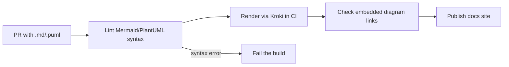
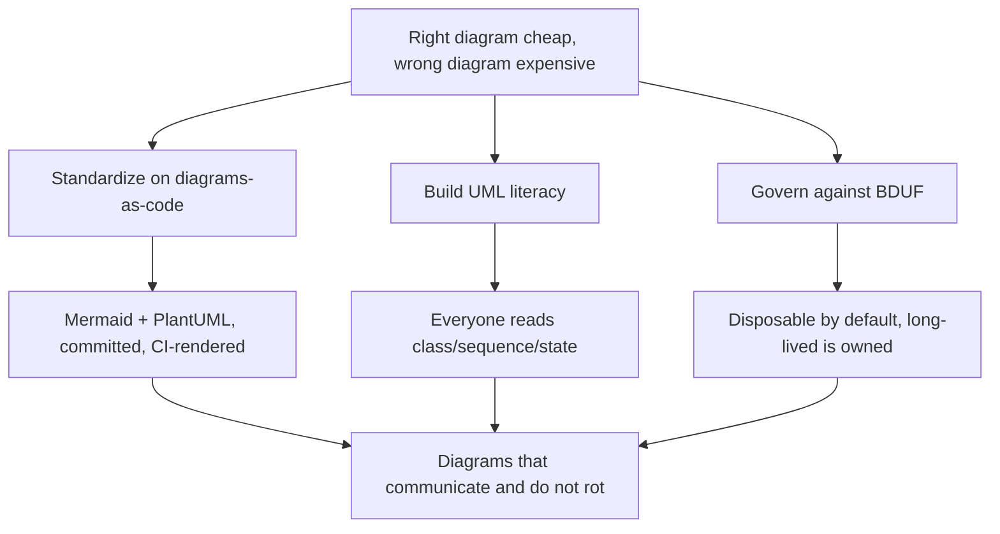

# UML Diagrams — Professional

> **Category:** [Documentation](../README.md) — standardizing the org on diagrams-as-code, building UML literacy as a baseline skill, governing against Big Design Up Front, and deciding what belongs in long-lived docs versus throwaway sketches at scale.

---

## Introduction

> Focus: **Org-level systems** — standards, literacy, governance, tooling.

At the professional level the question shifts from "should *I* draw this?" to "what diagramming practice should *the organization* have?" You're setting defaults that hundreds of engineers will follow, building the literacy so they can read each other's diagrams, and governing against the institutional pull toward Big Design Up Front — without swinging so far that nobody draws anything.

> The professional's job is to make the **right diagram cheap and the wrong diagram expensive**: cheap to draw a versioned sketch in a PR, costly (by convention and review) to produce an unowned blueprint that will rot. Standards, literacy, and governance are the three levers.

The thesis from the lower tiers scales up: **UML as sketch, written as code, kept minimal.** What's new is making that the *path of least resistance* across an org, where the gravitational pull is always toward either ceremony (mandated UML packages) or chaos (every team a different tool, no literacy, screenshots everywhere).

---

## Prerequisites

- **Required:** the [Senior](senior.md) level — minimum-viable-diagram judgement, C4 vs UML, disposable-sketch discipline.
- **Required:** you influence org-wide engineering standards, tooling, or onboarding.
- **Required:** fluency with the [docs-as-code toolchain](../10-docs-as-code-and-tooling/professional.md) and [diagrams-as-code](../08-diagrams-as-code/professional.md).
- **Helpful:** scar tissue from a past BDUF or stale-architecture-diagram episode.

---

## Glossary

| Term | Definition |
|------|-----------|
| **Diagrams-as-code** | Diagrams authored as committed text (Mermaid/PlantUML), rendered in the pipeline. |
| **UML literacy** | The baseline ability to *read* class/sequence/state diagrams, regardless of whether one authors them. |
| **BDUF** | Big Design Up Front — exhaustive modeling before code; the institutional anti-pattern. |
| **Org standard** | A documented, lightweight convention for which tool, which diagrams, where they live. |
| **Generated diagram** | A diagram derived from code/config/infra, so it cannot drift. |
| **Long-lived doc** | A maintained reference doc with an owner and update trigger. |
| **Goodhart's law** | When a measure becomes a target it ceases to be a good measure — relevant to "diagram count" metrics. |

---

## Standardizing on Diagrams-as-Code

The first org-level lever: **make every diagram a committed, versioned, reviewable text artifact.** Not because text is prettier, but because it folds diagrams into the engineering workflow they were exiled from — PR review, version control, CI rendering — and kills the screenshot-in-a-wiki failure mode at the source.

The standard, concretely:

- **One default authoring tool, with a documented escape hatch.** Pick **Mermaid** as the default (renders natively in GitHub/GitLab, zero setup) and **PlantUML** for the cases Mermaid can't serve (faithful activity/use-case, strict UML). A two-tool standard beats a free-for-all of ten.
- **Diagrams live next to the code they describe**, in `.md` or `.puml` files in the same repo — never in a separate wiki, drive, or drawing tool.
- **Rendered in the pipeline** (or natively by the platform), so the published picture always matches committed source ([docs-as-code](../10-docs-as-code-and-tooling/professional.md)).
- **Screenshots of drawing tools are not accepted in long-lived docs.** They're fine as disposable whiteboard photos in a closed PR; they're a smell in a maintained README.

The payoff compounds at scale: every engineer can edit any team's diagram, every diagram diffs in review, and the org never accumulates a graveyard of un-openable `.drawio` blobs whose original owners have left.

---

## UML Literacy as a Baseline Skill

The second lever, and the one most orgs neglect: **everyone must be able to *read* the five diagrams, even if few *author* them.**

The asymmetry is the whole point. Authoring UML is a sometimes-skill; *reading* it is a constant one. UML class and sequence diagrams appear in:

- Reference books and the **creational-patterns**, **structural-patterns**, and **behavioral-patterns** skills (every pattern is a class/sequence diagram).
- RFCs from other teams, vendor documentation, protocol specs.
- Open-source design docs and architecture pages.
- Whiteboard sessions where a colleague sketches a flow.

An engineer who can't read a sequence diagram is locked out of a large fraction of the industry's design communication. So the org invests in **literacy, not authorship**:

- A 30-minute "read these five diagrams" module in onboarding — the symbol set, not the full spec.
- A linked one-page reference (the [Junior cheat sheet](junior.md#cheat-sheet) is exactly this).
- Normalize *reading aloud* a diagram in design review, so the skill is practiced.

> The literacy bar: every engineer can read a class, sequence, and state diagram cold. Authoring is optional; reading is not.

---

## Anti-BDUF Governance

The third lever fights the institutional gravity toward **Big Design Up Front**. Organizations drift into mandated comprehensive modeling because it *looks* like rigor and is easy to require. Your governance makes the right thing easy and the wrong thing visibly costly.

What this looks like in practice:

- **No mandated UML packages.** Never require a "full class diagram and use-case catalog" as a gate. Require the *decision* (an ADR/RFC) to be clear; let the author choose whether a diagram serves it.
- **Diagrams justify themselves in review.** A reviewer is entitled to ask "what decision does this diagram convey?" An orphan diagram with no decision is removed, not maintained.
- **Default everything to disposable.** The org's stated norm is *sketch-to-communicate-then-discard*; long-lived diagrams are the explicit exception, with an owner.
- **Ban reverse-engineered everything-diagrams from docs.** A tool-generated class diagram of an entire service is not documentation; it's noise nobody can read or maintain.
- **Risk-driven, not coverage-driven** (Fairbanks): model the parts that carry real risk — a tricky protocol, a concurrency-heavy flow, a contested boundary — and *nothing else*.

The balance to hold: anti-BDUF must not become anti-diagram. The failure on the other side is a team so allergic to UML that flows go unexplained and tribal knowledge accumulates. The goal is **cheap, minimal, disposable diagrams everywhere, blueprint modeling almost nowhere.**

---

## What Lives in Long-Lived Docs

At scale you must be explicit about the small set of diagrams that earn a permanent maintenance budget, because everything maintained is a recurring cost across the whole org.

| Tends to deserve long life | Tends to be disposable |
|---|---|
| **C4 system context / container** (the architecture map) | a one-off flow explained in a PR |
| A **published protocol / handshake** other teams depend on | a whiteboard photo from a design session |
| The **core domain model** (a focused class diagram of the heart of the system) | a class diagram of an entire service |
| A **critical state-machine** (payments, orders) where illegal transitions are dangerous | a "current sprint" sketch |
| **Runbook topology / incident flows** | a use-case diagram (almost always disposable) |

The rules for the survivors, enforced as org convention:

- **Each long-lived diagram has a named owner and an explicit update trigger** ("update the container diagram when a service is added"). No owner → demote to a dated sketch.
- **Generated beats hand-drawn** wherever the source allows (dependency graphs, infra diagrams, ERDs from the schema). Generated diagrams can't rot. Reserve hand-drawing for what can't be generated.
- **Co-located and CI-rendered**, so a wrong diagram surfaces as a wrong diff ([Keeping Docs Alive](../11-keeping-docs-alive-and-doc-rot/professional.md)).
- **Scoped tightly.** The org's biggest rot source is the well-meaning "complete" diagram; mandate focus.

---

## An Org Diagramming Standard

A lightweight, written standard — one page, not a 40-page modeling manual. A realistic template:

```text
ORG DIAGRAMMING STANDARD (v1)

DEFAULT TOOL    Mermaid (renders natively on our GitHub/GitLab).
ESCAPE HATCH    PlantUML for activity/use-case or strict UML; rendered via CI/Kroki.
NEVER           binary screenshots of drawing tools in long-lived docs.

THE FIVE WE USE class · sequence · state-machine · activity · use-case (rarely)
ARCHITECTURE    C4 (context/container/component) for the big picture; UML for detail.
                Do NOT draw the C4 "Code" level.

WHERE THEY LIVE
  decision      -> ADR (frozen snapshot, never edited)
  proposal      -> design doc / RFC
  current truth -> README/arch page (OWNED + update trigger) or don't draw it
  ops           -> runbook (must be accurate)

LIFETIME        Default = disposable sketch. Long-lived = explicit, owned, triggered.

LITERACY        Every engineer can READ class/sequence/state. Authoring optional.

GOVERNANCE      A diagram must convey a stated decision; orphan diagrams are removed,
                not maintained. No mandated UML packages. Risk-driven, not coverage.
```

The point of writing it down is not bureaucracy — it's making the cheap, correct path the *obvious* one for a new hire, so the standard propagates by default rather than by enforcement.

---

## Tooling and Pipeline at Scale

To make diagrams-as-code frictionless org-wide:

- **Native rendering first.** Standardize on platforms that render Mermaid (GitHub/GitLab/MkDocs) so the common case needs zero pipeline.
- **A single render service for the rest.** Run **Kroki** (Mermaid + PlantUML + Graphviz + more behind one HTTP endpoint) so PlantUML/DOT diagrams render uniformly in CI and the docs site.
- **Lint and link-check diagrams** like any doc: broken Mermaid syntax should fail CI, not silently show raw text.
- **Generate what you can:** ERDs from the DB schema, dependency graphs from the build, infra diagrams from Terraform/Pulumi. Wire these into CI so they regenerate on change and never drift (infrastructure-as-code if applicable; see [diagrams-as-code](../08-diagrams-as-code/professional.md)).
- **Templates and snippets:** ship starter Mermaid/PlantUML blocks for the five diagrams in the design-doc and ADR templates, so the default is to sketch, not to skip.

A minimal CI check, conceptually:



---

## Measuring Without Goodharting

Resist the urge to measure diagram *quantity*. **Goodhart's law** bites hard here: mandate "every service has an architecture diagram" and you get a corpus of stale, box-checking diagrams that mislead. Diagram count is a vanity metric and an active hazard.

Measure proxies that correlate with the *value* — communication and freshness — not the artifact count:

- **Freshness of the few long-lived diagrams** (last-updated date vs last code change in the area). A drifting container diagram is a real signal.
- **Onboarding outcomes** — do new hires reach productivity faster? Good architecture diagrams help; this is the outcome that matters.
- **Review friction** — are flows in RFCs understood without long back-and-forth? A good sequence diagram shows up as faster reviews.

If you must have a guardrail, make it *negative*: "no binary diagram screenshots in long-lived docs," "no orphan diagrams," "no unowned architecture diagram." Prohibitions of the failure modes age better than mandates of artifacts.

---

## Best Practices

1. **Standardize on two tools** (Mermaid default, PlantUML escape hatch), committed and CI-rendered — never drawing-tool screenshots in long-lived docs.
2. **Invest in literacy over authorship** — every engineer reads the five; authoring is optional.
3. **Govern against BDUF:** no mandated UML packages; every diagram justifies itself by a decision.
4. **Default everything to disposable;** make long-lived diagrams the explicit, owned exception.
5. **Generate what you can** (ERDs, dep graphs, infra) so it can't drift; hand-draw only the rest.
6. **Write a one-page standard** and embed starter diagrams in ADR/design-doc templates.
7. **Don't measure diagram count;** watch freshness, onboarding, and review friction instead.

---

## Common Mistakes

1. **Mandating diagrams by count** — a guaranteed stale, misleading corpus (Goodhart).
2. **Tool sprawl** — ten drawing tools, no literacy, un-openable blobs from departed engineers.
3. **Teaching authorship but not reading** — leaving engineers unable to consume the industry's design communication.
4. **Over-correcting into anti-diagram culture** — flows go unexplained, tribal knowledge accumulates.
5. **Long-lived diagrams with no owner** — the institutional version of the accidental source of truth.
6. **Accepting reverse-engineered everything-diagrams** as documentation.

---

## Mental Models

- **Make the right diagram cheap, the wrong one expensive.** Standards/tooling lower the cost of a versioned sketch; governance/review raise the cost of an unowned blueprint.
- **Literacy is leverage.** One onboarding hour of "read these five" pays back across every design review the engineer ever attends.
- **The corpus rots at the speed of its weakest maintenance.** A thousand unowned diagrams is a liability, not an asset.
- **Generated > hand-drawn > screenshot.** Push every diagram up this ladder.
- **Prohibit failure modes, don't mandate artifacts.** Negative guardrails age better than positive quotas.

---

## Test Yourself

1. Why standardize on two tools rather than one or many?
2. Why does the org invest in UML *reading* more than *authoring*?
3. How does Goodhart's law apply to "every service must have an architecture diagram"?
4. What makes generated diagrams superior to hand-drawn ones for long-lived docs?
5. What's the over-correction failure mode of anti-BDUF governance?
6. Name three diagrams that typically deserve a long life and three that are typically disposable.

---

## Cheat Sheet

```text
THREE ORG LEVERS
  1. STANDARDIZE  Mermaid default + PlantUML escape hatch · committed · CI-rendered
                  no drawing-tool screenshots in long-lived docs
  2. LITERACY     everyone READS class/sequence/state · authoring optional
                  30-min onboarding module + one-page reference
  3. GOVERN       no mandated UML packages · every diagram justifies a decision
                  default disposable · long-lived = owned + triggered · risk-driven

WHAT LIVES LONG  C4 context/container · published protocol · core domain model ·
                 critical state-machine · runbook topology
WHAT'S DISPOSABLE PR-flow sketch · whiteboard photo · whole-service class dia ·
                 use-case dia · sprint sketch

TOOLING  native Mermaid first · Kroki for the rest · lint+link-check in CI ·
         GENERATE ERDs/dep-graphs/infra · starter blocks in ADR/RFC templates

MEASURE  NOT diagram count (Goodhart) — freshness · onboarding · review friction
         guardrails are PROHIBITIONS (no screenshots, no orphans, no unowned)
```

---

## Summary

- The professional question is org-level: **standards, literacy, and governance** make the right diagram cheap and the wrong one expensive.
- **Standardize on diagrams-as-code:** Mermaid default, PlantUML escape hatch, committed and CI-rendered; no drawing-tool screenshots in long-lived docs.
- **Invest in UML literacy** — every engineer reads class/sequence/state; authoring is optional. Reading is the constant skill.
- **Govern against BDUF:** no mandated UML packages, every diagram justifies a decision, default to disposable — without over-correcting into anti-diagram culture.
- **A small, owned set lives long** (C4 architecture, protocols, core domain model, critical state-machines); everything else is disposable. **Generate what you can.**
- **Don't measure diagram count** (Goodhart); watch freshness, onboarding, and review friction, and prohibit failure modes rather than mandate artifacts.

---

## Further Reading

- George Fairbanks, *Just Enough Software Architecture* — risk-driven modeling, the antidote to BDUF.
- Simon Brown, *Software Architecture for Developers* and [c4model.com](https://c4model.com/) — org-scale architecture diagramming.
- Martin Fowler, *UML Distilled* — the sketch discipline that scales down per-engineer.
- [Kroki](https://kroki.io/) — unified render service for Mermaid/PlantUML/Graphviz in CI.
- [Docs as Code & Tooling](../10-docs-as-code-and-tooling/professional.md) and [Keeping Docs Alive](../11-keeping-docs-alive-and-doc-rot/professional.md) — the pipeline and anti-rot practices these diagrams ride on.

---

## Related Topics

- **Previous:** [UML Diagrams — Senior](senior.md)
- **The toolchain:** [Diagrams as Code](../08-diagrams-as-code/professional.md), [Docs as Code & Tooling](../10-docs-as-code-and-tooling/professional.md).
- **Anti-rot at scale:** [Keeping Docs Alive](../11-keeping-docs-alive-and-doc-rot/professional.md).
- **Patterns documented with UML:** the **creational-patterns**, **structural-patterns**, **behavioral-patterns** skills.

---

## Diagrams

The three org levers and what each produces:




---

## Check your understanding

1. Explain UML Diagrams — Professional Level in your own words and name the problem it solves.
2. How would you apply the ideas around Table of Contents, Introduction, Prerequisites in a realistic engineering change?
3. What failure mode or misuse should you look for, and what evidence would reveal it?
4. How would you introduce and govern UML Diagrams — Professional Level across teams through reversible, measurable increments?
5. What observable result would convince you that the approach improved the system?
