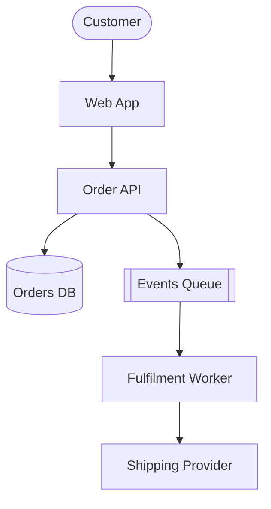
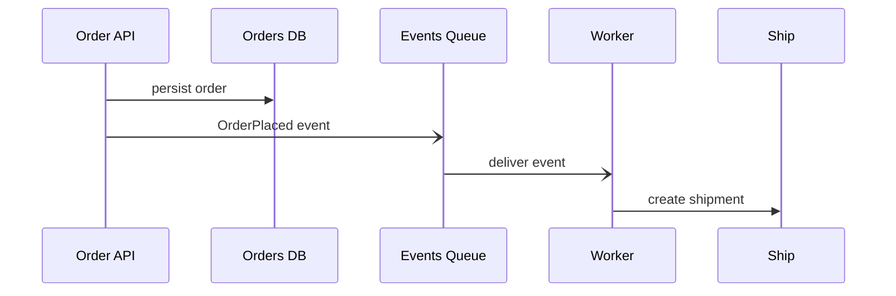
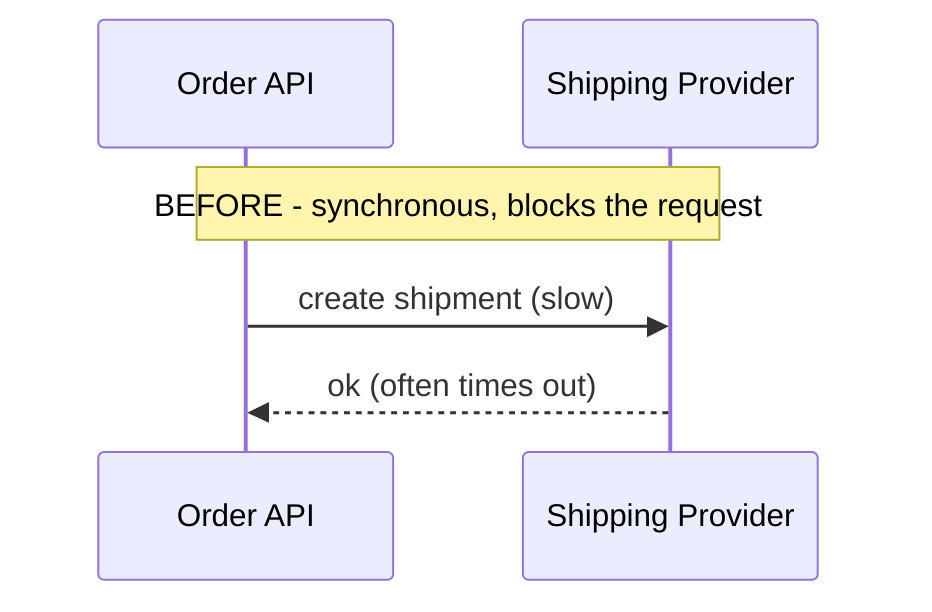
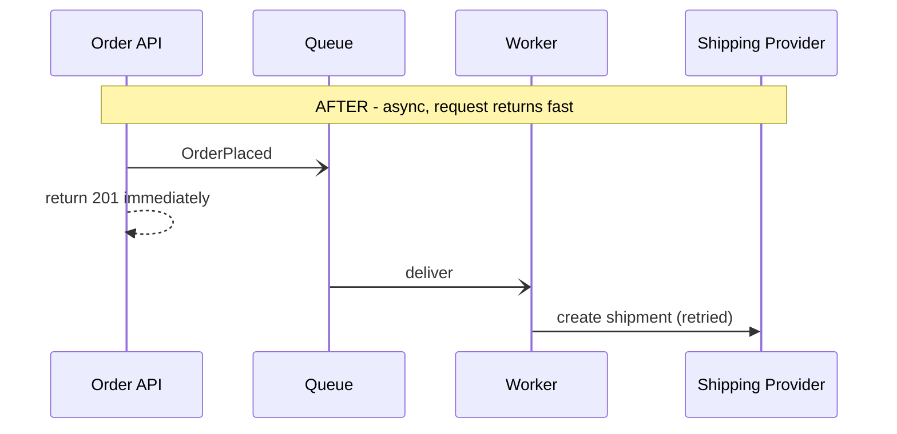
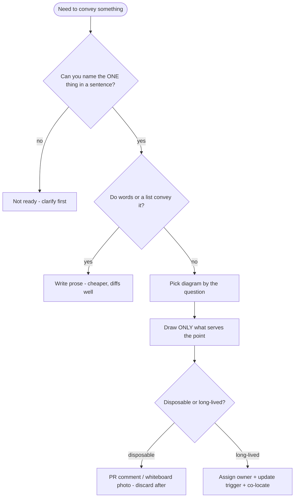

# UML Diagrams — Senior

> **Category:** [Documentation](../README.md) — choosing the *minimum* diagram that conveys a decision, where UML fits among ADRs/RFCs/C4, and the discipline of treating most diagrams as disposable sketches while protecting the few that must live.

---

## Introduction

> Focus: **Judgement** — the minimum diagram for the decision, and what deserves to live.

A senior rarely needs to be told *how* to draw a sequence diagram. The senior skill is **economy and placement**: drawing the *smallest* diagram that lands the decision, putting it in the *right* document, and being ruthless about which diagrams are throwaway sketches versus the rare few that must be maintained.

> The senior's governing question is not "is this diagram correct?" but **"is this the cheapest artifact that conveys the decision, and does it deserve a maintenance budget?"** Most diagrams should be answered with "a sketch in a PR comment" or "a whiteboard photo we'll never update."

The failure mode you're guarding against is **Big Design Up Front (BDUF)** dressed in UML: comprehensive class diagrams, full use-case catalogs, and blueprint models that consume weeks, impress no one, and are wrong by the next sprint.

---

## Prerequisites

- **Required:** the [Middle](middle.md) level — precise notation and the earns-its-keep heuristic.
- **Required:** you write [ADRs](../05-architecture-decision-records-adrs/senior.md) and [design docs / RFCs](../06-design-docs-and-rfcs/senior.md) and review others'.
- **Required:** working knowledge of the **C4 model** ([Diagrams as Code — Senior](../08-diagrams-as-code/senior.md)).
- **Helpful:** you've felt the pain of a stale architecture diagram that misled a teammate ([doc rot](../11-keeping-docs-alive-and-doc-rot/senior.md)).

---

## Glossary

| Term | Definition |
|------|-----------|
| **Minimum-viable diagram** | The smallest diagram that conveys the one decision or insight it exists for. |
| **Disposable sketch** | A diagram drawn for a single conversation and discarded after. |
| **Long-lived diagram** | A maintained diagram that earns an ongoing update budget (rare). |
| **BDUF** | Big Design Up Front — exhaustive modeling before code; the anti-pattern UML earned its bad name for. |
| **C4 model** | Context → Container → Component → Code: zoom levels for architecture diagrams. |
| **Decision record** | An ADR — a captured, dated decision with context and consequences. |
| **Single source of truth** | The one authoritative place a fact lives; a diagram should never become a second one that drifts. |

---

## The Minimum-Viable-Diagram Judgement

Every diagram has a cost: the time to draw it *plus* the lifetime cost to keep it true. A senior weighs both before drawing a single box.

The decision procedure:

1. **Name the one thing** the diagram must convey — a single decision, flow, or constraint. If you can't name it in a sentence, you don't yet know what to draw.
2. **Try words first.** If two sentences or a five-item list convey it, write that. Prose diffs and rots more gracefully than a picture.
3. **If a diagram wins, pick the type by the question** (sequence for flow, state for lifecycle, class for structure) and **draw only what serves the point.** Drop every box and arrow that doesn't change the reader's understanding.
4. **Decide its lifetime up front:** disposable sketch (most) or long-lived (rare). This dictates *where* it goes and *how much* polish it deserves.

The "draw only what serves the point" rule is where seniors differ from juniors. A sequence diagram explaining *why we added a token cache* needs the cache hit/miss branch and nothing else — not the load balancer, not the logging, not the retry logic. Each extra element is a future maintenance liability and a present distraction.

> A diagram is a lens, not a map. A map tries to show everything; a lens magnifies one thing. Draw lenses.

---

## Disposable Sketches vs Long-Lived Diagrams

The single most freeing realization: **most diagrams should be thrown away on purpose.** Treating every diagram as a maintained asset is what makes teams afraid to draw — and afraid-to-draw teams under-communicate.

| | **Disposable sketch** (default) | **Long-lived diagram** (rare) |
|---|---|---|
| Purpose | a single conversation / PR | ongoing reference |
| Where | whiteboard photo, PR comment, Slack, a doc that gets superseded | a maintained doc, a versioned `.md` next to the code |
| Polish | rough, partial, "good enough" | clean, complete-for-its-scope |
| Maintenance budget | **none** — discard after use | explicit owner + update trigger |
| Examples | "here's how the retry path works" in a PR; whiteboard during design | C4 system context, a published API protocol, a core domain model |

The discipline is **deciding which it is, deliberately.** A disposable sketch that accidentally becomes the team's "official" architecture diagram is the worst outcome: nobody scoped it to live, so nobody maintains it, and it rots while everyone trusts it.

Make disposability *visible* when it matters: a whiteboard photo in a closed PR is self-evidently a moment in time. A diagram embedded in an ADR is — correctly — frozen as "what we believed when we decided," and ADRs are *immutable by design*, which is exactly why they're a safe home for a diagram (more below).

---

## Diagrams Inside ADRs, RFCs, and Design Docs

UML diagrams rarely live alone; they live *inside* prose documents, and *which* document changes the diagram's contract.

| Home | What the diagram is | Maintenance contract |
|---|---|---|
| **[ADR](../05-architecture-decision-records-adrs/senior.md)** | a snapshot of the design *as decided* | **None — and that's correct.** ADRs are immutable; the diagram is frozen in time, superseded by a new ADR, never edited. |
| **[Design doc / RFC](../06-design-docs-and-rfcs/senior.md)** | the *proposed* design, under review | Lives while under review; often stale once built — link to the living source, don't pretend the RFC stays current. |
| **README / architecture page** | the *current* system | **High** — this one must stay true; the strongest rot risk. |
| **Runbook** | topology / incident flow at 3 a.m. | Must be accurate or it's dangerous; treat like the README. |

The senior insight: **the ADR is the safest place to put a diagram** precisely because nobody expects it to stay current. It documents *what we believed when we decided*, which is permanently true. The *dangerous* place is the README/architecture page, where readers assume currency — that's where you spend your maintenance budget or you don't draw it at all.

A sequence diagram is often the highest-value addition to a design doc: a reviewer who'd skim three paragraphs about a handshake will instantly spot a missing return arrow or a wrong call order.

---

## C4 vs UML: Which, When

These solve different problems and are complementary, not competing.

- **C4** answers *"what is this system and what are its big parts?"* across four zoom levels — **Context** (system + users + neighbors), **Container** (apps/services/datastores), **Component** (inside one container), **Code** (rare; this is where UML lives).
- **UML** answers *"how does this detailed piece work?"* — the structure of a class cluster, the order of a flow, the lifecycle of an entity.

| Question | Reach for |
|---|---|
| What systems exist and who talks to whom? | **C4 Context / Container** |
| What are the modules inside this service? | **C4 Component** |
| What are the types/relationships in this module? | **UML class** |
| What order do these services call each other? | **UML sequence** |
| What states can this entity be in? | **UML state-machine** |

The clean division: **C4 for the architecture levels, UML for the detail.** C4's own guidance says the bottom "Code" level *is* UML and is usually not worth drawing. So in practice: draw C4 for the big picture, and drop to a UML sequence/state/class diagram only for the specific detail that's hard to hold in your head.

A C4-Container sketch (Mermaid flowchart, the common pragmatic rendering):



Then, when explaining the *order flow* in detail, you drop to UML:



---

## Worked Example: One Decision, One Diagram

Suppose the decision is: *"We're moving order fulfilment from a synchronous API call to an async queue, because the shipping provider's latency was failing our request SLO."* You're writing the ADR.

**What NOT to do:** a full class diagram of the order subsystem, a use-case diagram of the shop, a complete activity diagram of checkout. None of that conveys the decision.

**What to do:** one before/after sequence diagram contrasting the two flows — the entire decision, visible at a glance.





Two small diagrams carry the whole "why." They live in the ADR, frozen forever as the rationale. No maintenance burden, maximum clarity. *That* is senior diagram judgement.

---

## Keeping the Survivors Alive

For the rare long-lived diagram, you owe it the same anti-rot discipline as any living doc ([Keeping Docs Alive](../11-keeping-docs-alive-and-doc-rot/senior.md)):

- **Co-locate it with the code** it describes, as committed Mermaid/PlantUML, so it's in the same PR when the code changes.
- **Assign an owner and an update trigger** — "when we add a service, update the container diagram" — written into the doc.
- **Prefer generated over hand-drawn** where feasible: a diagram derived from the code or config (dependency graph, infra diagram) can't drift. Hand-drawn is for the parts that *can't* be generated.
- **Make staleness visible** — date it, or better, render it in CI from source so a wrong diagram shows as a wrong diff.
- **Scope it tightly.** The smaller and more focused a long-lived diagram, the lower its rot rate; the everything-diagram rots fastest.

If you can't fund a long-lived diagram's maintenance, **demote it to a dated sketch** rather than let it masquerade as current truth.

---

## The Anti-Patterns Seniors Prevent

- **BDUF in UML clothing.** Weeks of comprehensive modeling before code. The model is detailed, complete, and wrong on contact with reality.
- **The wall of class diagrams.** A reverse-engineered diagram of every class in the system — generated by a tool, understood by no one, maintained by nobody.
- **Diagram-driven status theater.** Diagrams produced to *look* like rigorous engineering rather than to convey a decision.
- **The orphan diagram.** A diagram in a folder with no surrounding prose explaining what decision it serves.
- **The accidental source of truth.** A throwaway sketch that drifted into being "the" architecture diagram with no owner.
- **Re-litigating the diamonds.** Burning meeting time on aggregation-vs-composition. Decide a team default (often "skip aggregation") and move on.

---

## Best Practices

1. **Name the one thing first.** If you can't state the diagram's purpose in a sentence, don't draw it.
2. **Words before pictures.** Reach for a diagram only when prose or a list can't carry the load.
3. **Draw the lens, not the map** — only the elements that change the reader's understanding.
4. **Decide lifetime deliberately** — disposable (default) or long-lived (rare, owned, triggered).
5. **Put diagrams where their contract matches:** decisions → ADRs (frozen), proposals → RFCs, current truth → README (and fund its upkeep).
6. **C4 for architecture levels, UML for detail.** Don't draw the C4 "Code" level.
7. **Generate what you can; hand-draw only what you must.**

---

## Common Mistakes

1. **Over-drawing** — the maintenance liability of every extra box outlives the meeting it impressed.
2. **Putting the only architecture diagram somewhere with no owner** — guaranteed rot.
3. **Confusing C4 and UML** — drawing a UML class diagram when the audience needed a container-level overview, or vice versa.
4. **Editing an ADR's diagram** instead of writing a superseding ADR — ADRs are immutable.
5. **Letting a sketch become canonical** without scoping it to live.
6. **Equating "more diagrams" with "more rigor."** Rigor is in the decision, not the diagram count.

---

## Mental Models

- **Diagram as lens, not map.** A lens magnifies one thing; a map drowns it. Draw lenses.
- **The maintenance-budget test.** Every long-lived diagram is a recurring cost. If you won't fund it, demote it to a dated sketch.
- **ADR = freeze frame.** A diagram in an ADR is safe because it's *supposed* to be a snapshot in time; a diagram in a README is dangerous because readers assume it's live.
- **C4 zoom dial.** Context → Container → Component → (Code = UML). Zoom only as deep as the question requires.
- **Default to disposable.** The cheapest diagram is the one you discard after it's done its job.

---

## Test Yourself

1. You're documenting an async-migration decision in an ADR. What's the minimum-viable diagram?
2. Why is an ADR a *safer* home for a diagram than a README?
3. Give the C4-vs-UML division in one sentence.
4. Name three traits that distinguish a disposable sketch from a long-lived diagram.
5. What's the danger of a throwaway sketch that becomes "official"?
6. How do you handle a long-lived diagram you can't fund the maintenance for?

---

## Cheat Sheet

```text
DECISION PROCEDURE
  1. name the ONE thing the diagram must convey (one sentence) — else don't draw
  2. try words/list first; diagram only if it relieves a real load
  3. pick type by question; draw ONLY what serves the point (lens, not map)
  4. decide lifetime UP FRONT: disposable (default) | long-lived (rare, owned)

WHERE IT GOES (= its maintenance contract)
  ADR        frozen snapshot, immutable, never edited      <- safest home
  RFC/design proposal under review, then link to living source
  README     CURRENT truth -> fund upkeep or don't draw    <- highest rot risk
  runbook    must be accurate (3am) -> maintain

C4 vs UML   C4 = architecture levels (context/container/component)
            UML = detail (class/sequence/state)   (skip C4 "Code" level)

KILL ON SIGHT  BDUF in UML clothing · wall of reverse-eng class diagrams ·
               orphan diagram · accidental source of truth · diamond debates
```

---

## Summary

- The senior skill is **economy and placement**, not notation: the *minimum* diagram that conveys the decision, in the *right* document.
- **Default to disposable.** Most diagrams should be thrown away on purpose; treating every diagram as an asset makes teams afraid to draw.
- A diagram is a **lens, not a map** — include only what changes the reader's understanding.
- **Match the diagram to its document's contract:** ADRs freeze it (safest), READMEs imply currency (riskiest — fund the upkeep or don't draw).
- **C4 for architecture levels, UML for detail;** don't draw the C4 "Code" level.
- Keep the rare survivors alive: co-locate, assign an owner + update trigger, generate where possible, scope tightly — or demote to a dated sketch.
- The anti-pattern to kill is **BDUF in UML clothing** and the accidental, unowned source of truth.

---

## Further Reading

- Martin Fowler, *UML Distilled*, ch. on "UML as sketch" — the economy argument in full.
- Simon Brown, [The C4 Model](https://c4model.com/) — and "C4 vs UML" guidance.
- Simon Brown, *Software Architecture for Developers* — diagrams that earn their keep at the architecture level.
- George Fairbanks, *Just Enough Software Architecture* — risk-driven modeling: model only what reduces real risk.
- [ADRs](../05-architecture-decision-records-adrs/senior.md) and [Design Docs & RFCs](../06-design-docs-and-rfcs/senior.md) — where these diagrams live.

---

## Related Topics

- **Previous:** [UML Diagrams — Middle](middle.md)
- **Homes for diagrams:** [ADRs](../05-architecture-decision-records-adrs/senior.md), [Design Docs & RFCs](../06-design-docs-and-rfcs/senior.md).
- **C4 & tooling:** [Diagrams as Code](../08-diagrams-as-code/senior.md).
- **Fighting rot in survivors:** [Keeping Docs Alive](../11-keeping-docs-alive-and-doc-rot/senior.md).

---

## Diagrams

The senior decision flow for whether and what to draw:




---

## Check your understanding

1. Explain UML Diagrams — Senior Level in your own words and name the problem it solves.
2. How would you apply the ideas around Table of Contents, Introduction, Prerequisites in a realistic engineering change?
3. What failure mode or misuse should you look for, and what evidence would reveal it?
4. How would you validate a system-level decision about UML Diagrams — Senior Level under uncertainty?
5. What observable result would convince you that the approach improved the system?
