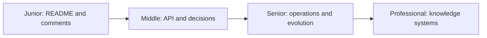
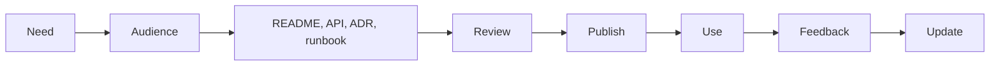

# Documentation

> Document the knowledge a future reader cannot reliably recover from code, runtime behavior, or memory.

| Level | Guide | You are done when |
|---|---|---|
| Junior | [Help the next reader](junior.md) | A teammate can set up, understand, and use your change. |
| Middle | [Document interfaces and decisions](middle.md) | Consumers can use APIs and understand important trade-offs. |
| Senior | [Document operations and architecture](senior.md) | Teams can operate, migrate, and recover the system safely. |
| Professional | [Govern knowledge](professional.md) | Documentation has ownership, feedback, quality controls, and measurable use. |

## Practice rule

Write for a named audience and task. Put documentation near the source of truth and assign the same change an owner for code and docs.

## Related

- [Code Review](../code-review/README.md)
- [Diagnostics](../diagnostics/README.md)
