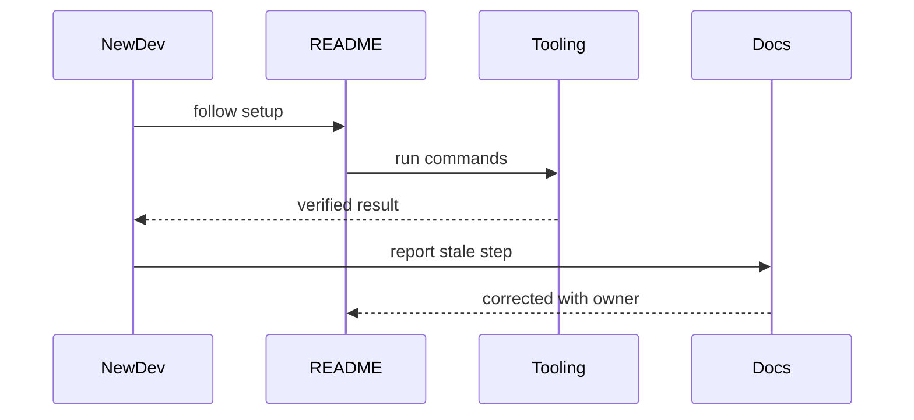

# Documentation — Junior

A useful README explains purpose, prerequisites, setup, common commands, verification, and where to get help. Test instructions on a clean environment.

Comments should explain why, constraints, and surprising behavior—not translate syntax. Public functions need contracts: inputs, outputs, failures, side effects, and examples.

Update documentation in the same change that modifies behavior. Remove misleading text instead of preserving it for completeness.

## Test yourself

1. Which setup step can a new teammate not infer?
2. What belongs in a code comment?
3. How do you verify a README?
4. When should stale documentation be deleted?

Continue to [`middle.md`](middle.md).
