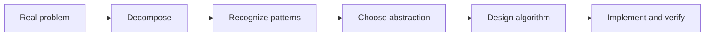

# Computational Thinking

> Turn a messy problem into parts, patterns, abstractions, algorithms, and code whose behavior you can explain.

The five core skills are decomposition, pattern recognition, abstraction, algorithmic thinking, and modeling a domain in code. They form one loop: separate concerns, notice repeated structure, preserve only relevant detail, define a procedure, then compare the program with reality.

| Level | Guide | You are done when |
|---|---|---|
| Junior | [Make one problem tractable](junior.md) | You can split a feature into verifiable outcomes and implement one clear path. |
| Middle | [Find stable concepts](middle.md) | You can choose package boundaries and abstractions from behavior rather than file size. |
| Senior | [Design for change](senior.md) | You can define seams, invariants, and incremental delivery across components. |
| Professional | [Shape the problem-solving system](professional.md) | You can align decomposition, ownership, architecture, and migration across teams. |

## Practice rule

Before writing code, write the observable result, constraints, and smallest independently verifiable slice. After coding, verify that the model still matches the domain.

## Related

- [Problem-Solving](../02-problem-solving/README.md)
- [Systems Thinking](../03-systems-thinking/README.md)
- [First-Principles Thinking](../05-first-principles-thinking/README.md)
