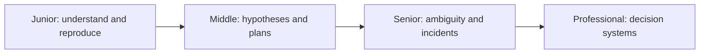
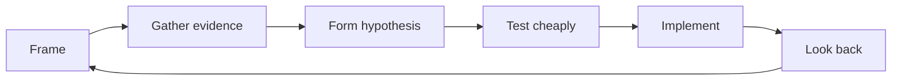

# Problem-Solving

> Solve the right problem with a falsifiable plan, small actions, and reflection that improves the next attempt.

This guide preserves the full problem-solving loop: understand the problem, devise a plan, execute it, reflect, and recover when stuck. For the dedicated deep dive on diagnosing a specific failure — pattern recognition, decomposition, evidence-driven hypotheses — see [Debug-Thinking](../08-debug-thinking/README.md).

| Level | Guide | You are done when |
|---|---|---|
| Junior | [Solve a bounded problem](junior.md) | You can define expected versus actual behavior and test one hypothesis. |
| Middle | [Manage competing explanations](middle.md) | You can prioritize hypotheses and produce a reversible plan. |
| Senior | [Lead uncertain work](senior.md) | You can reduce ambiguity, contain risk, and coordinate evidence across a system. |
| Professional | [Improve organizational decisions](professional.md) | You can design feedback, incident, and learning systems across teams. |

## Practice rule

Write the problem statement and evidence before the solution. If you cannot describe what observation would prove you wrong, you have a belief, not a hypothesis.

## Related

- [Computational Thinking](../01-computational-thinking/README.md)
- [Critical Thinking](../04-critical-thinking/README.md)
- [Debug-Thinking](../08-debug-thinking/README.md)
- [Scientific Thinking](../09-scientific-and-hypothesis-driven/README.md)
