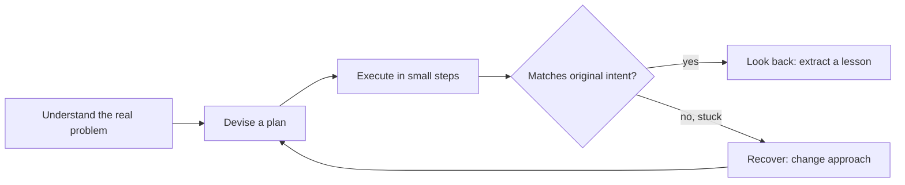

# Problem-Solving

> Turn a vague request into a well-understood problem, a plan you can safely change your mind about, and a result you actually verified.

The core skills are problem framing, plan design, incremental execution, verification against original intent, and reflection. They form one loop, in the spirit of Pólya's *How to Solve It*: understand before acting, devise a plan before executing, execute in small verifiable steps, check the result against the real goal rather than "it runs," then look back for a durable lesson — and when a step doesn't go anywhere, deliberately change your approach instead of pushing harder on the same one.

| Level | Guide | You are done when |
|---|---|---|
| Junior | [Solve the actual problem](junior.md) | You can restate a vague request as a concrete problem with explicit success criteria, plan the smallest path to it, and verify against that plan rather than "it compiles." |
| Middle | [Compare plans, stay reversible](middle.md) | You can generate competing approaches, choose between them with evidence and cost instead of gut feel, and sequence a plan so a wrong turn is cheap to undo. |
| Senior | [Lead through ambiguity](senior.md) | You can reduce genuine requirement ambiguity with targeted techniques, stage delivery to contain risk, and deliberately unstick yourself instead of grinding. |
| Professional | [Build a problem-solving system](professional.md) | You can design intake, postmortem discipline, decision rights, and institutional memory so problems in your organization get solved once, not repeatedly. |

## Practice rule

Before acting, write the problem in your own words and list concrete success criteria — not adjectives. When you're stuck, change your representation of the problem before you spend more effort pushing on the same one.

## Related

- [Computational Thinking](../01-computational-thinking/README.md)
- [Critical Thinking](../04-critical-thinking/README.md)
- [Debug-Thinking](../08-debug-thinking/README.md) — the specialized case of this loop applied to "something that used to work is now broken"; this guide covers the general loop, debug-thinking covers reproduction, bisection, and evidence-driven bug hypotheses.
