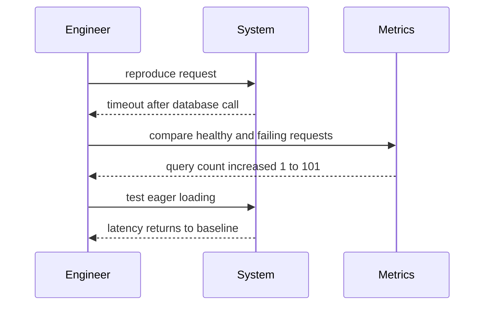

# Problem-Solving — Junior

Start by separating the request, the symptom, and the real problem. “The page is slow” is a symptom. A useful statement is: “For signed-in users, p95 load time rose from 600 ms to 2.4 s after release X.”

## A repeatable method

1. State expected and actual behavior.
2. Define scope: users, environment, version, time, and frequency.
3. Reproduce consistently.
4. Read the complete error and inspect recent changes.
5. Form one hypothesis and predict its evidence.
6. Run the smallest test that distinguishes it.
7. Fix the cause, verify the original reproduction, and reflect.

When stuck, shrink the input, compare with a working example, explain the problem aloud, or write down what you know versus assume. Do not change several variables at once.

## Test yourself

1. Rewrite “login is broken” as a useful problem statement.
2. What evidence would distinguish a network delay from a slow query?
3. Why is changing three settings a weak experiment?
4. What should you verify after the fix?

Continue to [`middle.md`](middle.md).
