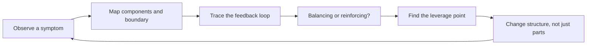

# Systems Thinking

> See behavior as the product of connections, feedback, and delays — not as the sum of isolated parts.

The core skills are boundary-setting, loop-tracing, distinguishing symptom from origin, classifying feedback as balancing or reinforcing, locating leverage points, diagnosing the real constraint, and designing incentives so local decisions don't damage the whole. They form one loop: a symptom shows up somewhere, but its cause usually lives in a connection or a delay elsewhere in the system, not in the component where it was observed.

| Level | Guide | You are done when |
|---|---|---|
| Junior | [Map a system's boundary and one loop](junior.md) | You can name a system's components, its boundary, and at least one real feedback loop inside it. |
| Middle | [Classify loops and find leverage](middle.md) | You can tell a balancing loop from a reinforcing one and pick the change with outsized effect. |
| Senior | [Redesign structure, not symptoms](senior.md) | You can diagnose the real bottleneck and change a policy or boundary instead of patching a component. |
| Professional | [Design incentives at org scale](professional.md) | You can design metrics and ownership so local optimization doesn't damage the global system. |

## Practice rule

Before you fix anything, draw the loop the symptom sits inside: what feeds it, what it feeds, and what closes the circle back to the start. A fix that doesn't touch the loop is a patch, not a change.

## Related

- [Computational Thinking](../01-computational-thinking/README.md)
- [Probabilistic Thinking](../06-probabilistic-thinking/README.md)
- [Scientific and Hypothesis-Driven Thinking](../09-scientific-and-hypothesis-driven/README.md)
