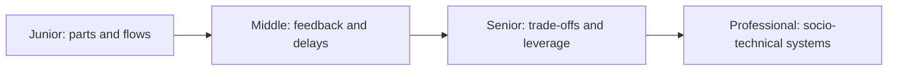
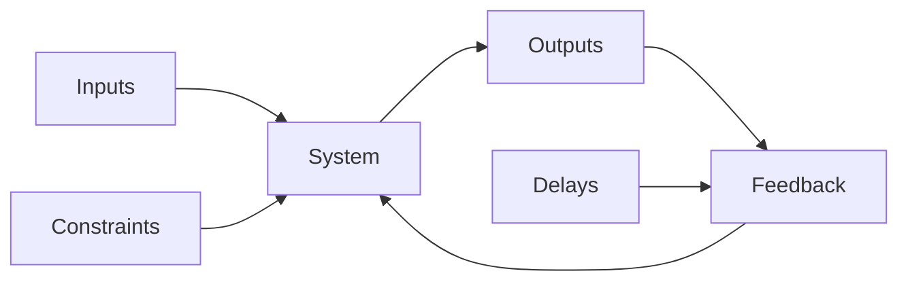

# Systems Thinking

> See behavior as the result of relationships, feedback, delays, constraints, and incentives—not isolated components.

This guide combines parts-and-whole thinking, emergence, feedback loops, second-order effects, mental models, trade-offs, leverage points, and bottlenecks.

| Level | Guide | You are done when |
|---|---|---|
| Junior | [Map a small system](junior.md) | You can draw actors, flows, boundaries, and one feedback loop. |
| Middle | [Explain dynamic behavior](middle.md) | You can reason about delays, accumulation, reinforcing and balancing loops. |
| Senior | [Intervene safely](senior.md) | You can predict second-order effects and choose leverage points. |
| Professional | [Shape socio-technical systems](professional.md) | You can align architecture, incentives, ownership, and operational feedback. |

## Practice rule

Before optimizing a component, draw what enters it, what leaves it, what accumulates, and which delayed signal changes future behavior.

## Related

- [Probabilistic Thinking](../06-probabilistic-thinking/README.md)
- [Scientific Thinking](../09-scientific-and-hypothesis-driven/README.md)
