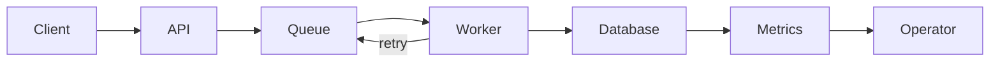

# Systems Thinking — Junior

A system is more than a list of components. Its behavior emerges from interactions. A fast API can still produce a slow product if queues, retries, databases, and clients amplify delay.

## Draw the system

Identify purpose, boundary, actors, components, inputs, outputs, data flow, control flow, and constraints. Then ask where work waits or accumulates.

The retry arrow is feedback. If the database slows, workers retry, the queue grows, and the database receives more load. Improving only worker speed may worsen overload.

## First habits

- State what is outside the boundary.
- Distinguish flow from stock: requests flow; queue depth accumulates.
- Look for delay between action and visible result.
- Ask how local optimization affects the whole outcome.

## Test yourself

1. What is the purpose and boundary of the example system?
2. Which quantity accumulates?
3. How can retries create worse behavior?
4. What metric would reveal the feedback loop?

Continue to [`middle.md`](middle.md).
