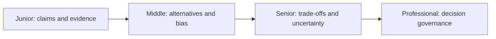
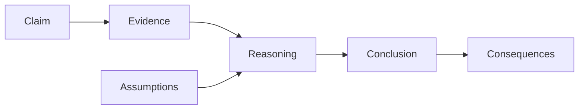

# Critical Thinking

> Separate claims, evidence, assumptions, and values so an engineering decision can survive disagreement.

| Level | Guide | You are done when |
|---|---|---|
| Junior | [Check one claim](junior.md) | You can identify evidence, assumptions, and a falsifying observation. |
| Middle | [Compare explanations](middle.md) | You can detect common fallacies and actively test alternatives. |
| Senior | [Run fair trade-off analysis](senior.md) | You can separate facts from values and make uncertainty visible. |
| Professional | [Govern consequential decisions](professional.md) | You can preserve dissent, evidence quality, and accountability across teams. |

## Practice rule

For every strong claim, ask: “Compared with what, measured how, under which conditions, and what evidence would change my mind?”

## Related

- [Probabilistic Thinking](../06-probabilistic-thinking/README.md)
- [First-Principles Thinking](../05-first-principles-thinking/README.md)
