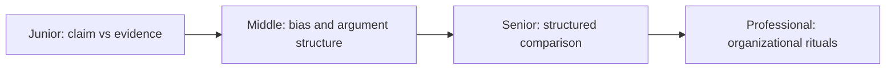
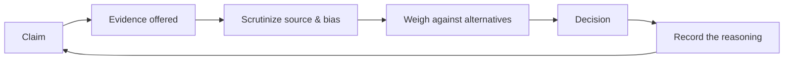

# Critical Thinking

> Separate claims from evidence, catch the fallacies and biases distorting a decision, and compare engineering trade-offs on their merits instead of on confidence or volume.

The core skills are separating a claim from the evidence behind it, recognizing fallacies and cognitive biases as they happen, deconstructing an argument into premises and conclusion to find the weak link, and comparing competing options against explicit, weighted criteria instead of gut feel or the loudest voice. They form one loop: hear a claim, ask what evidence backs it, scrutinize that evidence for bias and relevance, weigh it against the alternatives, decide, and record the reasoning so it can be audited later.

| Level | Guide | You are done when |
|---|---|---|
| Junior | [Separate claims from evidence](junior.md) | You can name one unsupported claim or fallacy in a real doc, comment, or discussion, and state what evidence would actually support it. |
| Middle | [Weigh evidence and spot bias](middle.md) | You can name which cognitive bias is shaping a team decision and deconstruct an argument into premises and conclusion to find the weak one. |
| Senior | [Compare options with evidence](senior.md) | You can run a weighted trade-off comparison across real options and detect motivated reasoning or groupthink in a high-stakes decision. |
| Professional | [Build organizational rituals](professional.md) | You can install pre-mortems, a devil's-advocate role, and decision logs that make critical thinking a repeatable habit instead of one person's trait. |

## Practice rule

Before accepting a claim, ask three questions: what evidence would prove it false, what alternative explanation fits the same observation just as well, and who benefits from the claim being true. If you can't answer all three, you don't understand the claim well enough to act on it yet.

## Related

- [Computational Thinking](../01-computational-thinking/README.md)
- [Probabilistic Thinking](../06-probabilistic-thinking/README.md)
- [Scientific and Hypothesis-Driven Thinking](../09-scientific-and-hypothesis-driven/README.md)
