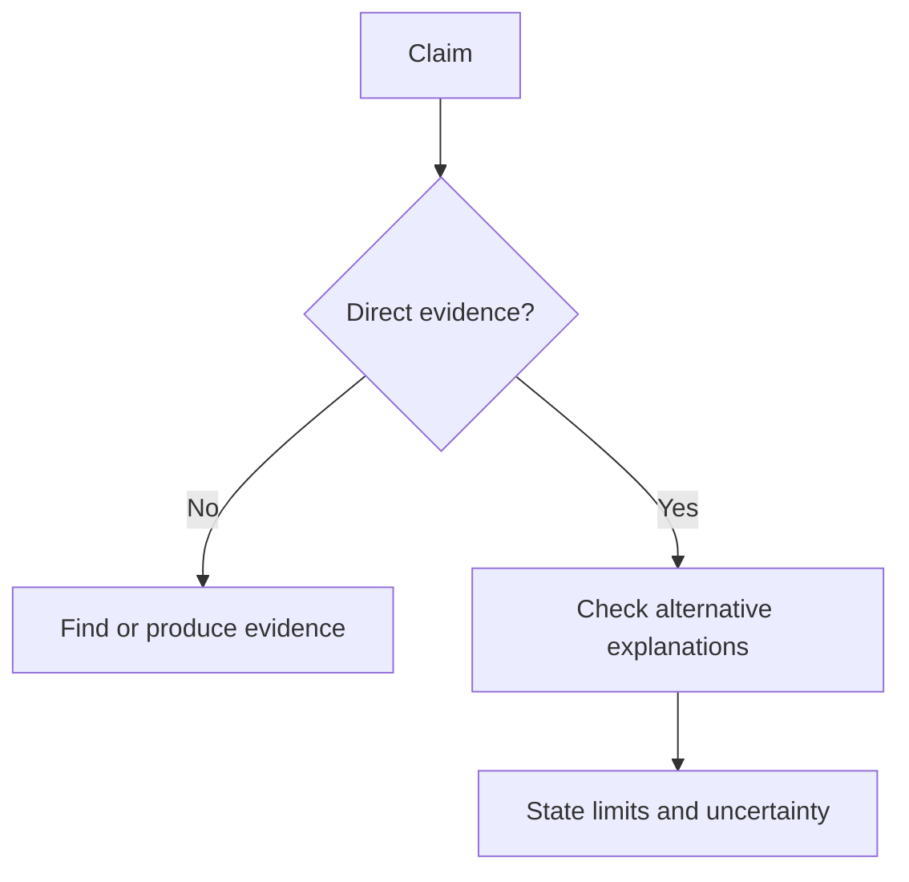

# Critical Thinking — Junior

Rewrite opinions as testable claims. “Redis is faster” becomes “For 1 KB reads at 5,000 requests per second, Redis has lower p95 latency than the current Postgres query while meeting durability needs.”

Classify statements as observation, inference, assumption, or preference. Check source quality, measurement method, sample, missing context, and whether the conclusion exceeds the evidence.

Avoid false dilemmas, appeals to authority, anecdotes treated as trends, and arguments about a distorted version of another proposal.

## Test yourself

1. Turn “microservices scale better” into a bounded claim.
2. What assumption connects a benchmark to production?
3. What evidence would falsify your preferred explanation?
4. Why is a senior engineer’s opinion not sufficient evidence?

Continue to [`middle.md`](middle.md).
