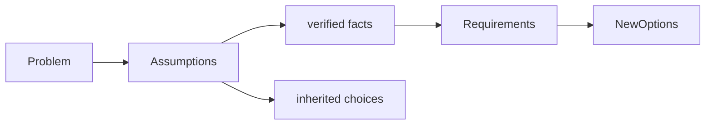

# First-Principles Thinking

> Separate genuine constraints from inherited choices, then rebuild options from what must actually be true.

| Level | Guide | You are done when |
|---|---|---|
| Junior | [Separate facts from habits](junior.md) | You can challenge one assumed solution and restate the need. |
| Middle | [Derive a design](middle.md) | You can rebuild options from invariants and measured constraints. |
| Senior | [Challenge architectural premises](senior.md) | You can expose hidden constraints and test a replacement safely. |
| Professional | [Reframe organization-scale choices](professional.md) | You can change the constraint system while preserving trust and continuity. |

## Practice rule

Ask “what must be true?” until each answer is observable, logically required, or explicitly a value choice.

## Related

- [Critical Thinking](../04-critical-thinking/README.md)
- [Creative Thinking](../07-creative-and-lateral-thinking/README.md)
