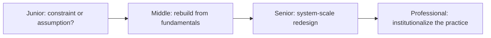
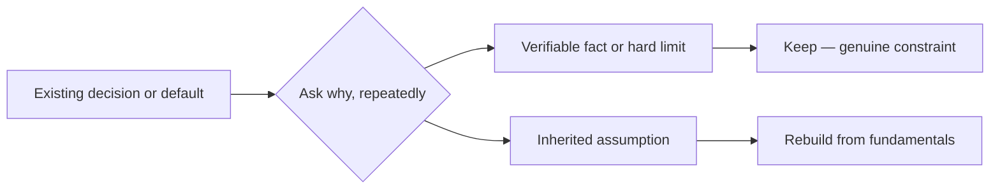

# First-Principles Thinking

> Reduce a decision to its genuine constraints, then rebuild the solution from what must actually be true — not from what was done last time.

The core skills are distinguishing a genuine constraint from an inherited assumption, tracing a decision's "why" chain until it hits something verifiable, deriving a solution from actual fundamentals instead of defaulting to the nearest existing pattern, and choosing — deliberately, not by habit — between reasoning-by-analogy and reasoning-by-first-principles depending on how well-precedented, reversible, and consequential the problem actually is.

| Level | Guide | You are done when |
|---|---|---|
| Junior | [Question one inherited assumption](junior.md) | You can trace a small decision to a genuine constraint, or admit it's just precedent nobody re-checked. |
| Middle | [Rebuild from fundamentals](middle.md) | You can derive a solution from actual constraints and still recognize when precedent was right all along. |
| Senior | [Redesign under real constraints](senior.md) | You can separate genuine system-level constraints from organizational habit and choose analogy vs. first principles on purpose. |
| Professional | [Institutionalize assumption-challenging](professional.md) | You can make deep assumption-tracing mandatory only where it pays for itself, and measure that the policy is working. |

## Practice rule

Before accepting a constraint, ask what observation would prove it false, and check whether anyone has actually looked. Before discarding a constraint because it's inconvenient, ask the same question of your own preference to change it — "this is old" is not evidence that it's wrong.

## Related

- [Computational Thinking](../01-computational-thinking/README.md)
- [Critical Thinking](../04-critical-thinking/README.md)
- [Systems Thinking](../03-systems-thinking/README.md)
