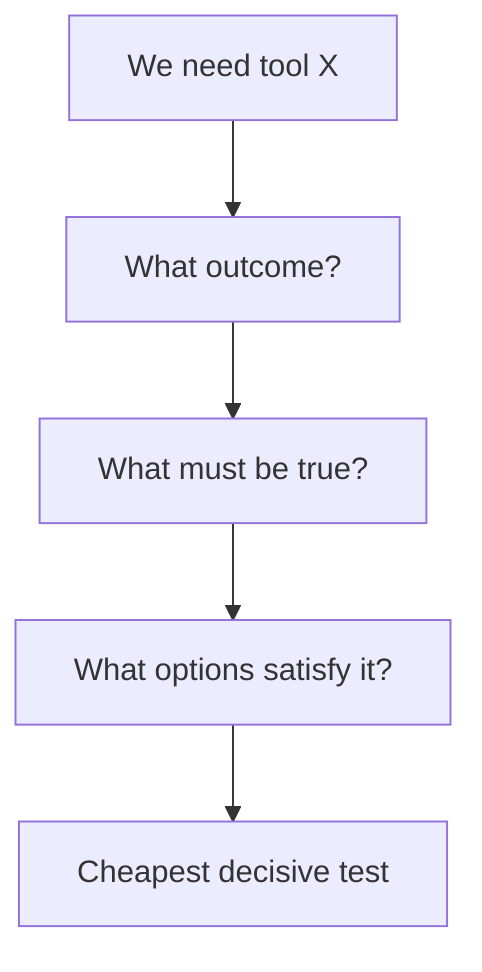

# First-Principles Thinking — Junior

When told “we need Kubernetes,” ask what outcome requires it. The actual needs may be repeatable deployment, health checks, rollback, and two replicas. Kubernetes is one solution, not a fundamental requirement.

Write four lists: desired outcome, verified facts, hard constraints, and assumptions. For each assumption, ask who chose it, why, whether conditions changed, and what experiment could remove it.

Do not challenge everything forever. Stop when further decomposition does not change the decision or evidence is more expensive than a reversible test.

## Test yourself

1. Restate “we need microservices” as outcomes and constraints.
2. Which statement is a fact versus an inherited choice?
3. What cheap test could remove an assumption?
4. When should questioning stop?

Continue to [`middle.md`](middle.md).
