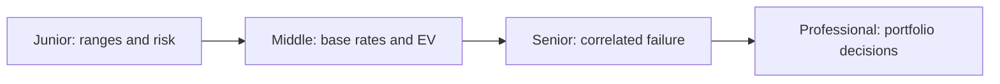
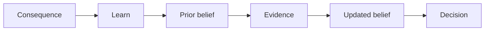

# Probabilistic Thinking

> Make uncertainty explicit, update beliefs with evidence, and choose actions by expected consequences rather than confidence alone.

| Level | Guide | You are done when |
|---|---|---|
| Junior | [Express uncertainty](junior.md) | You can estimate with a range and name major risks. |
| Middle | [Use base rates and expected value](middle.md) | You can compare decisions using probability and impact. |
| Senior | [Model system risk](senior.md) | You can reason about dependence, tails, and risk controls. |
| Professional | [Allocate risk across a portfolio](professional.md) | You can set evidence thresholds and risk appetite across initiatives. |

## Practice rule

Replace “will” with a probability, range, assumptions, and next evidence that would materially update it.

## Related

- [Computational Thinking](../01-computational-thinking/README.md)
- [Critical Thinking](../04-critical-thinking/README.md)
- [Scientific and Hypothesis-Driven Thinking](../09-scientific-and-hypothesis-driven/README.md)
