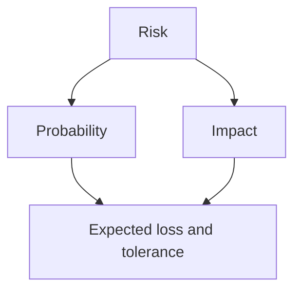

# Probabilistic Thinking — Junior

Avoid single-point estimates. “This takes three days” hides uncertainty. Use “50% chance by Wednesday, 85% by Friday, assuming the API is stable.”

Estimate best plausible, most likely, and worst plausible outcomes. Name unknowns that widen the range. Distinguish probability from impact: a rare data-loss event can deserve more control than a common harmless retry.

Track forecasts and outcomes. Calibration improves only when you learn whether “80%” events happen roughly eight times out of ten.

## Test yourself

1. Rewrite a point estimate as a calibrated range.
2. Compare a common low-impact and rare high-impact failure.
3. Which assumption contributes most uncertainty?
4. How do you measure calibration?

Continue to [`middle.md`](middle.md).
