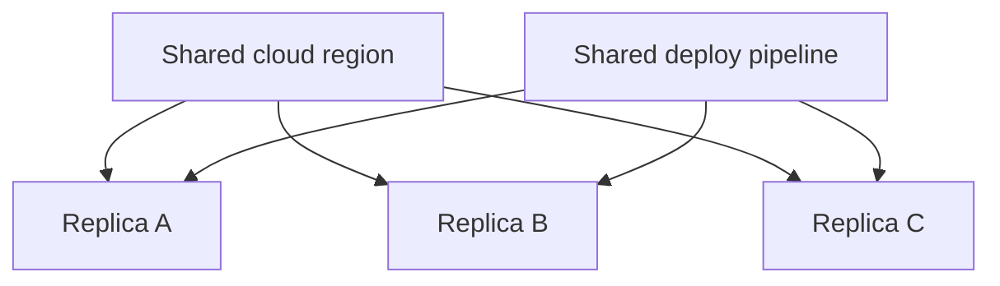

# Probabilistic Thinking — Senior

**Your question:** How do I model failure probabilities across a whole system, including correlated failures, and communicate the real uncertainty to people who need a straight answer?

Middle level teaches calibrated ranges for a single decision. Senior-level risk lives at the system boundary — you're not estimating one task, you're estimating whether a system of many parts stays up, and whether the redundancy you built actually protects you or just looks like it does on a whiteboard. The mistake that costs the most at this level is naive independence: multiplying probabilities as if failures don't share causes, when in real systems they usually do.

## Independent failure math — and why it's usually wrong

For truly independent components, probabilities compose simply:

- **All must work (series):** `P(system up) = P(A) × P(B) × P(C)`
- **Any one working is enough (redundancy):** `P(all fail) = P(A fails) × P(B fails) × P(C fails)`

**Example, naive:** Three replicas, each independently 99% available in a given window. `P(all three down) = 0.01 × 0.01 × 0.01 = 0.0001%` — "four nines of redundancy," reassuring on a slide.

**The catch:** that math assumes the three replicas can fail for *unrelated* reasons. In practice, check what they share:

- Same cloud region → a regional outage takes all three down together
- Same base image / same dependency version → a bad library release breaks all three at once
- Same deploy pipeline → one bad rollout hits all three simultaneously
- Same on-call engineer / same runbook → a wrong response compounds across all three

If all three replicas share a region, the real number isn't `0.01³` — it's closer to `P(region outage) + P(independent failure of all three | region is up)`, and the first term usually dominates. Redundancy that shares a root cause isn't redundancy; it's the same risk with extra billing.

**Takeaway from the diagram:** three boxes that look independent in the architecture diagram are actually downstream of two shared single points of failure. Model risk on *this* graph, not on the three-boxes-look-redundant version.

## The method: build a risk budget with correlation in mind

1. **List every component and its individual failure probability**, from real data (uptime logs, incident history) — not vendor SLAs alone, which describe the target, not the observed rate.
2. **List what each component shares with the others**: region, credentials, base image, deploy pipeline, on-call rotation, upstream vendor, config source.
3. **Group components by shared root cause.** Anything sharing a root cause should be treated as one failure unit for that cause, even if it's three separate services.
4. **Compute two numbers, not one:** the naive independent estimate, and the correlated estimate assuming the largest shared dependency fails. The gap between them is your hidden risk.
5. **Set a risk budget.** Decide, explicitly, how much combined failure probability the system can carry before it violates its SLA — and allocate it across components rather than assuming each one gets to use "the whole budget" independently.
6. **Design mitigations that break correlation**, not just add more of the same: a second region, a second deploy pipeline with staggered rollout, a different base image for at least one replica, a documented fallback that doesn't depend on the primary vendor.

### Worked example: risk budget for a checkout system

**System:** Checkout depends on PaymentGateway (99.9% target), InventoryService (99.95%), and a shared Redis cache (99.9%), all in one region, all deployed through the same CI pipeline.

**Naive independent estimate:** `1 − (0.999 × 0.9995 × 0.999) ≈ 0.25%` combined unavailability — looks like it clears a 99.5% SLA comfortably.

**Correlated reality check:**
- All three share the region → regional incident history shows ~1 event/year lasting ~40 minutes → contributes ~0.008% unavailability on its own, but takes *all three* down together, not just one.
- All three deploy through the same pipeline → last 12 months show 2 bad rollouts that degraded more than one service simultaneously.
- Redis is a single shared cache with no replica in a second zone → its failure alone removes both PaymentGateway and InventoryService's fast path, forcing both into a slow path that has never been load-tested at full traffic.

**Risk budget decision:** Treat "region + pipeline + shared Redis" as one correlated failure unit worth ~0.3-0.5% unavailability on its own — larger than the naive independent estimate for the whole system. Mitigation isn't "add a fourth replica" (doesn't break the correlation); it's a second Redis instance in a different zone with a tested fallback path, and staggered rollouts so a bad deploy doesn't hit all three services in the same five minutes.

## Communicate uncertainty without false precision

Stakeholders often want a single confident sentence. Giving them one when you don't have the evidence for it is a bigger risk than the system risk itself.

**Don't say:** "It'll definitely work." "We're at four nines." "No risk of correlated failure."

**Do say, in this shape:**
- **The range:** "Based on last year's incident data, combined unavailability is realistically 0.3-0.5%, not the 0.001% the independent math suggests."
- **The assumption that could be wrong:** "This assumes the region doesn't have a repeat of March's outage more than once a year."
- **The worst credible outcome:** "If the shared Redis and a bad deploy coincide, checkout could be down for up to 40 minutes — that's happened once in the last 12 months."
- **The trigger that changes the plan:** "If we see a second regional incident before Q3, we escalate the second-Redis-zone work from backlog to this sprint."

This gives a decision-maker something they can actually act on — a range, an assumption to watch, and a concrete trigger — instead of a comforting sentence that turns out to be wrong under exactly the conditions that matter.

## Common mistakes at senior level

| Mistake | Why it hurts | Fix |
|---|---|---|
| Multiplying probabilities across components that share infrastructure | Understates real failure probability, sometimes by orders of magnitude | Map shared dependencies first; group by root cause before computing |
| Treating vendor SLA numbers as the observed failure rate | SLAs are commitments (often with credits attached), not measurements of actual behavior | Pull real incident/uptime history where available; use SLA only as a floor |
| Adding redundancy that shares the same root cause as the primary | Looks like risk mitigation, is actually the same risk duplicated | Ask "what does this replica *not* share with the others?" before counting it as redundancy |
| Giving stakeholders a single confident number with no assumption stated | When reality diverges from the hidden assumption, trust in future estimates erodes | State the range, the assumption, and the trigger that would change the answer |
| Building a risk budget with no explicit allocation across components | Every team assumes they own the "whole" budget; total risk silently exceeds the SLA | Allocate the budget explicitly per component/shared-dependency group, and track against it |

## Hands-on exercise

Take a system you're responsible for that has some form of redundancy (multiple replicas, retries, failover).

1. List every component in the redundant path and its individually observed (not SLA-target) failure rate.
2. For each pair of components, list what infrastructure, pipeline, or credential they share.
3. Compute the naive independent-failure estimate for the whole path.
4. Compute a correlated estimate assuming the largest shared dependency fails — how much bigger is it?
5. Write one mitigation that breaks a correlation (not one that adds more of the same shared thing).
6. Draft the three sentences you'd actually tell a stakeholder: the range, the assumption, and the trigger.

## Verify your thinking

- [ ] Did you check what your "redundant" components share before trusting the independent-failure math?
- [ ] Is your risk budget allocated explicitly across components, or does everyone assume they get the whole thing?
- [ ] Can you name the single largest correlated-failure risk in your system right now?
- [ ] Did you use observed incident history, not just vendor SLA targets, for your failure rates?
- [ ] Would your stakeholder communication survive the worst credible outcome actually happening?

Continue to [`professional.md`](professional.md).
