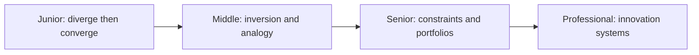
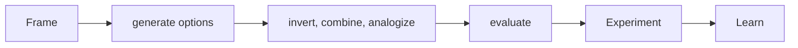

# Creative and Lateral Thinking

> Generate meaningfully different options before converging on the safest familiar answer.

| Level | Guide | You are done when |
|---|---|---|
| Junior | [Generate alternatives](junior.md) | You can separate option generation from evaluation. |
| Middle | [Use lateral techniques](middle.md) | You can create non-obvious options through inversion and analogy. |
| Senior | [Design an option portfolio](senior.md) | You can explore safely under constraints and uncertainty. |
| Professional | [Build innovation capacity](professional.md) | You can create incentives, funding, and feedback for sustained exploration. |

## Practice rule

Require at least three structurally different options before choosing, including “remove the need” and “change the constraint.”

## Related

- [First-Principles Thinking](../05-first-principles-thinking/README.md)
- [Scientific Thinking](../09-scientific-and-hypothesis-driven/README.md)
