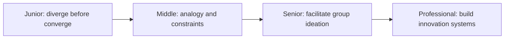
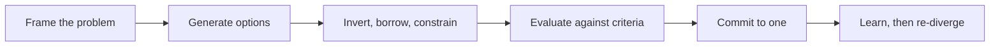

# Creative and Lateral Thinking

> Generate meaningfully different options before converging on the safest familiar answer.

The core skills are divergent generation, inversion, analogy transfer, constraint-based reframing, and criteria-driven convergence. They form one loop: frame the goal without a solution baked in, generate options faster than you judge them, transform the strongest raw ideas with a lateral technique, converge using named criteria instead of preference, then commit and learn from what happens. Skipping divergence collapses the loop into "the first idea anyone said out loud" — technically a decision, but not a choice.

| Level | Guide | You are done when |
|---|---|---|
| Junior | [Separate divergence from convergence](junior.md) | You can generate five structurally different options for a real problem before judging any of them. |
| Middle | [Borrow structure and use constraints](middle.md) | You can transfer a pattern from another domain and use a deliberate limitation to force better options than the default. |
| Senior | [Facilitate ideation without groupthink](senior.md) | You can run a group session that doesn't collapse into the first idea spoken, and know when to stop diverging and commit. |
| Professional | [Build the conditions for real innovation](professional.md) | You can fund and evaluate unconventional ideas at organizational scale without producing innovation theater. |

## Practice rule

Before choosing, require at least three structurally different options, including one that removes the need entirely and one that changes a constraint you have been treating as fixed. In a group, never let the first idea spoken be the anchor everyone else reacts to — get options on the table before anyone argues for one.

## Related

- [Computational Thinking](../01-computational-thinking/README.md)
- [First-Principles Thinking](../05-first-principles-thinking/README.md)
- [Scientific and Hypothesis-Driven Thinking](../09-scientific-and-hypothesis-driven/README.md)
