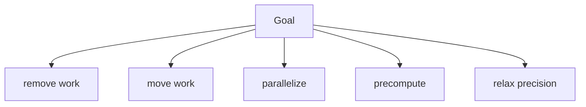

# Creative and Lateral Thinking — Junior

Do not judge while generating. First create options; then evaluate them against constraints.

For “reduce image upload latency,” generate alternatives across categories: compress earlier, upload directly to storage, process asynchronously, reduce resolution, cache transformed images, or remove unnecessary variants.

Time-box divergence, invite rough ideas, and combine options. During convergence, use correctness, user value, effort, risk, and reversibility.

## Test yourself

1. Why separate divergence from convergence?
2. Generate five structurally different options for a slow report.
3. Which option removes work entirely?
4. Which criteria should evaluate the options?

Continue to [`middle.md`](middle.md).
