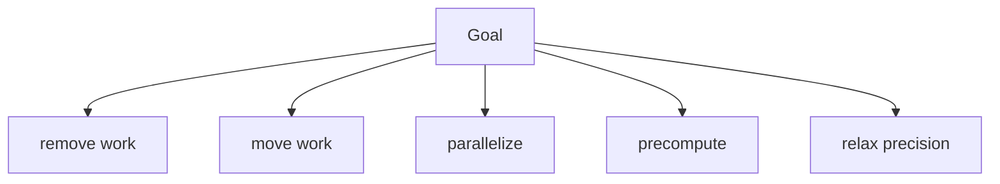

# Creative and Lateral Thinking — Junior

**Your question:** How do I generate several genuinely different options for a real problem before judging any of them?

The instinct when you hit a problem is to picture one solution and start building it. That solution is usually the first pattern that comes to mind — often just the last thing you saw work somewhere else. It might be fine. But if you never generate real alternatives, you can't know whether it's the best available option or just the first available one. Creative thinking at junior level is not about being "artistic" — it is the discipline of separating **divergence** (generating options, judging nothing) from **convergence** (evaluating options against criteria, judging everything). Collapsing the two into one step is the single biggest reason teams ship the obvious-but-mediocre answer.

## The method: Diverge across categories, then converge on criteria

1. **State the goal as an outcome, not a solution.** "Reduce image upload latency" is a goal. "Add a background job queue" is already a solution — write the goal, not the fix, or you'll only generate variations of that one fix.
2. **Force yourself across categories before listing freely.** Free brainstorming defaults to whatever you already know. Use a fixed set of transformation categories and generate at least one option per category:
   - **Remove** — can you eliminate the work entirely?
   - **Move** — can the work happen somewhere else (client, edge, a different service)?
   - **Parallelize** — can steps that run sequentially run at the same time?
   - **Precompute** — can you do the work before it's needed, instead of on demand?
   - **Approximate** — can you accept a cheaper, less precise answer for most cases?
3. **Ban criticism during the list.** No "that won't work," no "we tried that," not even out loud to yourself. If an idea seems bad, write it down anyway and move on — judging kills the next three ideas you would have had.
4. **Time-box it.** Ten to fifteen minutes. Divergence with no limit turns into stalling; divergence that's cut off after two ideas isn't divergence.
5. **Only then, converge.** Pick explicit criteria (effort, risk, impact, reversibility) and score each option. Do not let "which one do I already like" substitute for scoring.

## A concrete example

**Goal:** Reduce profile-picture upload latency. Current p95 is 2,200 ms; target is under 800 ms.

**Where the time goes today:** network transfer 400 ms, virus scan 150 ms, resize into 3 variants (thumbnail, medium, full) 900 ms sequentially, database write 100 ms, response serialization 50 ms. Resizing is more than a third of the total — the obvious first idea is "make resizing faster."

**Diverge across categories (six options, not one):**

| # | Category | Option |
|---|---|---|
| 1 | Remove | Only generate the thumbnail on upload; generate medium/full the first time they're actually requested |
| 2 | Move | Client uploads directly to object storage via a presigned URL, bypassing the app server for the transfer itself |
| 3 | Parallelize | Generate all three variants concurrently instead of one after another (900 ms → ~350 ms) |
| 4 | Precompute | Nothing to precompute here — no future request is predictable enough (write this down: "not applicable" is a valid outcome of checking a category) |
| 5 | Approximate | Return success as soon as the original is stored; resize asynchronously and swap in variants when ready |
| 6 | Remove | Drop the "full" variant entirely — audit shows it's requested for 0.3% of profiles; nobody asked for it, an old ticket added it "just in case" |

**Converge with criteria:**

| Option | Impact on p95 | Effort | Risk |
|---|---|---|---|
| 3. Parallelize resize | -550 ms | Small | Low |
| 6. Drop unused variant | -300 ms | Small | Low (verify usage first) |
| 5. Async resize | -900 ms (perceived) | Medium | Medium — need a "processing" state in the UI |
| 2. Direct-to-storage upload | -400 ms | Large | Medium — new failure modes at the storage boundary |

The team ships options 3 and 6 together first (small, low risk, additive) and holds option 5 as the next experiment if that's not enough. Notice this decision was only possible because six structurally different options existed to compare — "make resizing faster" alone would have produced only option 3.

## Recognizing a genuinely different option

Not every new-sounding idea is actually a new option. Ask: **does this change a different step, or does it just reword the same step?**

- "Use a faster resize library" and "cache resized images" both attack the *resize* step — they're two tactics inside one option (Remove/Approximate), not two structurally different options.
- "Resize on upload" vs. "resize lazily on first read" changes *when* the work happens — that's structurally different.
- "Resize in the app server" vs. "resize in a separate worker" changes *where* the work happens — also structurally different.

A quick test: if two options would show up as edits to the same function, they're the same option. If they'd touch different parts of the system (a different service, a different point in time, a removed step), they're different.

## Common beginner mistakes

| Mistake | Why it hurts | Fix |
|---|---|---|
| Judging ideas as you list them ("that won't work," said out loud) | Kills quantity — the next two ideas you'd have had never get said | Ban all critique until the list phase is fully over |
| Generating variations of one idea instead of structurally different ideas | The list looks long but is narrow; the real alternative never surfaces | Force one option per category (remove/move/parallelize/precompute/approximate) before free-listing |
| Picking the first option that "feels right" | Skips convergence entirely — no real comparison ever happened | Score every option against the same named criteria before deciding |
| Stopping at two or three options | Not enough divergence to escape the default answer | Require at least five before you're allowed to evaluate any of them |
| Treating brainstorming as unlimited and unfocused | Wastes time, produces a messy list nobody acts on | Time-box divergence to 10–15 minutes and write down the goal first |

## Hands-on exercise

Pick one real problem from your current backlog — a slow endpoint, a flaky test, a clunky feature.

1. Write the goal as an outcome ("reduce X," "eliminate Y"), not as a solution.
2. List the five transformation categories (remove, move, parallelize, precompute, approximate) and force at least one option under each — write "not applicable" if a category genuinely doesn't fit, but only after trying.
3. Do not evaluate anything until you have at least five options written down.
4. Pick three criteria (for example: effort, risk, impact) and score each option against all three.
5. Write one sentence explaining why you rejected the two strongest alternatives to the one you'd pick.
6. Check: could you explain to a teammate why your chosen option beats the second-best one, using the criteria — not "it felt right"?

## Verify your thinking

- [ ] Did you write the goal before any solution existed on paper?
- [ ] Do you have at least five options, and can you point to which category each came from?
- [ ] Are any two of your options actually the same idea reworded? (If so, you don't have five yet.)
- [ ] Did you score options against named criteria instead of picking by preference?
- [ ] Can you name the specific reason you rejected your second-best option?

Continue to [`middle.md`](middle.md).
