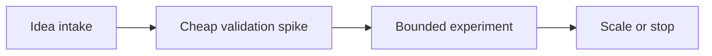

# Creative and Lateral Thinking — Professional

**Your question:** How do I build organizational conditions where genuinely novel ideas can surface and get funded, without turning into unfocused experimentation?

A senior engineer can facilitate one good session. That doesn't scale past one room. At professional level, the job is designing the *system* an organization uses to surface unconventional ideas, decide which ones deserve real money and time, and kill the rest honestly — without that system decaying into either of its two failure modes: an organization so risk-averse that nothing unconventional ever survives contact with a roadmap, or an organization so enamored with "innovation" that it funds enthusiasm instead of evidence and nothing ever ships.

## Psychological safety and protected time as preconditions

Neither of these is a slogan — both need to be concrete enough to observe.

**Psychological safety, observably:**
- People propose ideas that could be wrong in a public forum (a design review, a planning meeting) without it affecting how they're evaluated.
- Disagreement with a senior person's stated opinion happens *in the room*, not only in side channels afterward.
- A failed experiment is discussed in a retro without anyone being blamed for having proposed it — the question asked is "what did we learn," not "whose idea was this."

**Anti-signal:** if postmortems for failed experiments consistently identify an individual as the cause rather than the process or the evidence available at the time, psychological safety is not real, regardless of what the values poster in the hallway says.

**Protected time, observably:**
- A specific, named allocation — for example, a fixed percentage of a team's sprint capacity per quarter, or a recurring "exploration week" — that shows up on the same roadmap as delivery work, not as leftover time if delivery finishes early.
- Exploration time survives a bad quarter. If it's the first thing cut whenever delivery is behind, it was never actually protected — it was borrowed.
- Someone owns the allocation and can point to what was explored last quarter, the same way a delivery lead can point to what shipped.

**Anti-signal:** "innovation time" that exists in a policy document but has a 0% actual utilization rate because nobody ever gets explicit permission to use it.

## A process for evaluating and funding unconventional ideas at scale

The core difficulty is telling a promising unconventional idea apart from noise, at a volume where no single facilitator can personally evaluate every submission. Use a staged funnel with increasing evidence requirements and increasing budget at each stage:

| Stage | Cost | Duration | Exit requirement |
|---|---|---|---|
| Intake | ~0 | N/A | Idea is written down with a named problem and a falsifiable claim, not just an enthusiasm |
| Cheap validation spike | 1–3 person-days | Under a week | Evidence that the core mechanism plausibly works, gathered as cheaply as possible (a prototype, a manual test, a small data pull) |
| Bounded experiment | A defined budget and headcount, agreed up front | 2–6 weeks | A predefined success metric is met or missed; result is published either way |
| Scale | Normal delivery funding | Ongoing | Owning team is identified, operational readiness is confirmed, and the metric that justified scaling continues to be tracked |

### Distinguishing a promising unconventional idea from noise

| Signal of a promising idea | Signal of noise |
|---|---|
| Names a specific mechanism ("cache the ranking signal at the edge to cut p95 by an estimated 200ms") | Names only an aspiration ("we should be more AI-driven") |
| Comes with a falsifiable test ("if this works, metric X moves by at least Y within two weeks") | No way to know if it succeeded or failed |
| Traces to an observed pain point (a support ticket pattern, a metric regression, a real user complaint) | Traces only to "I read about this at a conference" with no connection to a problem this org actually has |
| Has a named owner willing to spend their own time on the spike | Everyone thinks someone else should validate it |
| Failure would be informative — a clear no tells you something | Failure would be ambiguous — you'd learn nothing either way |

Ideas that only have the left column at intake still deserve a cheap validation spike — the whole point of that stage is converting vague enthusiasm into falsifiable evidence, cheaply, before anyone commits real budget.

## Cross-team contracts and accountability

An unconventional idea that scales almost always crosses a team boundary — it started in one team's exploration time but now needs to run in production, own an on-call rotation, and answer to an SLA. Define this before the scale decision, not after:

- **Who owns the scaled version operationally?** The team that ran the bounded experiment is not automatically the team that should run it in production forever — sometimes the right outcome is a handoff, and the handoff needs an explicit owner and an explicit date, the same as any other migration.
- **Who accepts the risk if the scaled idea fails in production?** If the experimenting team funded the bet but a different team now owns the pager, write down who makes the call to roll it back, and who is accountable for the postmortem.
- **What's the escalation path if the promised metric stops holding after scale?** An idea that cleared its bounded-experiment bar can still regress six months later. Someone needs standing authority to pull it back out of production, the same way a normal feature would be reverted for a regression.
- **What's the contract between the funding body and the team executing the spike?** A named budget and duration, agreed before work starts, protects both sides — the team isn't surprised by a mid-spike "we're pulling funding," and leadership isn't surprised by scope creep past the agreed window.

Skipping this is how a promising experiment becomes an orphaned service two years later: it scaled on the strength of good results, but no team ever formally accepted operational ownership, so on-call coverage, upgrades, and incident response all happen informally, by whoever notices first.

### A sustained scenario: funnel evolution over three quarters

A mid-sized engineering org starts with no real funnel — ideas outside the roadmap surface in hallway conversations and either get built quietly by whoever's excited about them, or forgotten. A postmortem after one such quiet project fails expensively in production (built without a spike, without a named owner, without a rollback plan) triggers the org to stand up the process above.

**Quarter 1:** Intake and spike stages are defined; exploration time is allocated as 10% of each team's capacity, tracked visibly. Eleven ideas enter intake. Six get a cheap spike. Two show enough signal to justify a bounded experiment; four are killed with a short public write-up each — this is the org's first real signal that the funnel works, because until now, nothing had ever been formally killed. Kill rate at the spike-to-experiment gate: 4 of 6.

**Quarter 2:** The two bounded experiments run with a predefined budget and duration. One misses its success metric and is killed cleanly, its findings published — it turns out the mechanism worked, but the cost to run it in production would have exceeded its benefit, which is exactly the kind of finding the funnel exists to surface honestly. The other clears its bar and reaches a scale decision. Before scaling, the cross-team contract above gets written explicitly: the platform team, not the original exploring team, will own it in production, with a two-week transition period and a named on-call owner from day one.

**Quarter 3:** The scaled idea is in production, tracked with the same discovery metric that justified funding it, now folded into normal operational dashboards. Exploration time utilization is reviewed: 8 of 9 teams used their allocation; the ninth is flagged, and its lead is asked directly whether the allocation is real for them or exists only on paper — the answer surfaces that a reorg had quietly absorbed their exploration time into delivery pressure, which leadership then corrects.

The funnel's own health — not any single idea's success — is what's being managed here. A single scaled win in three quarters is a reasonable outcome; a funnel that reliably converts vague hallway ideas into either honest kills or accountable scale decisions is the actual deliverable.

## The innovation theater failure mode

Innovation theater is activity that produces the *appearance* of exploration with no real mechanism to converge on anything shippable. It's expensive precisely because it looks like progress.

**Recognizable symptoms:**
- Hackathons or "innovation days" happen on a calendar cadence, but fewer than one idea per year from them ever reaches production.
- An idea-submission board exists, ideas accumulate, and nobody is accountable for triaging it — submitting becomes a one-way action with no feedback loop.
- "Innovation" is measured by activity (number of workshops run, number of ideas submitted) rather than outcome (number of ideas that reached a scale decision, number that shipped).
- Discovery work and delivery work share the same success metrics, so discovery gets judged by delivery standards (velocity, on-time completion) that punish the very uncertainty it exists to reduce.
- Leadership publicly celebrates the *existence* of an exploration program without ever being able to name what it concluded.

**The fix is not less exploration — it's an actual convergence mechanism**, the same discipline this whole topic has taught at every level, applied at the funnel stage: every idea that enters the funnel above has a defined exit (kill or fund the next stage), and that exit decision is made by someone with authority to say no.

## Discovery metrics vs. delivery metrics

Judging exploration by delivery metrics (velocity, sprint completion, deadline adherence) systematically punishes it — the entire point of an experiment is that you don't know the answer yet. Track discovery separately:

| Metric | What it tells you | Healthy range (illustrative — set your own from your own funnel's baseline) |
|---|---|---|
| Idea-to-spike cycle time | How long a validated idea waits before anyone tests it | Days, not quarters |
| Spike-to-decision rate | Percentage of spikes that reach an explicit fund/kill decision instead of silently stalling | Should approach 100% — a spike with no decision is theater, not a bad outcome |
| Kill rate at the bounded-experiment stage | Percentage of funded experiments that get killed after the defined evidence window | 50–80% is often healthy — a 0% kill rate usually means the bar for entering an experiment is too low, or evidence is being ignored |
| Time-to-scale-decision | How long a successful experiment waits before a scale/no-scale call | Bounded and pre-agreed at funding time, not open-ended |
| Learning published, not just "shipped or didn't" | Whether a killed experiment's write-up is reusable by the next team that has a similar idea | Every killed experiment has a short public record; low or zero rate here means the org re-runs the same failed experiment repeatedly |

A high kill rate is not a failure of the innovation system — it's the system doing its job. The failure is a kill rate near zero (nothing is ever really being tested) or a fund rate near zero (nothing unconventional ever gets a chance).

## Rollout checklist: standing up or repairing an innovation funnel

### Phase 1: Diagnose the current state
- [ ] Count how many funded experiments in the last year reached an explicit scale-or-stop decision (not "quietly stopped being mentioned")
- [ ] Check whether exploration time is actually used, or exists only in policy
- [ ] Identify whether postmortems on failed experiments assign blame to individuals or to the process and evidence available

### Phase 2: Define the funnel
- [ ] Write the stage gates (intake → spike → bounded experiment → scale) with explicit cost, duration, and exit evidence for each
- [ ] Name who has authority to say no at each gate — an unowned gate is not a real gate
- [ ] Separate discovery metrics from delivery metrics before the first experiment is funded, not after

### Phase 3: Protect the inputs
- [ ] Allocate exploration time as a named, visible line item that survives a bad quarter
- [ ] Confirm psychological safety observably — check whether disagreement happens in the room, not only afterward
- [ ] Make submission-to-feedback a bounded loop (every submitted idea gets a real response within a defined window, even if the response is "not now, here's why")

### Phase 4: Run and measure
- [ ] Track idea-to-spike cycle time, spike-to-decision rate, kill rate, and time-to-scale-decision
- [ ] Publish killed experiments' findings somewhere the next team will actually find them
- [ ] Review the funnel's own metrics quarterly, the same way delivery metrics are reviewed

### Phase 5: Correct based on evidence
- [ ] If kill rate is near zero, tighten the bar for entering a bounded experiment, or check whether negative evidence is being ignored
- [ ] If fund rate is near zero, check whether risk-aversion or delivery-metric pressure is suppressing intake before ideas ever reach a spike
- [ ] If nothing scales, check whether the scale stage itself has unclear ownership or unfunded operational readiness

## Anti-patterns to avoid

| Anti-pattern | Consequence | Prevention |
|---|---|---|
| Innovation theater — activity with no convergence mechanism | Expensive appearance of progress; real ideas die of neglect, not of a real no | Every funnel stage has a named owner and an explicit exit decision |
| Judging discovery work with delivery metrics | Experiments get killed for being "late" or "off track" when uncertainty was the entire point | Separate metrics for discovery (cycle time, kill rate, learning published) from delivery (velocity, on-time rate) |
| Zero kill rate at the experiment stage | Signals the bar for funding was too low, or evidence is being ignored to avoid conflict | Treat a healthy kill rate (50–80%) as a sign the system is working, not failing |
| Protected time that's the first thing cut under delivery pressure | Time was never actually protected; teams learn not to trust the policy | Track utilization; treat cuts to it as a leadership escalation, the same as a missed SLA |
| Blaming an individual in a failed-experiment postmortem | Destroys psychological safety; the next unconventional idea never gets proposed out loud | Postmortems examine process and evidence available at the time, never the person |
| Centralizing all creative exploration in one "innovation team" | Line teams stop generating options themselves; the central team becomes disconnected from real operational pain points | Fund the pipeline (spike budget, experiment budget, decision rights), not a monopoly on who gets to have ideas |

## Hands-on exercise

Take your own team's or organization's current approach to unconventional ideas — whether it's formal or entirely informal.

1. Count: in the last year, how many ideas outside the normal roadmap reached an explicit scale-or-stop decision? If you don't know, that's itself the diagnosis.
2. Pick one idea that was proposed and then quietly disappeared with no decision recorded. Write what stage it would have needed to pass through (spike, bounded experiment) and what evidence was actually available when it disappeared.
3. Check protected time: is there a named allocation, and did anyone use it last quarter? If not, is it policy or theater?
4. Draft one discovery metric your team could start tracking next quarter (cycle time, kill rate, or spike-to-decision rate) and the number you'd consider healthy.
5. Write the one sentence you'd add to your team's process to make the next killed experiment's evidence findable by the next person with a similar idea.

## Verify your thinking

- [ ] Can you point to a specific idea from the last year that reached an explicit scale-or-stop decision, not just "stopped being discussed"?
- [ ] Is your protected exploration time a named, tracked allocation, or does it only exist in a policy document?
- [ ] Do your discovery metrics differ from your delivery metrics, or are experiments being judged by velocity and deadlines?
- [ ] Would a failed experiment's postmortem in your org name the process and evidence, or the person who proposed it?
- [ ] Can you distinguish, with a specific example, a promising unconventional idea your team funded from one that was correctly treated as noise?
