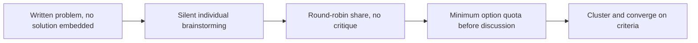

# Creative and Lateral Thinking — Senior

**Your question:** How do I facilitate group ideation that doesn't collapse into the first idea anyone said out loud?

Alone, you can enforce your own discipline of diverging before converging. In a group, that discipline breaks down for a predictable reason: the first idea spoken anchors everyone who speaks after it. People react to it, refine it, or defer to whoever said it — especially if that person is senior or was asked first. The room converges in minutes, and everyone leaves believing they "brainstormed," when what actually happened was one idea getting lightly stress-tested. Senior-level creative thinking is facilitation: designing the *process* of a group session so the loudest or earliest voice doesn't quietly become the only voice.

## The method: Facilitate silent divergence before any discussion

1. **Frame the problem in writing, without a solution embedded in it.** "How do we improve search relevance?" not "should we retrain the ranking model?" — the second framing has already picked a category of answer before the room even opens its mouth.
2. **Silent, individual brainstorming first.** Everyone writes their own options for 5–10 minutes before anyone speaks. This is the single highest-leverage move against anchoring — no one has heard anyone else's idea yet, so there's nothing to anchor to.
3. **Round-robin share, no critique.** Go around the room; each person reads one idea at a time, no discussion, until everyone has shared everything. Capture every idea visibly (shared doc, whiteboard, sticky notes) — visibility matters as much as the ideas themselves, because it lets quieter voices see their idea recorded next to a senior person's.
4. **Enforce a minimum quota before convergence is allowed.** "We need at least 10 options on the board before anyone argues for one" gives people permission to keep contributing past the first plausible answer.
5. **Cluster and dedupe, then converge with named criteria** — same discipline as junior and middle level, now applied to a shared list instead of a personal one.

## Lateral techniques for a genuinely stuck design

Sometimes divergence stalls even with a good process — the group circles the same two or three options. Three techniques reliably produce new material:

| Technique | How it works | When to use it |
|---|---|---|
| **Random stimulus** | Introduce an unrelated object, word, or system and force a connection ("how would a spreadsheet solve this?", "how would a vending machine solve this?") | The group keeps regenerating the same options in different words |
| **Provocation** | Ask a deliberately extreme question — "what if we had infinite budget?" or "what if we had zero budget and one week?" — then walk the answer back to something feasible | The room is anchored on "the way we always build things here" |
| **Reversal** | Invert the goal — "how would we make search relevance actively worse?" — then flip each answer into a design principle | The team can't articulate what "good" looks like but can easily list what breaks it |

### Worked scenario: a stuck search-relevance review

A team has been stuck for two review cycles on declining search relevance (click-through on top-3 results down from 34% to 27% over a quarter). In the first cycle, the most senior engineer opened with "we should retrain the ranking model with more recent click data" — and every subsequent conversation was about how to schedule and validate a retrain. No one seriously proposed anything else; the option was never wrong, but it was never actually *chosen* either, because nothing else was ever really on the table.

The facilitator restarts the session using silent brainstorming. Twelve options surface, including several nobody had said out loud before: query auto-correction is silently disabled for a subset of misspelled brand names; the top-3 slots are being pushed down by a promoted-listings change shipped six weeks ago (timing lines up with the drop); result snippets stopped highlighting matched terms after a template refactor, which may be hurting perceived relevance even when ranking is fine.

Provocation — "what if we had zero ML budget for this quarter" — pushes the group past "retrain the model" entirely and surfaces two heuristic fixes: re-enable the auto-correction that was silently disabled, and audit whether the promoted-listings change is the real cause. Both ship in three days; the model retrain, still a valid option, becomes a longer-running parallel track instead of the only track. Click-through recovers to 33% before the retrain even finishes — the actual cause was never the model.

The facilitator also runs reversal on the same list, as a check rather than a first move: "how would we make relevance actively worse, on purpose?" The group produces answers quickly — silently disable query correction, quietly change what counts as a 'top' result without telling anyone, refactor a shared template without re-checking every page that uses it. Read back, two of those three had *already happened* in the prior six weeks, just not on purpose. Reversal here doesn't generate a new fix; it confirms the team already had the right root causes on the board, which raises confidence in shipping the auto-correction and promoted-listings fixes without waiting for the retrain's shadow-evaluation results.

## Avoiding groupthink and anchoring

- **Anchoring signal:** the group's discussion converges within the first five minutes onto refining one idea. If that happens, the problem wasn't hard — the room just never diverged.
- **Groupthink signal:** disagreement stops being voiced even though people privately have doubts (visible in body language, or in side conversations after the meeting that never happened in the room). Silent writing before speaking directly counters this — people commit their real opinion to paper before social pressure has a chance to shape it.
- **Seniority-anchoring signal:** the most junior or newest person in the room never has an idea recorded before the most senior person speaks. Fix the *ordering* of the process (silent-first, or reverse-seniority round-robin), not just the encouragement to "speak up."
- **Practical countermeasure:** rotate who frames the problem statement and who facilitates. A facilitator who is also the most invested stakeholder in one particular answer cannot run an unbiased process, no matter how well-intentioned.

## Balancing exploration against delivery pressure

Facilitating good divergence doesn't mean diverging forever. Senior judgment is knowing when to stop:

- **Time-box explicitly and say so out loud.** "We diverge for 20 minutes, then we converge — no extensions" prevents both premature convergence and endless exploration.
- **Decide based on what a diverge cycle would actually retire.** If the team already has high confidence in the cause and low uncertainty about the fix, more divergence is theater — commit and ship. If uncertainty about the cause is still high (as in the search example above), divergence is worth the delay.
- **Weigh cost of delay against blast radius.** A reversible, low-blast-radius change (a config flag) doesn't need the same divergence investment as an irreversible one (a schema migration, a public API contract).

### Maintain a small option portfolio instead of picking exactly one

A stuck decision rarely needs a single winner chosen on the spot — it needs a portfolio, sized by how much each option costs and how much uncertainty it retires. For the search-relevance example, the portfolio the team actually ran:

| Option | Category | Blast radius | Budget | Success evidence | Stop condition |
|---|---|---|---|---|---|
| Re-enable auto-correction | Safe increment | Low — config-level revert | Half a day | Click-through on misspelled queries returns to baseline within 48 hours | N/A — already known-good, just re-enabling |
| Audit promoted-listings placement | Bounded experiment | Low — read-only analysis first, then a config change if confirmed | 3 days | Correlation between the promoted-listings rollout date and the CTR drop is confirmed or ruled out | Kill if no correlation found after the audit; don't guess further |
| Retrain ranking model | High-upside bet | Medium — shadow-tested before going live | 2 weeks, capped | CTR on top-3 improves by at least 2 points in shadow evaluation vs. current model | Kill if shadow evaluation shows no improvement after 2 weeks; don't extend without new evidence |

Running these three in parallel, instead of sequentially picking one and waiting to see if it worked, is what let the team recover most of the lost click-through in days instead of waiting weeks for a model retrain that turned out not to be the actual cause.

### Expose weak assumptions before committing

Before locking in on an option — even a well-scored one — ask the group directly:

- "What would have to be true about the world for this option to fail even though it looked good on paper?" If nobody can answer, the option hasn't really been stress-tested, just liked.
- "What evidence, if we saw it tomorrow, would make us regret choosing this?" Naming that evidence in advance means you'll actually notice it if it shows up, instead of rationalizing it away.
- "Whose preference is this, and whose evidence is this?" It's fine to move forward on preference for a low-blast-radius option. It is not fine to present preference as if it were evidence when the blast radius is high.

## Common mistakes at senior level

| Mistake | Why it hurts | Fix |
|---|---|---|
| Opening a group session by stating your own idea first | Anchors the entire room before divergence has a chance to happen | Frame the problem in writing without a solution; share your own idea last, after everyone else's |
| Letting the most senior voice speak before others have committed ideas to paper | Junior and quieter contributors defer instead of contributing | Silent individual brainstorming before any discussion, every time |
| Facilitating and advocating for the same option in the same session | Nobody can trust the process is neutral | Rotate facilitation away from the most invested stakeholder |
| Diverging with no time-box | Exploration becomes stalling; delivery pressure builds resentment against creative work generally | State the time-box out loud before starting, and hold it |
| Treating every stuck decision as a facilitation problem when the real issue is missing data | Wastes a session generating opinions when what's needed is an experiment | Ask first: do we lack ideas, or do we lack evidence? Use [Scientific and Hypothesis-Driven Thinking](../09-scientific-and-hypothesis-driven/README.md) if it's the latter |

## Hands-on exercise

Take a design decision at work that has stalled — a review that keeps re-litigating the same one or two options.

1. Rewrite the problem statement so it names the outcome, with no solution embedded.
2. Run (or simulate) silent individual brainstorming for 10 minutes before any discussion — actually write your own ideas down without looking at anyone else's first.
3. If the list stalls under eight options, apply one lateral technique (random stimulus, provocation, or reversal) and see what it adds.
4. Identify which option in your list was the "anchor" — the one that would have been chosen if the group had jumped straight to discussion. Compare it against what the fuller list produced.
5. Decide, explicitly: is this decision reversible and low-blast-radius enough to commit now, or does it need a bounded experiment first?
6. Write the time-box you'd hold the next real session to, and one sentence on how you'd stop yourself from exceeding it.

## Verify your thinking

- [ ] Did you write the problem statement without a solution embedded in it?
- [ ] Did every participant commit ideas privately before anyone spoke?
- [ ] Can you name which idea would have anchored the discussion if you'd skipped silent brainstorming?
- [ ] Did you use a lateral technique (random stimulus, provocation, reversal) only when divergence had genuinely stalled, not by default?
- [ ] Can you explain, with a reason tied to reversibility or blast radius, why you stopped diverging when you did?

Continue to [`professional.md`](professional.md).
