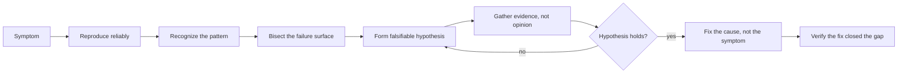

# Debug-Thinking

> Turn "it's broken" into a falsifiable hypothesis, a reproducible trigger, and a fix you can prove closed the gap between expected and actual behavior.

Debug-Thinking is the mental model for finding out *why* — the reasoning process a developer runs whether they have a full observability stack or just a print statement and a debugger. It is deliberately separate from [SRE & Reliability](../../on-production/sre-reliability/README.md), which covers the tooling (logs, metrics, traces, crash reports) and organizational practice (postmortems, error budgets) built on top of this reasoning.

| Level | Guide | You are done when |
|---|---|---|
| Junior | [Diagnose one bug](junior.md) | You can reproduce a failure reliably, form one falsifiable hypothesis, and verify the fix closed the actual gap. |
| Middle | [Correlate signals across boundaries](middle.md) | You can prioritize competing hypotheses and bisect a failure across a call chain or commit history. |
| Senior | [Diagnose emergent and intermittent failure](senior.md) | You can separate correlation from causation under partial information and lead a live incident's technical diagnosis. |
| Professional | [Build organizational debugging capability](professional.md) | You can spread the skill so no team depends on one debugging expert, and design systems that stay debuggable as they grow. |

## Practice rule

State what you expected, what actually happened, and one falsifiable hypothesis before you touch a debugger. If you can't state a way the hypothesis could be wrong, you have a guess, not a hypothesis.

## Related

- [Problem-Solving](../02-problem-solving/README.md) — the general frame→plan→execute→reflect loop this topic specializes for the specific case of "something that used to work is now broken."
- [Critical Thinking](../04-critical-thinking/README.md) — separating claims from evidence and catching cognitive biases, which debugging leans on constantly.
- [SRE & Reliability](../../on-production/sre-reliability/README.md) — the tooling (logs, metrics, traces) and operational practice (postmortems, error budgets) that debug-thinking is applied through in production.
