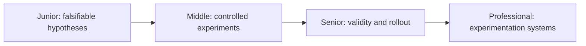
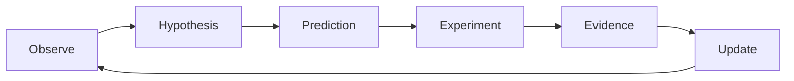

# Scientific and Hypothesis-Driven Thinking

> Turn uncertainty into a claim that evidence can disprove, then design the cheapest trustworthy test.

This combines falsifiability, experiments and A/B tests, measure-before-optimize, and spikes/prototypes.

| Level | Guide | You are done when |
|---|---|---|
| Junior | [Write a falsifiable claim](junior.md) | You can predict evidence before changing code. |
| Middle | [Design a useful experiment](middle.md) | You can control variables and interpret measurements. |
| Senior | [Protect validity and rollout](senior.md) | You can handle confounding, guardrails, and production risk. |
| Professional | [Build experimentation capability](professional.md) | You can govern causal evidence, platforms, and organizational learning. |

## Practice rule

Write the hypothesis, prediction, measurement, and decision rule before running the experiment.

## Related

- [Problem-Solving](../02-problem-solving/README.md)
- [Metacognition](../10-metacognition-and-learning/README.md)
