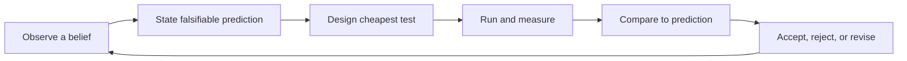

# Scientific and Hypothesis-Driven Thinking

> Turn "this should help" into a falsifiable prediction, the cheapest test that could prove it wrong, and a decision based on what the test actually showed.

The core skills are forming a hypothesis specific enough that evidence could prove it wrong, designing an experiment that isolates one variable against a real baseline, measuring before and after instead of trusting a feeling, using time-boxed spikes to retire a single unknown before committing engineering time, and reading results without fooling yourself — resisting the pull to stop early or see what you expected to see.

| Level | Guide | You are done when |
|---|---|---|
| Junior | [State a falsifiable hypothesis](junior.md) | You can turn a vague belief about a change into a falsifiable prediction and check it with a cheap before/after measurement. |
| Middle | [Design a controlled experiment](middle.md) | You can establish a baseline, isolate one variable, spot confounds, and use a time-boxed spike to retire a specific unknown. |
| Senior | [Run experiments safely in production](senior.md) | You can run an A/B test or staged rollout responsibly, avoid stopping early, and separate correlation from causation in telemetry. |
| Professional | [Build an experimentation culture](professional.md) | You can design a lightweight review process and shared infrastructure so experimentation scales without degrading into noise or gridlock. |

## Practice rule

Before you build anything, write the hypothesis, the specific number or direction that would prove it wrong, and the cheapest measurement that checks it — only then make the change, and only then compare the actual result to what you predicted.

## Related

- [Computational Thinking](../01-computational-thinking/README.md) — decomposing a change into a testable outcome is what makes it possible to state a falsifiable hypothesis about it in the first place.
- [Probabilistic Thinking](../06-probabilistic-thinking/README.md) — expressing a prediction as a range and updating it with evidence is the same discipline applied to belief instead of to a single experiment result.
- [Debug-Thinking](../08-debug-thinking/README.md) — debug-thinking separates correlation from causation to diagnose why a system is *broken*; this topic applies the same rigor to validating whether an intentional *change* actually caused an improvement.
