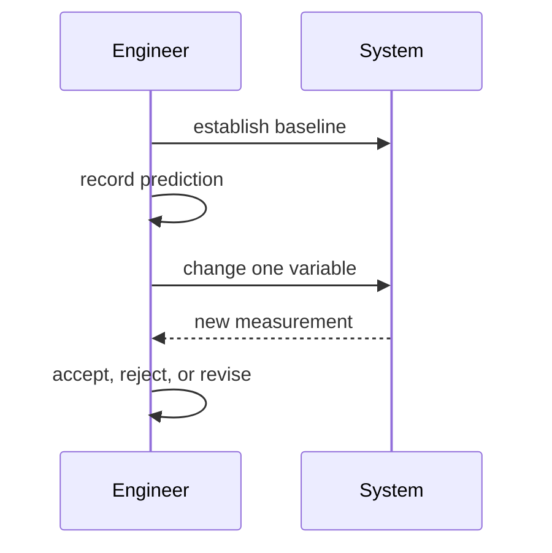

# Scientific Thinking — Junior

“The cache is broken” is not a hypothesis. “Requests miss the cache because the key includes a changing timestamp; removing it will increase hit rate from 5% to above 70%” is falsifiable.

Measure before optimizing. Use a representative input and enough repetitions to separate signal from noise. A spike produces knowledge and may be discarded; a production feature requires maintainability and operations.

## Test yourself

1. Rewrite a vague performance belief as a hypothesis.
2. What baseline is required?
3. Why change one variable?
4. What result would reject the claim?

Continue to [`middle.md`](middle.md).
