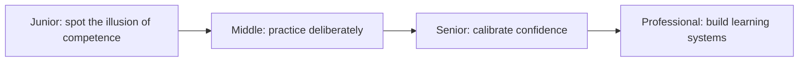
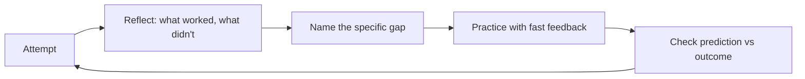

# Metacognition and Learning

> Inspect your own reasoning, practice the specific weakness that's holding you back, and know the edges of what you actually know.

The core skills are self-reflection right after doing real work, telling recognition apart from actual retrieval, choosing learning techniques with evidence behind them over passive review, calibrating your own confidence against your track record, mapping the boundary of your own knowledge before a high-stakes call, and — at professional level — designing mentorship, calibration, and postmortem loops so a team's judgment improves over time, not just one person's. They form one loop: notice a gap between how understood something feels and how well you can actually reproduce or predict it, target that gap with practice that gives fast feedback, and check afterward whether your confidence matched what actually happened.

| Level | Guide | You are done when |
|---|---|---|
| Junior | [Tell familiarity from understanding](junior.md) | You can catch yourself mistaking "I've seen this" for "I could build this," and you reflect on your own work right after finishing it. |
| Middle | [Practice the weak spot, not the whole job](middle.md) | You can name a specific weakness from evidence, pick a learning technique suited to it, and build a feedback loop instead of passively repeating work. |
| Senior | [Know where your confidence is wrong](senior.md) | You can check your own track record for over- or under-confidence and map what you don't know before a high-stakes technical call. |
| Professional | [Build learning into how the team works](professional.md) | You can design mentorship, calibration, and postmortem loops that make the org's judgment measurably better over time, not just your own. |

## Practice rule

After every piece of real work, spend five minutes writing what worked, what took longer than expected and why, and what you'd do differently — then, before you trust any skill you're tempted to call "known," test it by explaining or reproducing it unaided instead of rereading it.

## Related

- [Computational Thinking](../01-computational-thinking/README.md)
- [Debug-Thinking](../08-debug-thinking/README.md) — its professional level covers spreading diagnostic skill across a team; this topic covers building that same kind of learning capability more broadly, across estimation, design judgment, and calibration, not only debugging.
- [Critical Thinking](../04-critical-thinking/README.md)
