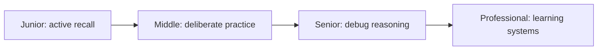
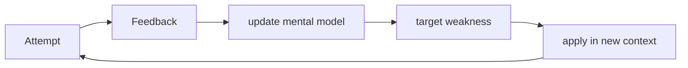

# Metacognition and Learning

> Inspect how you think, practice, and update beliefs so experience turns into reusable skill rather than repeated exposure.

This guide combines learning how to learn, debugging your reasoning, deliberate practice, and knowing the boundary of your knowledge.

| Level | Guide | You are done when |
|---|---|---|
| Junior | [Learn actively](junior.md) | You can retrieve, apply, and verify a concept without copying. |
| Middle | [Practice deliberately](middle.md) | You can isolate weaknesses and build a feedback loop. |
| Senior | [Debug your reasoning](senior.md) | You can expose assumptions, uncertainty, and decision errors. |
| Professional | [Build learning organizations](professional.md) | You can design knowledge flow, expertise, and feedback across teams. |

## Practice rule

Spend less time rereading and more time predicting, retrieving, building, explaining, receiving feedback, and correcting errors.

## Related

- [Scientific Thinking](../09-scientific-and-hypothesis-driven/README.md)
- [Critical Thinking](../04-critical-thinking/README.md)
