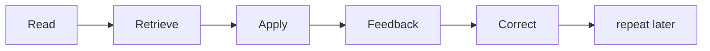

# Metacognition and Learning — Junior

Recognition feels like knowledge but is often familiarity. Close the page and explain the idea, predict an output, or build the smallest example.

Use a simple loop:

1. Choose one observable skill.
2. Predict before running the code.
3. Attempt without copying.
4. Compare with evidence.
5. Explain the error in your own words.
6. Repeat later with a different example.

Keep a learning log with the question, prediction, result, corrected model, and next test. Write “I don’t know yet” when evidence is missing.

## Test yourself

1. How does recognition differ from retrieval?
2. What prediction can you make before running code?
3. Why vary the next example?
4. What belongs in a learning log?

Continue to [`middle.md`](middle.md).
