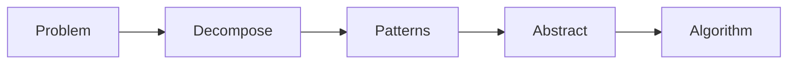

# Computational Thinking — Make It Work

**What it is:** formulating a problem so its solution can be expressed as computational steps — a sequence a person or a computer can actually carry out.

## The mechanism: four moves, in order

- **Decompose** — break the problem into smaller parts that are easier to understand and solve on their own.
  - A bicycle is easier to understand as wheels, chain, frame, brakes than as one whole object. Same with a feature: "user login" is easier as "validate input", "check credentials", "create session", "handle failure".
- **Recognize patterns** — look at the decomposed parts and find what repeats.
  - Every cat has eyes, a tail, fur — the *general* characteristics. One cat has green eyes, another has yellow — the *specifics*. Once you see the pattern (all cats share the same shape of features), you can describe any cat by filling in the specifics.
- **Abstract** — keep the general pattern, discard the specifics you don't need for the problem at hand.
  - To draw a basic cat, you need "has a tail" — you don't need to know if it's long or short. Abstraction is choosing what to ignore, on purpose.
- **Design an algorithm** — turn the abstracted pattern into an ordered, unambiguous set of steps.
  - Tying a shoelace, making tea, packing a bag — all algorithms you already run without thinking. A program needs the same thing written down: a clear start, a clear end, and every step in between.

## Worked example

**Problem:** "Users can upload a profile picture."

- **Decompose:** validate file type, validate file size, resize image, store file, update database, return response.
- **Pattern:** "validate X, reject with a reason if it fails" repeats across type and size checks.
- **Abstract:** the caller only needs `ImageStore.save(bytes) -> url` — not whether storage is S3 or local disk.
- **Algorithm:** 1) validate type → 2) validate size → 3) resize → 4) store → 5) update DB → 6) respond.

## Evaluate before you call it done

A solution built this way should pass four checks:

- **Understood** — is every part decomposed enough that someone else can follow it?
- **Complete** — does it cover every part of the original problem, not just the easy parts?
- **Efficient** — does it use a reasonable amount of time and resources for the actual input size?
- **On-spec** — does it meet the constraints you were actually given, not just "it runs"?

Continue to [Make It Right](make-it-right.md).
