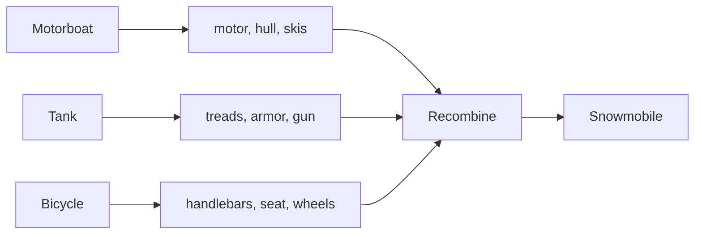

# First-Principles Thinking — Make It Work

**What it is:** a basic truth is a fact that can't be deduced from anything else — Aristotle called it "the first basis from which a thing is known." First-principles thinking means reducing a problem to those truths, then building a solution back up from them, instead of copying the nearest existing solution.

## The mechanism: deconstruct, then reconstruct

- **Deconstruct** — break the thing down into its actual constituent parts, ignoring what it's currently assembled *as*.
- **Reconstruct** — recombine those parts (or cheaper/better substitutes for them) into something new that satisfies the real goal.

Military strategist John Boyd's thought experiment shows the mechanism cleanly. Take three unrelated things:

- A motorboat with a skier behind it → motor, hull, skis
- A military tank → metal treads, armor plates, a gun
- A bicycle → handlebars, wheels, gears, a seat

Deconstructed, these parts have nothing to do with "boats," "tanks," or "bikes" anymore — they're just parts. Recombine them (treads + motor + skis + handlebars + seat) and you get a snowmobile: something none of the three original objects was designed to be.

## Reasoning from first principles vs. reasoning by analogy

- **Analogy:** "we do it this way because that's how it's done elsewhere / how it's always been done here."
- **First principles:** "what do we actually know for certain is true, and what can we build from just that?"

Elon Musk applied this to rocket costs: a finished rocket was quoted at $65M. Instead of accepting that as the price of doing business, he asked what a rocket is actually made of — aerospace-grade aluminum, titanium, copper, carbon fiber — and priced those raw materials on the commodity market. They came to about 2% of the quoted price. That gap is what SpaceX was built to close.

## Optimize the function, not the form

Deconstructing correctly means separating the **function** (what the thing actually needs to do) from the **form** (the shape it currently happens to have). Reconstruction only works if you rebuilt from the function, not from a nicer-looking version of the old form.

## Evaluate before you call it done

- **Reduced** — did you actually reach truths you can't break down further, or did you stop at "common knowledge"?
- **Rebuilt** — did you recombine those truths into an actual solution, or just list facts and stop?
- **Cheaper/better** — does the reconstructed version genuinely beat the thing it replaces, on the goal that mattered?

Continue to [Make It Right](make-it-right.md).
