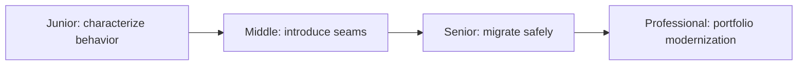
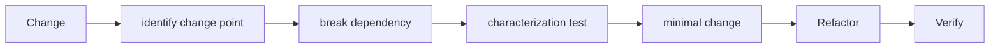

# Legacy Code

> Legacy code is code you cannot change confidently; the first task is to create evidence and seams, not rewrite it.

| Level | Guide | You are done when |
|---|---|---|
| Junior | [Make one safe change](junior.md) | You can capture existing behavior and change it with a focused test. |
| Middle | [Create seams](middle.md) | You can isolate dependencies and improve design incrementally. |
| Senior | [Modernize a system](senior.md) | You can stage migration while preserving compatibility and rollback. |
| Professional | [Govern a legacy portfolio](professional.md) | You can prioritize modernization by risk, economics, and outcomes. |

## Practice rule

Do not “clean up” behavior you do not understand. First capture what the system does, including surprising behavior that callers may depend on.

## Related

- [Technical Debt](../technical-debt/README.md)
- [Anti-Patterns](../anti-patterns/README.md)
