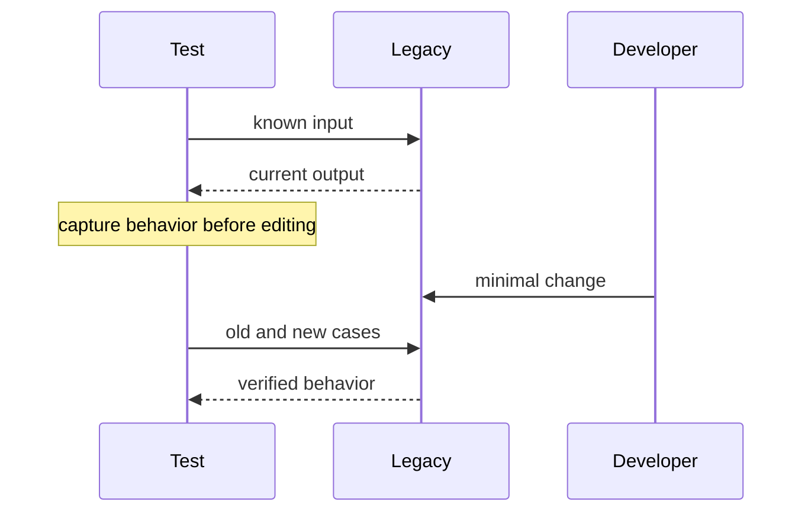

# Legacy Code — Junior

Find the smallest observable behavior around the requested change. Run the existing tests, reproduce the current result, and add a characterization test that records it.

Characterization tests do not declare existing behavior correct. They reveal accidental changes. Keep the production edit narrow and separate naming or extraction steps when possible.

## Test yourself

1. What does a characterization test prove?
2. Which current “bug” might be a caller dependency?
3. Why separate structural and behavioral edits?
4. What is the smallest safe observation point?

Continue to [`middle.md`](middle.md).
