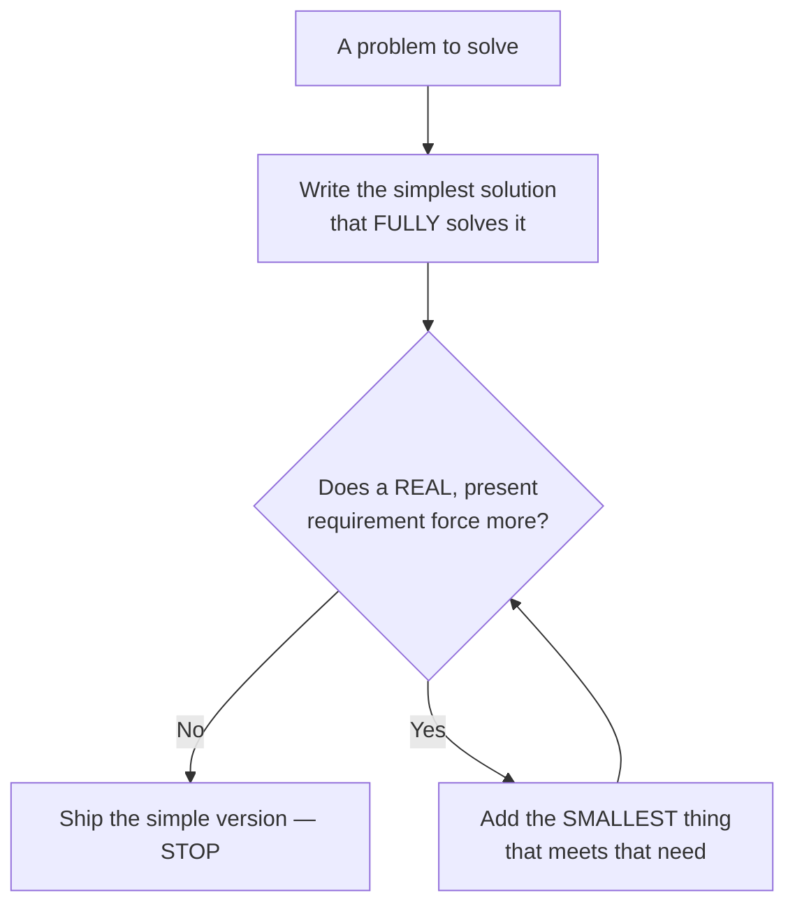
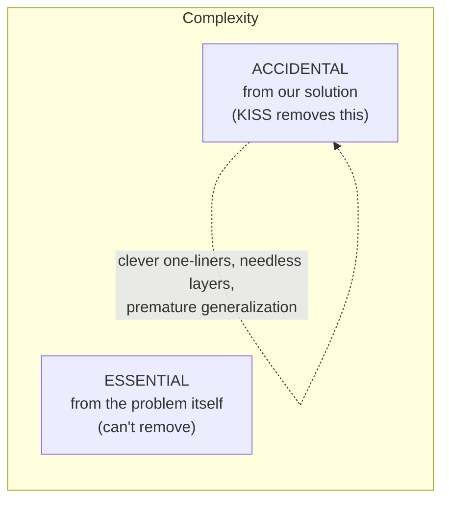

# KISS (Keep It Simple, Stupid) — Junior

> **Category:** [Design Principles](../../README.md) — prefer the simplest solution that fully solves the problem; complexity must earn its place.

---

## Introduction

> Focus: **What is it?** and **How to use it?**

**KISS** stands for **"Keep It Simple, Stupid."** It is a design principle with a blunt message:

> When you have several ways to solve a problem, prefer the **simplest one that still fully solves it.** Any extra complexity must justify itself — if it doesn't, take it out.

That's the whole idea. It is not a recipe ("use these three patterns") and not a metric you can compute. It's a default *bias*: reach for the plain, direct, boring solution first, and only add machinery — a layer, an abstraction, a configuration option, a clever trick — when something real forces you to.

### Why this matters

Most code that's hard to work with is not too *simple* — it's too *complicated*. It has abstractions added "just in case," indirection that hides what's happening, clever one-liners nobody can read, and frameworks built for a scale that never arrived. Every one of those is a cost: more to read, more to test, more to change, and more places a bug can hide.

The expensive resource in software is **human understanding.** A junior often thinks the goal is to make the computer do something impressive. The goal is actually to make the *next human* — usually future-you, six months from now, at 11 p.m., fixing a bug — understand the code instantly. KISS is the habit of optimizing for that human.

The hardest part of KISS to accept early in your career: **simple code can look unimpressive.** A five-line function doesn't show off. But the engineer who writes the boring five lines that everyone understands is doing a *harder* job than the one who writes the clever thirty lines that only they understand — they just made it look easy.

---

## Prerequisites

- **Required:** You can write functions/methods and basic classes, and read code others wrote.
- **Required:** A feel for "this code is confusing" vs. "this code is clear" — KISS sharpens that instinct into a principle.
- **Helpful:** Exposure to **[YAGNI](../02-yagni/junior.md)** ("You Aren't Gonna Need It") — KISS's closest relative; YAGNI stops you from *building* what you don't need, KISS keeps what you do build *simple*.
- **Helpful:** Any experience debugging someone else's over-engineered code — it's the fastest way to *feel* why KISS matters.

---

## Glossary

| Term | Definition |
|------|-----------|
| **KISS** | "Keep It Simple, Stupid" — prefer the simplest solution that fully solves the problem. |
| **Complexity** | How much you must hold in your head to understand or change the code: branches, layers, moving parts, indirection. |
| **Accidental complexity** | Complexity *we* added — not required by the problem, only by our solution. KISS targets this. |
| **Essential complexity** | Complexity that comes from the problem itself; you can't remove it, only manage it. |
| **Over-engineering** | Building more machinery than the problem needs — extra abstractions, layers, configurability, generality. |
| **Premature generalization** | Making code "generic" for cases that don't exist yet, instead of solving the one case you have. |
| **Cyclomatic complexity** | A rough count of the independent paths (branches) through a function — a numeric proxy for "how tangled is this?" |
| **YAGNI** | "You Aren't Gonna Need It" — don't build a capability until a real, present requirement demands it. |

---

## Where the Name Comes From

KISS has a real origin, and it explains the principle better than any definition.

In the 1960s, **Kelly Johnson**, lead engineer at Lockheed's **Skunk Works** (the legendary unit that built the U-2 and SR-71 Blackbird spy planes), gave his designers a rule. The jets had to be **repairable in the field by an average mechanic, with basic tools, under combat pressure** — not by a specialist in a clean hangar with exotic equipment. So the design had to be simple enough that an ordinary person could fix it where it sat.

That constraint became **"Keep It Simple, Stupid."**

### The part everyone gets wrong

The "Stupid" is **not** an insult to the engineer. It does **not** mean "keep it simple because you're stupid." It describes the **desired property of the result**: the design should be so simple that it works even under stupid-proof, low-resource conditions — an average mechanic, basic tools, a muddy field.

> "Stupid" describes how simple the *outcome* should be — not how dumb the *designer* is. (Many people even render it "Keep It Simple and Straightforward" to dodge the misreading.)

The software lesson is exact: your code should be repairable by an "average mechanic" — a teammate of ordinary skill, with ordinary tools, under deadline pressure, who didn't write it and doesn't have you on hand to explain it. If only *you* (the original genius) can fix it, the design has failed Kelly Johnson's test.

---

## What KISS Actually Says

KISS is a *preference under a tie-or-better*: among solutions that **all fully solve the problem**, choose the simplest. Two halves matter equally:

1. **"Fully solves the problem."** Simplicity never means dropping a required behavior. A solution that's shorter because it ignores a real case isn't simpler — it's *wrong*. (More in [Simple Is Not Simplistic](#simple-is-not-simplistic).)
2. **"The simplest such solution."** Of the correct options, pick the one with the fewest moving parts, the least indirection, the most obvious flow.

A useful sharpening: **complexity must earn its place.** Every abstraction, layer, parameter, and clever trick is a *withdrawal* from the reader's attention budget. KISS makes the default answer to "should I add this?" be **no, unless it pays for itself** — solving a real, present problem that the simple version can't.

### Simple ≠ short

Simple does **not** mean *fewest characters*. A dense one-liner that you have to decode is **less** simple than three plain lines that read top to bottom. KISS minimizes **things-to-understand**, not keystrokes. A clear ten-line function beats a cryptic three-line one.

---

## How Complexity Sneaks In

KISS is mostly about recognizing the specific shapes accidental complexity takes, so you can resist them:

| Shape | What it looks like | The simple alternative |
|---|---|---|
| **Clever one-liner** | A nested ternary / chained stream that needs decoding | Plain `if`s or a named intermediate variable |
| **Needless abstraction layer** | A wrapper class that only forwards calls | Call the thing directly |
| **Premature generalization** | A generic `process(type, data)` for the one case you have | The one specific function you actually need |
| **Over-built framework** | A plugin/config system for three hard-coded rules | Three plain functions |
| **Speculative flexibility** | An interface with one implementation, "for later" | The concrete type; add the interface when a 2nd appears |
| **Deep nesting** | `if` inside `if` inside `for` inside `try` | Early returns; extract a named helper |

### Proxies you can actually see

You can't measure "simplicity" directly, but a few rough numbers correlate with it. Treat them as smoke detectors, not laws:

- **Cyclomatic complexity** — the number of independent paths (roughly, branches + 1) through a function. A function with 15 branches is hard to test and follow.
- **Nesting depth** — how many levels of `if`/`for`/`try` are stacked. Past ~3, comprehension falls off a cliff.
- **Number of moving parts** — classes, methods, parameters, and indirections involved in one feature. If a "send an email" feature touches eight classes, ask why.

When one of these spikes, it's a signal to stop and ask: *is this complexity essential to the problem, or did I add it?*

---

## Real-World Analogies

| Concept | Analogy |
|---|---|
| **Field-repairable design (the origin)** | A tool you can fix with a Swiss Army knife in a field beats one that needs the manufacturer's lab. |
| **Simple beats clever** | A light switch on the wall vs. an app, an account, and a Wi-Fi handshake to turn on a lamp. The switch wins. |
| **Over-engineering** | Buying a 12-blade food processor to slice one apple. More machine than the job needs. |
| **Premature generalization** | Building a six-lane highway to a village of ten people because it "might grow." |
| **Accidental vs. essential complexity** | Brain surgery is *essentially* hard (the problem is hard). A confusing tax form is *accidentally* hard (the form is badly designed). KISS attacks the bad form, not the brain surgery. |
| **Simple ≠ simplistic** | A paper airplane is simple *and* simplistic — it can't carry passengers. A well-designed small plane is simple but still does the job. |

---

## Mental Models

**The intuition:** *"What's the most boring, direct thing that would actually work here? Start there. Add cleverness only when boredom fails."*

```
   Problem
      │
      ▼
  ┌─────────────────────────────┐
  │ Simplest solution that      │  ← start here, ALWAYS
  │ FULLY solves the problem    │
  └─────────────────────────────┘
      │
      ▼  does a REAL, present need force more?
   ┌──────┐        ┌──────────────────────────┐
   │  No  │──────▶ │ Stop. Ship the simple one │
   └──────┘        └──────────────────────────┘
   ┌──────┐        ┌──────────────────────────┐
   │  Yes │──────▶ │ Add the SMALLEST thing    │
   └──────┘        │ that meets that need      │
                   └──────────────────────────┘
```

A second model — **complexity has a budget.** Every abstraction, layer, and trick *spends* from the reader's limited attention. KISS asks: *is this purchase worth it?* Most of the time the honest answer is no, and the simple version is the better buy.

A third model — **the average mechanic test** (straight from Kelly Johnson): *Could a competent teammate who didn't write this, working under deadline, understand and fix it without me?* If not, simplify until they can.

---

## A Worked Example: From Clever to Simple

We want a function that returns a price after applying a discount, where the discount depends on a customer tier.

### Attempt 1: the "impressive" version

A junior eager to look senior might write:

```python
class DiscountStrategy(ABC):
    @abstractmethod
    def rate(self) -> float: ...

class StandardDiscount(DiscountStrategy):
    def rate(self): return 0.0
class SilverDiscount(DiscountStrategy):
    def rate(self): return 0.05
class GoldDiscount(DiscountStrategy):
    def rate(self): return 0.10

class DiscountFactory:
    _registry = {"standard": StandardDiscount, "silver": SilverDiscount, "gold": GoldDiscount}
    def create(self, tier): return self._registry[tier]()

def final_price(price, tier):
    return price * (1 - DiscountFactory().create(tier).rate())
```

This has a Strategy pattern, an abstract base class, three subclasses, and a Factory — for what is, in the end, **a lookup of three numbers.** To change a rate, you hunt down a class. To understand `final_price`, you trace through a factory into a registry into a class hierarchy. Eight moving parts for a one-line job.

### Attempt 2: the KISS version

```python
DISCOUNT_RATES = {"standard": 0.0, "silver": 0.05, "gold": 0.10}

def final_price(price, tier):
    rate = DISCOUNT_RATES.get(tier, 0.0)
    return price * (1 - rate)
```

One dictionary, one function. To change a rate, edit the table. To understand it, read two lines. It does *exactly* what the first version did, with **two moving parts instead of eight.**

### Why the simple version is the *better* engineering

It's tempting to think the first version is "more flexible." But flexibility you don't use is pure cost:

- The first version is harder to read, harder to change, and harder to test (you must construct strategies and factories).
- If a real new requirement arrives — say, time-limited promo codes — *neither* version is ready for it; you'll redesign anyway. So the elaborate structure bought you nothing.
- When you genuinely need polymorphism (real, differing *behavior* per tier — not just a number), you can introduce it *then*, shaped by the actual requirement instead of a guess.

This is KISS in one example: **the simplest thing that fully works is usually the right thing**, and the elaborate version was solving a problem (open-ended discount behaviors) that nobody had.

---

## Code Examples

### Java — kill the clever one-liner

```java
// Clever, but you have to decode it
boolean ok = u != null && u.getRoles() != null
    && u.getRoles().stream().anyMatch(r -> r.getName() != null
        && r.getName().equalsIgnoreCase("admin"));

// KISS: a named helper that reads like a sentence
boolean ok = isAdmin(u);

boolean isAdmin(User u) {
    if (u == null || u.getRoles() == null) return false;
    return u.getRoles().stream().anyMatch(Role::isAdmin);
}
```

The one-liner isn't *wrong* — it's *opaque*. The KISS version has more lines but a fraction of the reading cost, and the intent (`isAdmin`) is now obvious at the call site.

### Python — early returns flatten the pyramid

```python
# Deeply nested — comprehension falls off a cliff
def can_checkout(cart, user):
    if user is not None:
        if user.is_active:
            if cart.items:
                if cart.total <= user.credit_limit:
                    return True
    return False

# KISS: guard clauses, one level deep, reads top to bottom
def can_checkout(cart, user):
    if user is None or not user.is_active:
        return False
    if not cart.items:
        return False
    return cart.total <= user.credit_limit
```

Same behavior; the nesting (a complexity proxy) drops from four levels to one. Each condition now stands alone and is easy to test.

### TypeScript — don't generalize what isn't general yet

```typescript
// Premature generalization: a "configurable" engine for ONE shape of data
function transform<T>(items: T[], opts: {
  map?: (x: T) => unknown; filter?: (x: T) => boolean;
  sort?: (a: T, b: T) => number; limit?: number;
}): unknown[] { /* ...lots of optional branches... */ }

// KISS: the one thing the caller actually needed
function topThreeActiveNames(users: User[]): string[] {
  return users.filter(u => u.active).map(u => u.name).slice(0, 3);
}
```

The generic `transform` handles infinite imagined cases and is harder to read for *every* call. The specific function solves the real one in a line you can't misread. If a second, genuinely different use shows up, write a second specific function — or generalize *then*, when you can see both.

---

## Simple Is Not Simplistic

This is the distinction that separates KISS from laziness.

- **Simple** = the fewest moving parts that **still fully solve the problem.**
- **Simplistic** = oversimplified to the point of being **wrong** — it's shorter because it *ignores a real case.*

KISS never licenses dropping a required behavior. A concrete pair:

```python
# SIMPLISTIC (broken): "simple" because it ignores empty input and even-length lists
def median(nums):
    return sorted(nums)[len(nums) // 2]   # crashes on [], wrong for even counts

# SIMPLE (correct AND minimal): handles the real cases, no extra machinery
def median(nums):
    if not nums:
        raise ValueError("median of empty sequence is undefined")
    ordered = sorted(nums)
    mid = len(ordered) // 2
    if len(ordered) % 2 == 1:
        return ordered[mid]
    return (ordered[mid - 1] + ordered[mid]) / 2
```

The first is *not* "more KISS" — it fails on inputs the problem includes. The second is the real KISS solution: it's the **smallest correct** thing, not the *shortest* thing. Simplicity removes the **needless**, never the **necessary**.

> KISS = "the smallest solution that is still *correct*." If shrinking it breaks a real case, you've gone from simple to simplistic — and that's a bug, not a virtue.

---

## Best Practices

1. **Start with the most boring solution that fully works.** Reach for cleverness only after the boring version proves insufficient.
2. **Optimize for the reader, not the writer.** Code is read far more than it's written; favor obvious over impressive.
3. **Prefer named helpers over clever expressions.** `isAdmin(u)` beats a five-clause boolean, even if it's more lines.
4. **Flatten nesting** with guard clauses / early returns; keep functions shallow.
5. **Don't generalize on the first case.** Solve the specific problem; generalize when you've seen the pattern for real (the *rule of three*).
6. **Make complexity justify itself.** Before adding a layer/abstraction/option, name the present requirement that forces it. No requirement → don't add it (that's [YAGNI](../02-yagni/junior.md)).
7. **Apply the average-mechanic test:** could a teammate fix this without you? If not, simplify.

---

## Common Mistakes

1. **Confusing "simple" with "short."** Cramming logic into a dense one-liner reduces clarity. Fewer concepts, not fewer characters.
2. **Equating complexity with skill.** Adding patterns to "look senior." The senior move is usually *removing* an abstraction.
3. **Premature generalization.** Building a generic engine for the one concrete case you have. Solve the case you have.
4. **Speculative flexibility.** Interfaces with one implementation, config nobody sets, hooks nobody calls — all "for later." (See [YAGNI](../02-yagni/junior.md).)
5. **Going simplistic.** Dropping a required edge case to make the code shorter — that's a bug, not simplicity.
6. **Cleverness for its own sake.** Bit-twiddling or one-liners where a plain loop would read better and run just as fast.

---

## Tricky Points

- **Simple ≠ easy (preview).** *Simple* is a property of the design (few, untangled parts); *easy* is about what's familiar or quick to type. Writing simple code is often *hard* — it takes more thought to find the small clean solution than to bolt on another `if`. This distinction (Rich Hickey's *Simple Made Easy*) is developed at [Senior](senior.md).
- **KISS targets *accidental* complexity, not essential.** Some problems are genuinely hard (concurrency, distributed consensus, tax law). KISS doesn't promise to make those trivial — it promises not to make them *worse* with avoidable mess. (Fred Brooks' distinction; see [Middle](middle.md).)
- **A little duplication can be simpler than the wrong abstraction.** Removing every repeat sometimes *adds* a confusing shared helper. Two clear copies can be simpler than one tangled abstraction — a tension with [DRY](../07-dry/junior.md) explored at [Senior](senior.md).
- **KISS is a default, not a dogma.** It can be misused to reject *necessary* complexity ("that's over-engineering!"). The skill is telling essential from accidental — covered at [Senior](senior.md).

---

## Test Yourself

1. What does KISS stand for, and where did the name come from?
2. What does the "Stupid" in KISS actually describe — and what does it *not* mean?
3. Is "simple" the same as "short"? Explain.
4. What's the difference between *simple* and *simplistic*? Give an example.
5. Name three shapes that accidental complexity commonly takes.
6. What's the "average mechanic" test, and how do you apply it to code?

---

## Cheat Sheet

```text
KISS = "Keep It Simple, Stupid"
  Among solutions that FULLY solve the problem, pick the SIMPLEST.
  Complexity must EARN its place — no requirement, no complexity.

ORIGIN
  Kelly Johnson, Lockheed Skunk Works. "Stupid" = how simple the
  RESULT must be (field-repairable by an average mechanic), NOT the engineer.

SIMPLE IS NOT...
  ...short      → fewest CONCEPTS, not fewest characters
  ...simplistic → never drop a REQUIRED case to shorten code (that's a bug)
  ...easy       → simple is often HARD to find (see Senior)

WATCH FOR (accidental complexity)
  clever one-liners · needless layers · premature generalization
  over-built frameworks · one-impl interfaces · deep nesting

PROXIES (smoke detectors)
  cyclomatic complexity · nesting depth · moving-parts-per-feature

THE TEST
  Could an average teammate fix this without me, under deadline?
```

---

## Summary

- **KISS** = "Keep It Simple, Stupid" — among solutions that **fully** solve the problem, prefer the **simplest**; complexity must earn its place.
- **Origin:** Kelly Johnson, Lockheed Skunk Works — designs had to be **field-repairable by an average mechanic**. "Stupid" describes the desired simplicity of the *result*, not the engineer.
- **Simple ≠ short** (fewest concepts, not characters) and **simple ≠ simplistic** (never drop a required case to shorten code).
- Accidental complexity sneaks in as **clever one-liners, needless layers, premature generalization, and speculative flexibility**; cyclomatic complexity, nesting depth, and moving-part count are visible proxies.
- The practical test: **could an average teammate fix it without you?** If not, simplify.

---

## Further Reading

- Kelly Johnson & Maggie Smith, *Kelly: More Than My Share of It All* — the Skunk Works and the origin of the rule.
- Fred Brooks, *No Silver Bullet* — essential vs. accidental complexity (the theory KISS targets).
- Rich Hickey, *Simple Made Easy* (talk) — "simple ≠ easy" (developed at [Senior](senior.md)).
- John Ousterhout, *A Philosophy of Software Design* — complexity as the enemy; depth vs. shallowness.
- **Closest relative:** [YAGNI](../02-yagni/junior.md) — don't build what you don't need.

---

## Related Topics

- **Closest principle:** [YAGNI](../02-yagni/junior.md) — KISS keeps it simple; YAGNI stops you building it at all.
- **Related:** [Avoid Premature Optimization](../05-avoid-premature-optimization/junior.md), [Optimize for Deletion](../06-optimize-for-deletion/junior.md), [DRY](../07-dry/junior.md).
- **Practice that produces simplicity:** [Simple Design](../../../craftsmanship-disciplines/04-simple-design/junior.md).

---

## Diagrams






---

## Check your understanding

1. Explain KISS (Keep It Simple, Stupid) — Junior Level in your own words and name the problem it solves.
2. How would you apply the ideas around Table of Contents, Introduction, Prerequisites in a realistic engineering change?
3. What failure mode or misuse should you look for, and what evidence would reveal it?
4. What small example would prove that you can apply KISS (Keep It Simple, Stupid) — Junior Level correctly?
5. What observable result would convince you that the approach improved the system?
