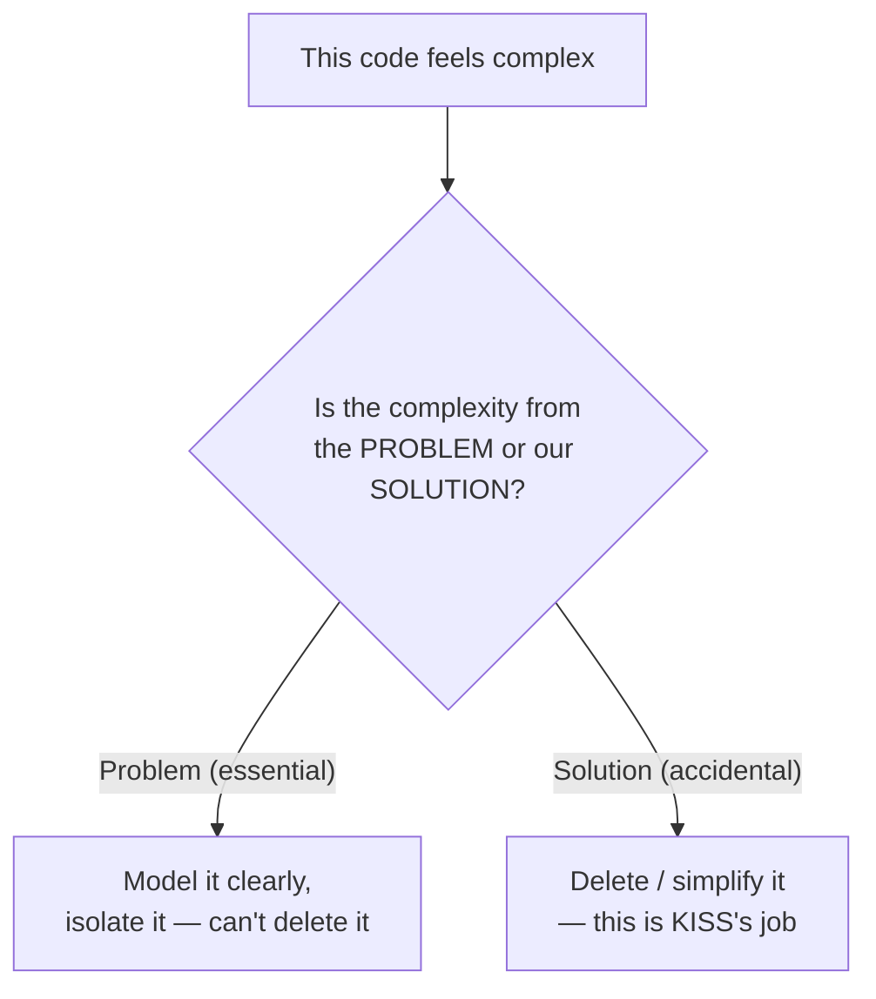
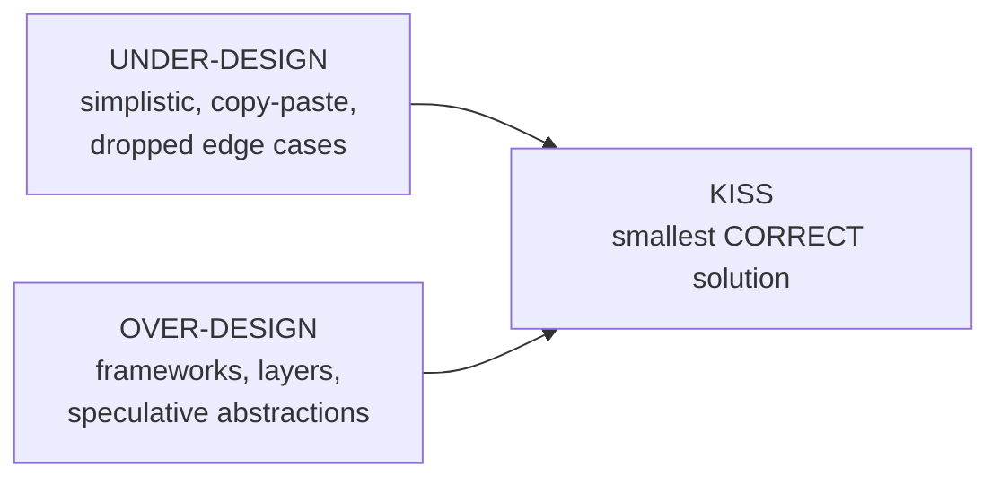
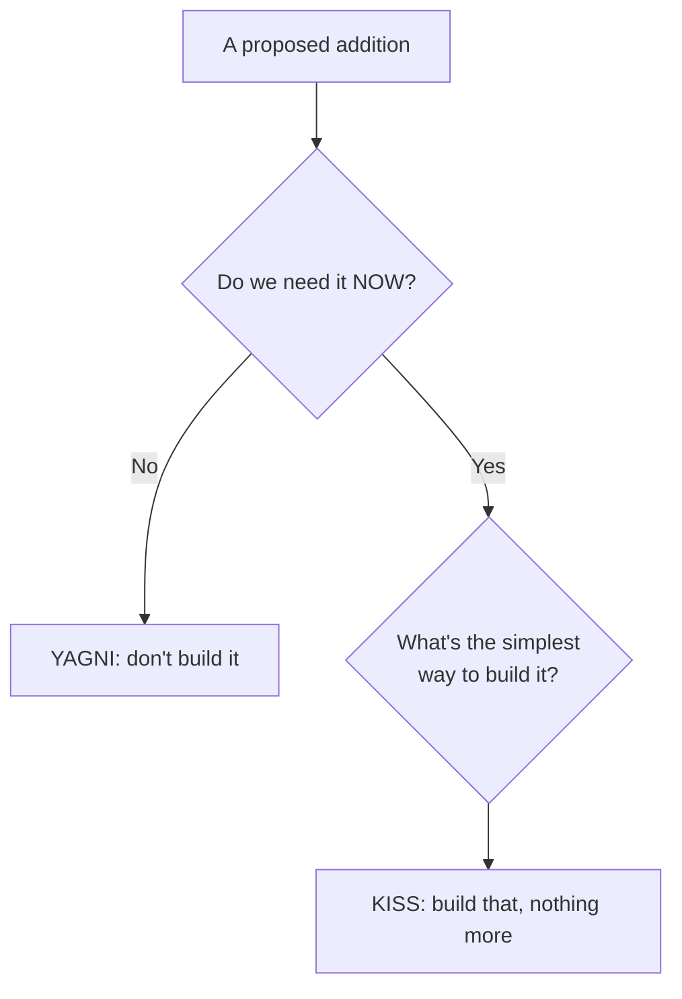

# KISS (Keep It Simple, Stupid) — Middle

> **Category:** [Design Principles](../../README.md) — prefer the simplest solution that fully solves the problem; complexity must earn its place.

> **Prerequisite:** [Junior](junior.md)
> **Focus:** **Why** and **When**

---

## Table of Contents

1. [Introduction](#introduction)
2. [Essential vs. Accidental Complexity](#essential-vs-accidental-complexity)
3. [Applying KISS to Real Code](#applying-kiss-to-real-code)
4. [KISS and YAGNI: Two Sides of One Coin](#kiss-and-yagni-two-sides-of-one-coin)
5. [The Tension with DRY and Abstraction](#the-tension-with-dry-and-abstraction)
6. [Measuring Complexity in Practice](#measuring-complexity-in-practice)
7. [Trade-offs](#trade-offs)
8. [Edge Cases](#edge-cases)
9. [Tricky Points](#tricky-points)
10. [Best Practices](#best-practices)
11. [Test Yourself](#test-yourself)
12. [Summary](#summary)
13. [Diagrams](#diagrams)

---

## Introduction

> Focus: **Why** and **When**

At the junior level, KISS is a slogan you nod at: *prefer the simple thing.* At the middle level it becomes a stream of **judgement calls** you make all day: *Is this abstraction earning its keep, or did I add it out of habit? Is the duplication I'm about to remove worth the shared helper it creates? Is this complexity coming from the problem, or from me?*

The recurring tension is between **two failure modes**:

- **Under-design** — the simplistic ball of copy-paste, magic numbers, and dropped edge cases. Too simple to be correct or maintainable.
- **Over-design** — the gold-plated tangle of layers, options, and speculative abstractions. Too complex for the problem.

Most engineers are trained to fear under-design and so they over-correct into over-design, which the industry *rewards* because it looks sophisticated. KISS's real contribution at this level is to make over-design **visibly suspect**: every element you add must answer "what present requirement forces you?" The middle skill is calibrating between the two extremes — and the single sharpest tool for that calibration is learning to separate **essential** from **accidental** complexity.

---

## Essential vs. Accidental Complexity

This is the theoretical backbone of KISS, from Fred Brooks' 1986 essay **"No Silver Bullet."** Brooks split the difficulty of building software into two kinds:

> - **Essential complexity** — inherent in the *problem itself.* A tax engine is complicated because tax law is complicated. A flight scheduler is complicated because the constraints are real. You cannot remove this; you can only *manage* it.
> - **Accidental complexity** — introduced by our *tools, choices, and solutions*, not by the problem. A confusing build system, a needless inheritance hierarchy, a hand-rolled framework — none of it required by the problem.

**KISS targets accidental complexity.** It does *not* promise to make hard problems easy — it promises not to pile avoidable mess on top of them.

| | Essential | Accidental |
|---|---|---|
| Source | The problem domain | Our solution |
| Can we remove it? | No — only manage/contain it | **Yes — and KISS says we must** |
| Example | "Payments must be idempotent and auditable" | "We wrapped payments in three layers of generic handlers" |
| Right response | Model it clearly; isolate it | Delete it |

The middle-level skill — and the one juniors most often lack — is **telling the two apart.** When someone says "this code is complex," the first question is always: *is the complexity essential (the problem is hard) or accidental (we made it hard)?* Only the accidental kind is KISS's business. Attacking essential complexity ("just simplify the tax rules!") is how you get a *simplistic*, broken system.



---

## Applying KISS to Real Code

Consider a real request: *"Validate a signup form (email present and well-formed, password ≥ 8 chars)."* A working, KISS solution:

```python
def validate_signup(email: str, password: str) -> list[str]:
    errors = []
    if not email or "@" not in email:
        errors.append("Email is invalid.")
    if len(password) < 8:
        errors.append("Password must be at least 8 characters.")
    return errors
```

Direct, testable, reads top to bottom. Now compare the "senior-looking" version a lot of teams ship:

```python
class ValidationRule(ABC):
    @abstractmethod
    def validate(self, value) -> Optional[str]: ...

class RequiredRule(ValidationRule): ...
class EmailFormatRule(ValidationRule): ...
class MinLengthRule(ValidationRule):
    def __init__(self, n): self.n = n

class ValidatorEngine:
    def __init__(self, rules: dict[str, list[ValidationRule]]): self.rules = rules
    def run(self, data: dict) -> dict[str, list[str]]: ...

VALIDATORS = ValidatorEngine({
    "email": [RequiredRule(), EmailFormatRule()],
    "password": [MinLengthRule(8)],
})
```

This is a **validation framework** for *two fields with three rules*. It has an abstract base, four rule classes, an engine, and a registry — perhaps a dozen moving parts where the first version had one function. To understand `validate_signup`'s behavior you now read six files.

The discipline is not "frameworks are bad." It's: **build the framework the day a real requirement forces it** — say, fifty fields with rules configured by non-engineers, or rules shared across twelve forms. With *two* fields, the framework is accidental complexity, and the four-line function is the better engineering for the problem that exists.

> The question that resolves it every time: *what present requirement makes the framework necessary that the plain function can't meet?* If the honest answer is "none yet, but maybe later," that's a [YAGNI](../02-yagni/middle.md) violation and the simple version wins.

### The cost the framework is actually charging

Engineers underweight the cost of the elaborate version because most of it is invisible at the moment of writing. Spelled out, the validation framework charges you:

- **Reading cost on every visit.** Anyone touching signup validation now navigates an abstract base, four rule classes, an engine, and a registry to answer "what does this validate?" The plain function answers it in four lines you read once.
- **Indirection on every debug.** A failing validation means stepping through `ValidatorEngine.run` into a rule's `validate` into the base contract — instead of reading a flat list of `if`s.
- **A constrained future.** When a *real* new requirement arrives (cross-field rules: "password can't contain the email"), the rule-per-field engine usually doesn't fit it cleanly — so you bend the framework or work around it. You designed for a future you guessed wrong.
- **Tests of the machinery itself.** The engine and base class need their own tests, or they rot untested — and that test surface is pure overhead for two fields.

The plain function has none of these costs. That's the asymmetry KISS keeps pointing at: the simple version's costs are paid *if and when* a real need arrives (a cheap refactor, once); the elaborate version's costs are paid *now and forever*, whether the need arrives or not.

---

## KISS and YAGNI: Two Sides of One Coin

KISS and **[YAGNI](../02-yagni/middle.md)** ("You Aren't Gonna Need It") are the closest pair in this whole roadmap, and middle engineers should understand exactly how they divide the work:

| | KISS | YAGNI |
|---|---|---|
| Governs | The *shape* of what you build | *Whether* to build it at all |
| Question | "Is this the simplest way to do it?" | "Do I need to do this now?" |
| Targets | Accidental complexity in present code | Speculative features/abstractions for the future |
| Failure it prevents | Over-engineered solutions | Building things nobody asked for |

They reinforce each other. YAGNI stops you *adding* the speculative feature; KISS keeps the feature you *do* add as simple as possible. A speculative abstraction is usually **both** a YAGNI violation (you don't need it yet) **and** an anti-KISS move (it complicates the present code). In practice you invoke them together: *"We aren't gonna need the plugin system (YAGNI), so let's keep this as three plain functions (KISS)."*

The clean mental split:

> **YAGNI keeps unneeded things from being built. KISS keeps the needed things simple.**

---

## The Tension with DRY and Abstraction

The trickiest middle-level lesson: **KISS sometimes conflicts with [DRY](../07-dry/middle.md)**, and KISS often wins.

The naive belief is "duplication is always bad, remove it." But removing duplication *adds* an abstraction — a shared function, a base class, a generic helper — and that abstraction has a complexity cost. When the abstraction is *wrong* or *forced*, it is **more complex than the duplication it replaced.**

```python
# Two methods share ~80% of their lines, but the shared part is shaped
# differently in each. A forced "DRY" extraction to remove the duplication:
def _shared(self, mode, x, y, flag, locale=None):   # 5 params to serve 2 callers
    if mode == "summary":
        ...
    elif mode == "detail":
        ...   # a tangle of `if mode ==` branches

# vs. KISS: accept a little duplication, keep two clear independent methods
def render_summary(self): ...   # self-contained, obvious
def render_detail(self):  ...   # self-contained, obvious
```

The "DRY" version has fewer duplicated lines but **more complexity**: five parameters, mode-branching, and two callers now coupled so an edit to one risks the other. The KISS version has a little repeated text but each method reads alone. **Sandi Metz's rule applies: "duplication is far cheaper than the wrong abstraction."**

The reconciliation middle engineers need:

- DRY is about removing duplicated **knowledge** (the same business rule in two places that *must* change together).
- It is **not** about removing duplicated **characters** (two things that merely look alike but encode different decisions).
- When DRYing real knowledge keeps things simple → do it. When DRYing forces a contorted abstraction → KISS wins: keep the duplication.

> A little duplication is sometimes simpler than the wrong abstraction. KISS gives you permission to leave it. (Deepened with *connascence* and the wrong-abstraction death spiral at [Senior](senior.md).)

---

## Measuring Complexity in Practice

You can't optimize what you can't see. At the middle level, learn to *read* the proxies for complexity in your own diffs:

| Proxy | What it catches | Rule of thumb |
|---|---|---|
| **Cyclomatic complexity** | Branch-heavy "god functions" | A function past ~10 paths wants splitting |
| **Nesting depth** | Pyramids of `if`/`for`/`try` | Past ~3 levels, refactor (guard clauses, extract) |
| **Number of parameters** | Functions doing too much / leaky config | Past ~4, suspect a hidden object or speculative flags |
| **Moving parts per feature** | Over-engineering trend | "Send an email" touching 8 classes is a smell |
| **Indirection depth** | Forwarding/wrapper layers | If you trace 5 hops to find the real logic, flatten |

These are **smoke detectors, not laws.** A number going up is a prompt to *ask* "essential or accidental?" — not an automatic verdict. A genuinely hard algorithm may have high cyclomatic complexity that's irreducible (essential); a trivial CRUD endpoint with high complexity is almost certainly accidental.

> The honest gate for *readability* is **cognitive complexity** (which penalizes nesting and hard-to-follow flow), not cyclomatic alone — a point developed at [Professional](professional.md).

### Reading a diff for complexity

In practice you apply these proxies *to your own pull requests* before review, not as a CI dashboard. Three quick habits catch most accidental complexity at the source:

- **Count the new types.** If a one-line behavior change introduced a new interface, a new class, and a new factory, stop and ask which present requirement forced each. Usually one or more comes out.
- **Read the deepest method aloud.** If you can't describe what it does in one sentence without saying "and then, if, unless, except when," its cognitive complexity is too high — flatten with guard clauses or extract a named step.
- **Trace one call to its real work.** Follow a representative call through the layers. Every hop that only forwards the call (a pass-through wrapper) is accidental complexity; collapse it.

These are five-minute checks, and they shift the conversation from "the reviewer caught my over-engineering" to "I caught it myself." That's where KISS becomes a habit rather than a rule imposed from outside.

---

## Trade-offs

| Decision | Lean simple (KISS) | Lean elaborate (more structure) |
|---|---|---|
| Cost to build now | Low | High (build + test the machinery) |
| Cost to read | Low — obvious flow | Higher — indirection to trace |
| Cost when a real need arrives | Refactor to add structure (cheap with tests) | Possibly zero — *if* you guessed the need right |
| Risk | Might need rework later | Wrong guess → rework *plus* dead structure to remove |
| Looks impressive in review | No | Yes (a trap) |
| Best when | The problem is what it is today | A *known, present* need demands the structure |

The asymmetry favors KISS: if you keep it simple and later need structure, you pay **once** to add it. If you over-build and guessed wrong, you pay **twice** — to remove the wrong structure *and* build the right one. Simple is the lower-variance bet.

---

## Edge Cases

### 1. The genuinely complex domain

Some problems are *essentially* complex — concurrency, distributed consensus, regulatory tax logic, a physics engine. KISS does not mean "make it look simple by hiding the hard parts behind a clever facade that lies." It means: **don't add accidental complexity on top of essential complexity.** Model the hard thing clearly, isolate it, and keep everything *around* it simple. (See [Essential vs. Accidental](#essential-vs-accidental-complexity).)

### 2. "Simple" that pushes complexity onto the caller

A function can be simple *internally* by making its **callers** do more work — e.g., returning raw flags every caller must interpret. That's not KISS; you moved the complexity, you didn't remove it. The right measure is **total** complexity, including the call sites. (Ousterhout calls the good kind "deep modules": simple interface, the complexity *absorbed* inside.)

### 3. Over-simplification under deadline

Shipping the simplistic version ("skip the empty-list case, ship it") to hit a date is a *conscious debt*, not KISS. KISS produces the **smallest correct** solution; dropping correctness is incurring debt you must track and repay, not simplicity.

---

## Tricky Points

- **KISS ≠ "no abstraction."** Abstractions that *reduce* total complexity (a well-named function hiding genuine essential complexity) are pro-KISS. KISS opposes *accidental* abstraction, not all of it.
- **"Simple for the writer" ≠ "simple for the reader."** A clever trick is easy to *write* and hard to *read*. KISS optimizes the reader; that's usually the harder thing to write.
- **Removing duplication can add complexity.** A shared helper couples its callers and adds indirection. If that costs more than the duplication, KISS says keep the duplication. (The DRY tension.)
- **KISS can be weaponized.** "That's over-engineering" is sometimes used to reject *necessary* (essential) complexity or a load-bearing seam. The defense is the essential/accidental distinction — covered at [Senior](senior.md).
- **The proxies can lie.** A method-shredding refactor lowers per-function cyclomatic complexity while making the *whole* harder to follow. Optimize the metric and you can get *less* simple code. (See [Professional](professional.md).)

---

## Best Practices

1. **Classify the complexity first.** Before "simplifying," ask: essential (manage it) or accidental (delete it)? Don't attack essential complexity.
2. **Default to the small concrete solution.** Build structure when a present requirement forces it, not before. (KISS + [YAGNI](../02-yagni/middle.md) together.)
3. **Prefer a little duplication to the wrong abstraction.** DRY real knowledge; don't contort code to remove coincidental repetition.
4. **Measure total complexity, including call sites.** Don't "simplify" a module by dumping work on its callers.
5. **Read the proxies** (cyclomatic, nesting, params, moving parts) as prompts — then judge essential vs. accidental.
6. **Justify every added element** with a present requirement. No requirement → no element.

---

## Test Yourself

1. State Brooks' distinction between essential and accidental complexity. Which does KISS target?
2. How do KISS and YAGNI divide the work? Give the one-line split.
3. Why can removing duplication make code *less* simple? When should KISS override DRY?
4. What's wrong with "simplifying" a module by making its callers do more?
5. Give three complexity proxies and explain why they're smoke detectors, not laws.
6. How can KISS be misused, and what's the defense?

---

## Summary

- The middle-level skill is **calibrating between under-design (simplistic) and over-design (gold-plated)**, using the essential/accidental distinction as the compass.
- **Brooks:** essential complexity comes from the problem (manage it); accidental complexity comes from our solution (**KISS deletes it**).
- **KISS and YAGNI** are two sides of one coin: YAGNI keeps unneeded things unbuilt; KISS keeps the built things simple.
- KISS **can override [DRY](../07-dry/middle.md)**: a little duplication is often simpler than the wrong abstraction.
- Complexity **proxies** (cyclomatic, nesting, params, moving parts) are smoke detectors — they prompt the essential-vs-accidental question, they don't answer it.
- KISS can be **weaponized** to reject necessary complexity; the essential/accidental distinction is the defense.

---

## Diagrams

### KISS between the two failure modes



### KISS + YAGNI division of labor




---

## Check your understanding

1. Explain KISS (Keep It Simple, Stupid) — Middle Level in your own words and name the problem it solves.
2. How would you apply the ideas around Table of Contents, Introduction, Essential vs. Accidental Complexity in a realistic engineering change?
3. What failure mode or misuse should you look for, and what evidence would reveal it?
4. Which local design trade-off would make you choose or reject KISS (Keep It Simple, Stupid) — Middle Level in an existing codebase?
5. What observable result would convince you that the approach improved the system?
